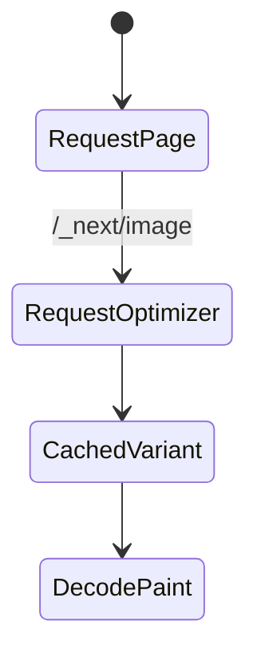

# Image Optimization

<TopicMeta />

<Prerequisites />

::: tip Published
This page meets the handbook **published** bar: deep explanation, ≥10 common mistakes, and official references. Further engine-level errata welcome via PR.
:::

## Introduction

`next/image` wraps `` with **automatic optimization**: required dimensions/aspect guidance, lazy loading by default, modern formats (WebP/AVIF when supported), and an optimization loader (default or custom/CDN).

## Why does it exist?

Images dominate LCP bytes. Manual `srcset` is error-prone; a framework component encodes best practices and protects CLS with reserved space.

## Historical Background

Introduced in Next 10 era; evolved with `fill`, `sizes`, remotePatterns security, and sharper defaults.

## Mental Model

Provide `width`/`height` or `fill` + sized parent; set `sizes` so the browser picks a sane candidate; mark the LCP hero with `priority`.

## Internal Workflow

1. Import `Image` from `next/image`.
2. Configure `images.remotePatterns` for remote hosts.
3. Set dimensions/`sizes`/`priority` as needed.
4. Verify Network tab shows optimized URLs.

## Lifecycle



## Browser Perspective

Uses `srcset`/`sizes`; lazy images use loading=lazy semantics.

## JavaScript Engine Perspective

Not applicable.

## React Perspective

Not applicable.

## Next.js Perspective

Optimizer runs on the server/CDN path; can be replaced with custom loader.

## Server Perspective

Not applicable.

## Network Perspective

Fewer bytes via modern formats; cache optimized variants.

## Memory Perspective

Huge unoptimized bitmaps still hurt decode memory—compress sources.

## Performance

Biggest LCP lever on many sites. Wrong `sizes` overdownloads; missing sizes causes CLS.

## Production Example

PDP hero uses `priority` + accurate `sizes`; gallery below folds stays lazy. Remote CMS images allowed via remotePatterns.

## Code Examples

```tsx
import Image from 'next/image'

export function Hero() {
  return (
    <Image
      src="/hero.jpg"
      alt="Product hero"
      width={1200}
      height={630}
      sizes="(max-width: 768px) 100vw, 1200px"
      priority
    />
  )
}
```

## Diagrams


## Common Mistakes

1. Omitting sizes with fill, causing oversized downloads
2. Not setting priority on the LCP image
3. Allowing any remote host (security/SSR F) via wildcard
4. Using raw `` for all heroes and skipping optimization
5. Serving 4000px PNG sources without compression
6. Forgetting width/height and causing CLS
7. Missing a production edge case for 11-nextjs.image-optimization (#1)
8. Missing a production edge case for 11-nextjs.image-optimization (#2)
9. Missing a production edge case for 11-nextjs.image-optimization (#3)
10. Missing a production edge case for 11-nextjs.image-optimization (#4)


## Best Practices

- Always set sizes for responsive layouts
- priority only for above-the-fold LCP candidates
- Lock remotePatterns tightly
- Prefer modern source assets (AVIF/WebP pipeline upstream)

## Anti-patterns

- priority on every image
- CSS-only resizing of giant downloads
- Disabling the optimizer globally to “fix CI”

## Comparison

| | next/image | raw img |
| --- | --- | --- |
| Optimization | Yes | Manual |
| CLS guards | Built-in | DIY |
| Flexibility | High with loader | Maximum |

## Interview Questions

### Easy

**Q:** Why use next/image?

**A:** It automates responsive images, lazy loading, modern formats, and layout stability for better LCP/CLS.

### Medium

**Q:** What does the sizes prop do?

**A:** Tells the browser how wide the image will display so it can pick an appropriate srcset candidate.

### Hard

**Q:** How do you optimize images on a custom CDN?

**A:** Use a custom `loader` that returns CDN URLs with width/quality params, keep sizes/priority correct, and ensure remotePatterns/security still apply.

## Summary

- next/image optimizes and stabilizes images
- sizes + dimensions are mandatory for good results
- priority for LCP heroes only
- Lock down remote image hosts

## References

- [Next.js — Image Optimization](https://nextjs.org/docs/app/building-your-application/optimizing/images)
- [web.dev — Optimize LCP](https://web.dev/articles/optimize-lcp)

<RelatedTopics />


Prev: [`11-nextjs.node-runtime`](/11-nextjs/node-runtime/) · Next: [`11-nextjs.fonts`](/11-nextjs/fonts/)
