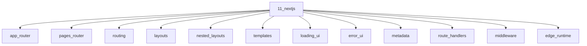

# Next.js

## Scope

App Router, server components, caching, streaming, and edge runtimes

## Prerequisites

See the learning paths and each topic's prerequisites in the registry.

## Topics in order

- [App Router](/11-nextjs/app-router/) — mid, ~40 min
- [Pages Router](/11-nextjs/pages-router/) — junior, ~30 min
- [Routing](/11-nextjs/routing/) — junior, ~30 min
- [Layouts](/11-nextjs/layouts/) — junior, ~25 min
- [Nested Layouts](/11-nextjs/nested-layouts/) — mid, ~25 min
- [Templates](/11-nextjs/templates/) — mid, ~20 min
- [Loading UI](/11-nextjs/loading-ui/) — junior, ~20 min
- [Error UI](/11-nextjs/error-ui/) — junior, ~20 min
- [Metadata](/11-nextjs/metadata/) — junior, ~25 min
- [Route Handlers](/11-nextjs/route-handlers/) — mid, ~30 min
- [Middleware](/11-nextjs/middleware/) — mid, ~35 min
- [Edge Runtime](/11-nextjs/edge-runtime/) — mid, ~30 min
- [Node Runtime](/11-nextjs/node-runtime/) — mid, ~25 min
- [Image Optimization](/11-nextjs/image-optimization/) — junior, ~30 min
- [Fonts](/11-nextjs/fonts/) — junior, ~25 min
- [Server Components](/11-nextjs/server-components/) — mid, ~45 min
- [Client Components](/11-nextjs/client-components/) — junior, ~30 min
- [Server Actions](/11-nextjs/server-actions/) — mid, ~40 min
- [Streaming](/11-nextjs/streaming/) — mid, ~35 min
- [Caching](/11-nextjs/caching/) — senior, ~50 min
- [Partial Prerendering](/11-nextjs/partial-prerendering/) — senior, ~40 min
- [Data Fetching](/11-nextjs/data-fetching/) — mid, ~40 min
- [Route Groups](/11-nextjs/route-groups/) — mid, ~20 min
- [Intercepting Routes](/11-nextjs/intercepting-routes/) — senior, ~30 min
- [Parallel Routes](/11-nextjs/parallel-routes/) — senior, ~30 min

## Module knowledge graph

## Suggested learning paths

Browse [Learning Paths](/learning-paths/).
