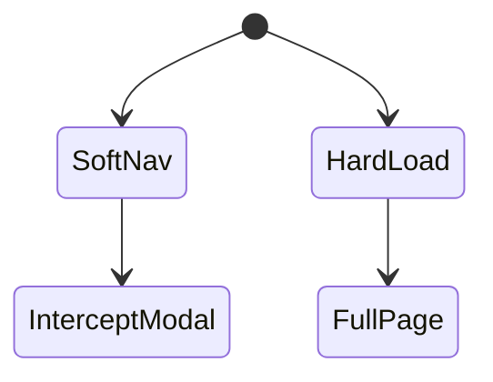
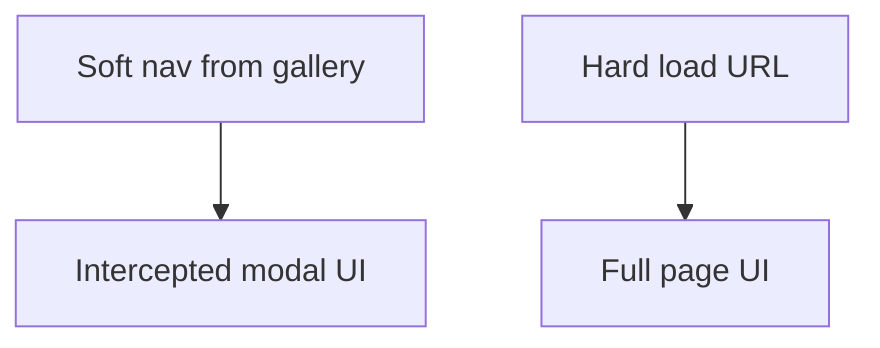

# Intercepting Routes

<TopicMeta />

<Prerequisites />

::: tip Published
This page meets the handbook **published** bar: deep explanation, ≥10 common mistakes, and official references. Further engine-level errata welcome via PR.
:::

## Introduction

**Intercepting routes** let you show an alternate UI—often a modal—when navigating from within the app, while a direct load of the same URL shows the full page. Conventions use `(.)`, `(..)`, `(...) ` segments relative to the filesystem.

## Why does it exist?

UX patterns like “photo modal over gallery” need soft navigation interception without giving up shareable deep links.

## Historical Background

Advanced App Router routing pattern paired with parallel routes for modals.

## Mental Model

From inside → intercept (modal). Hard reload/shared link → full page. Parallel slots usually host the modal UI.

## Internal Workflow

1. Create intercepting segment (e.g. `photo/(..)photo/[id]`).
2. Pair with parallel route slot for modal.
3. Ensure default.tsx for slots.
4. Test both soft nav and hard load.

## Lifecycle



## Browser Perspective

URL shows the photo route; UI may be modal overlay.

## JavaScript Engine Perspective

Not applicable.

## React Perspective

Often composed with parallel route slots.

## Next.js Perspective

Filesystem conventions encode intercept depth.

## Server Perspective

Not applicable.

## Network Perspective

Same RSC navigation payload path as other soft navs.

## Memory Perspective

Not applicable.

## Performance

Modals avoid remounting the whole gallery if the parallel layout persists—big UX win.

## Production Example

Gallery at `/photos` opens `/photos/123` as modal via intercept; opening `/photos/123` in a new tab shows full detail page.

## Code Examples

```txt
app/@modal/(.)photos/[id]/page.tsx  ← intercept as modal slot
app/photos/[id]/page.tsx            ← full page
```

## Diagrams



## Common Mistakes

1. Wrong intercept relative path (.) vs (..)
2. Missing default.js for parallel slots causing errors
3. Forgetting full page route for hard loads
4. Accessibility: modal without focus trap/escape
5. Assuming intercept works for external links the same way
6. Overusing intercepts for simple navigations
7. Missing a production edge case for 11-nextjs.intercepting-routes (#1)
8. Missing a production edge case for 11-nextjs.intercepting-routes (#2)
9. Missing a production edge case for 11-nextjs.intercepting-routes (#3)
10. Missing a production edge case for 11-nextjs.intercepting-routes (#4)


## Best Practices

- Always implement the full page counterpart
- Use with parallel routes for modals
- Handle a11y for modal UX
- Test soft vs hard navigation

## Anti-patterns

- Intercept-only routes with no full page
- Modals that break back button expectations
- Deep intercept trees no one understands

## Comparison

| Navigation | UI |
| --- | --- |
| In-app soft | Intercepted modal |
| Direct load | Full page |

## Interview Questions

### Easy

**Q:** What are intercepting routes for?

**A:** Showing an alternate UI (like a modal) on client navigations while keeping a full page for direct loads of the same URL.

### Medium

**Q:** Why pair them with parallel routes?

**A:** Parallel slots let you render the modal alongside the current page layout without unmounting the underlying gallery.

### Hard

**Q:** How do (.) vs (..) intercept conventions differ?

**A:** They specify how many segment levels to match relative to the filesystem—pick the one that aligns the intercept folder with the target route depth.

## Summary

- Intercept soft navigations for modal-style UX
- Keep full pages for deep links
- Usually combined with parallel routes
- Mind a11y and defaults for slots

## References

- [Next.js — Intercepting Routes](https://nextjs.org/docs/app/building-your-application/routing/intercepting-routes)

<RelatedTopics />


Prev: [`11-nextjs.route-groups`](/11-nextjs/route-groups/) · Next: [`11-nextjs.parallel-routes`](/11-nextjs/parallel-routes/)
