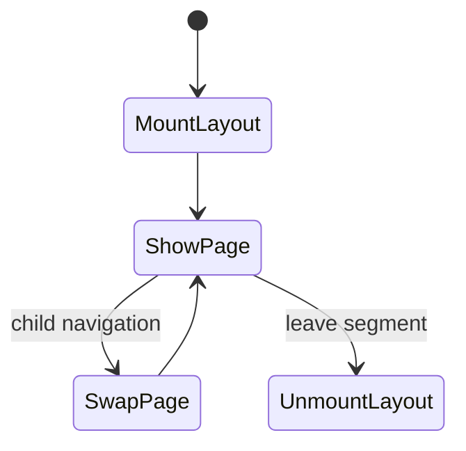
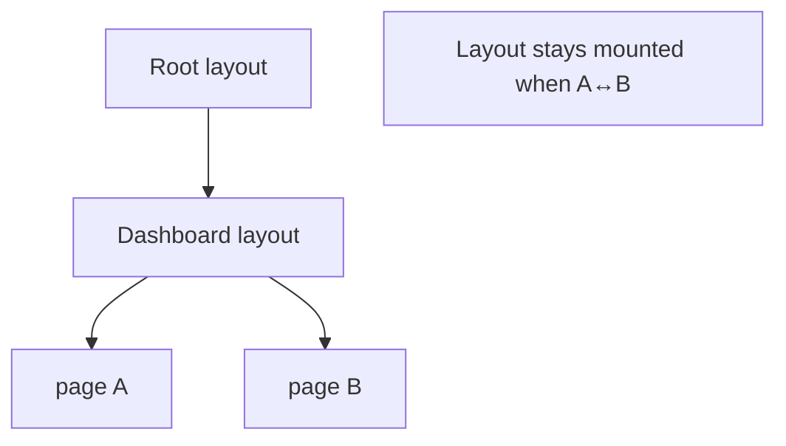

# Layouts

<TopicMeta />

<Prerequisites />

::: tip Published
This page meets the handbook **published** bar: deep explanation, ≥10 common mistakes, and official references. Further engine-level errata welcome via PR.
:::

## Introduction

A **layout** (`layout.tsx`) wraps child routes and **does not remount** on navigation between those children. Root layout must include `<html>` and `<body>`. Layouts are the right place for shells: nav, sidebars, and shared chrome.

## Why does it exist?

Without persistent layouts, every navigation remounts the chrome, losing UI state and redownloading shared UI work. Layouts make shared structure a first-class routing concept.

## Historical Background

Pages Router had `_app`/`_document`. App Router nested layouts per segment, matching how product UIs actually nest (dashboard → section → page).

## Mental Model

Layout = durable shell. Page = swappable leaf. Layout can be Server Component and still wrap Client children. State in a Client layout (or client child living in the layout) survives sibling navigations.

## Internal Workflow

1. Add `layout.tsx` in a segment.
2. Receive `children` (and optionally parallel `slots`).
3. On navigation within the segment, Next keeps the layout fiber tree and replaces `children`.
4. Use nested layouts for section-specific chrome.

## Lifecycle



## Browser Perspective

DOM for the shell stays put; only the page region updates—smoother UX and less flicker.

## JavaScript Engine Perspective

Not applicable.

## React Perspective

Layout components preserve React state and effects across child route changes.

## Next.js Perspective

Root layout is mandatory once. Nested layouts compose automatically along the matched segments.

## Server Perspective

Layouts can fetch shared data, but fetching too high can widen cache invalidation blast radius.

## Network Perspective

Not applicable.

## Memory Perspective

Client state in layouts lives for the segment lifetime—great for nav UI, dangerous for huge caches.

## Performance

Shared layout fetch runs for the segment; don’t put per-page waterfalls in the root layout. Prefer passing data down or fetching in the page.

## Production Example

Dashboard layout loads the current user once, renders a sidebar, and child pages stream their tables independently with their own loading.tsx.

## Code Examples

```tsx
// app/dashboard/layout.tsx
export default function DashboardLayout({ children }: { children: React.ReactNode }) {
  return (
    <div className="grid grid-cols-[240px_1fr]">
      <aside>Sidebar</aside>
      <main>{children}</main>
    </div>
  )
}
```

## Diagrams



## Common Mistakes

1. Expecting layout state to reset on every navigation
2. Putting `<html>` in nested layouts
3. Fetching highly volatile per-page data in the root layout
4. Wrapping the world in a client layout for a single interactive widget
5. Forgetting that layouts run for all child routes’ rendering modes
6. Using layout for one-off mount animations (use template instead)
7. Missing a production edge case for 11-nextjs.layouts (#1)
8. Missing a production edge case for 11-nextjs.layouts (#2)
9. Missing a production edge case for 11-nextjs.layouts (#3)
10. Missing a production edge case for 11-nextjs.layouts (#4)


## Best Practices

- Keep root layout minimal and static when possible
- Push interactivity into small Client Components inside the layout
- Pair layouts with loading.tsx for child segments
- Document which data is owned by layout vs page

## Anti-patterns

- Auth checks only in layouts without also protecting Route Handlers/Server Actions
- Mega-layout that imports every feature’s client code
- Conditional layouts via runtime hacks instead of route groups

## Comparison

| | layout.tsx | template.tsx |
| --- | --- | --- |
| Remount on nav | No | Yes |
| State preserved | Yes | No |
| Typical use | Shells, nav | Enter animations, per-visit reset |

## Interview Questions

### Easy

**Q:** Does a layout remount when navigating between child pages?

**A:** No. Layouts persist; only the page segment swaps (unless you leave the layout’s segment).

### Medium

**Q:** Where must `<html>` and `<body>` live?

**A:** In the root `app/layout.tsx` only.

### Hard

**Q:** How do you provide two different root chrome designs without URL prefixes?

**A:** Use route groups like `app/(marketing)/layout.tsx` and `app/(app)/layout.tsx`, each with its own layout tree under a shared root layout.

## Summary

- Layouts wrap children and persist across navigations
- Root layout owns html/body
- Nested layouts compose with the segment tree
- Use templates when you need remount semantics

## References

- [Next.js — Layouts and Pages](https://nextjs.org/docs/app/building-your-application/routing/pages-and-layouts)

<RelatedTopics />


Prev: [`11-nextjs.routing`](/11-nextjs/routing/) · Next: [`11-nextjs.nested-layouts`](/11-nextjs/nested-layouts/)
