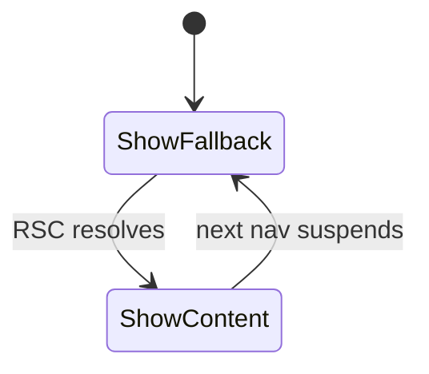
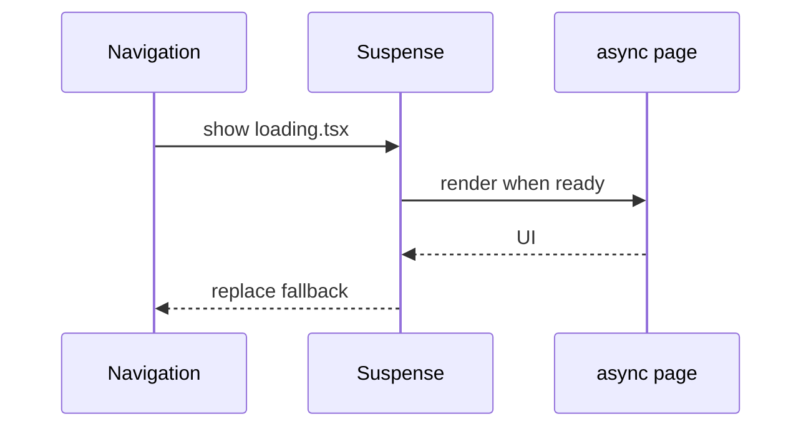

# Loading UI

<TopicMeta />

<Prerequisites />

::: tip Published
This page meets the handbook **published** bar: deep explanation, ≥10 common mistakes, and official references. Further engine-level errata welcome via PR.
:::

## Introduction

**Loading UI** is a `loading.tsx` file that Next automatically wraps in a `<Suspense>` boundary for that segment. While the segment’s Server Components suspend (usually on data), users see the fallback immediately—critical for streaming UX.

## Why does it exist?

Without segment-level fallbacks, slow data makes navigations feel stuck. `loading.tsx` standardizes skeletons at the right boundary instead of ad-hoc spinners in every page.

## Historical Background

Part of App Router’s streaming model built on React 18 Suspense for data.

## Mental Model

`loading.tsx` ≈ default Suspense fallback for the page (and its subtree) in that segment. Nested segments can each have their own loading UI so only the slow part swaps to a skeleton.

## Internal Workflow

1. Add `loading.tsx` exporting a fallback component.
2. Navigate or render; async page/layout suspends.
3. Fallback shows instantly; streamed content replaces it when ready.
4. Prefer meaningful skeletons that match final layout to limit CLS.

## Lifecycle



## Browser Perspective

HTML for the fallback can arrive in the early stream; content chunks follow.

## JavaScript Engine Perspective

Not applicable.

## React Perspective

Suspense coordinates revealing UI when promises resolve on the server.

## Next.js Perspective

Convention file—no manual Suspense required for the common case.

## Server Perspective

Not applicable.

## Network Perspective

Streaming multiplexes fallback + later bytes over one response.

## Memory Perspective

Keep fallbacks cheap—no giant client graphs in loading.tsx.

## Performance

Improves perceived performance (INP of navigation UX) more than raw LCP sometimes. Avoid layout shift by matching skeleton dimensions to content.

## Production Example

A reports route shows a table skeleton in `loading.tsx` while a warehouse query runs; the dashboard shell from the parent layout stays interactive.

## Code Examples

```tsx
// app/reports/loading.tsx
export default function Loading() {
  return <div className="h-40 animate-pulse rounded bg-neutral-200" aria-busy="true" />
}
```

## Diagrams



## Common Mistakes

1. Skeleton shapes that differ from final UI causing CLS
2. Putting loading.tsx only at root so the whole app flashes
3. Making loading.tsx a Client Component that fetches data
4. Assuming loading.tsx wraps the layout above it (it wraps the segment’s page/children, not parent layouts)
5. No aria-busy / accessible status for assistive tech
6. Using loading UI to hide broken slow APIs forever instead of fixing TTFB
7. Missing a production edge case for 11-nextjs.loading-ui (#1)
8. Missing a production edge case for 11-nextjs.loading-ui (#2)
9. Missing a production edge case for 11-nextjs.loading-ui (#3)
10. Missing a production edge case for 11-nextjs.loading-ui (#4)


## Best Practices

- Colocate loading.tsx with the slow segment
- Match skeleton geometry to content
- Keep fallbacks server-friendly and tiny
- Combine with error.tsx for failure paths

## Anti-patterns

- Global CSS spinners unrelated to layout structure
- Blocking the entire shell for a leaf fetch
- Duplicate Suspense boundaries that fight loading.tsx

## Comparison

| Approach | Scope |
| --- | --- |
| loading.tsx | Segment convention |
| Manual Suspense | Custom boundaries inside components |
| Client spinner useEffect | Late, worse UX, more JS |

## Interview Questions

### Easy

**Q:** What does loading.tsx do?

**A:** Defines the Suspense fallback for that route segment while server content streams in.

### Medium

**Q:** Why can the layout still show while loading.tsx is visible?

**A:** Parent layouts are outside the segment’s Suspense boundary created for loading.tsx, so they remain rendered.

### Hard

**Q:** How does loading UI relate to Partial Prerendering?

**A:** Static shells can ship instantly while dynamic holes suspend; loading UI (or Suspense fallbacks) fill those holes until dynamic HTML streams—PPR formalizes static+dynamic composition.

## Summary

- loading.tsx is segment-level Suspense fallback
- Enables streaming-friendly navigations
- Design skeletons to reduce CLS
- Nest loading UI where latency lives

## References

- [Next.js — Loading UI and Streaming](https://nextjs.org/docs/app/building-your-application/routing/loading-ui-and-streaming)

<RelatedTopics />


Prev: [`11-nextjs.templates`](/11-nextjs/templates/) · Next: [`11-nextjs.error-ui`](/11-nextjs/error-ui/)
