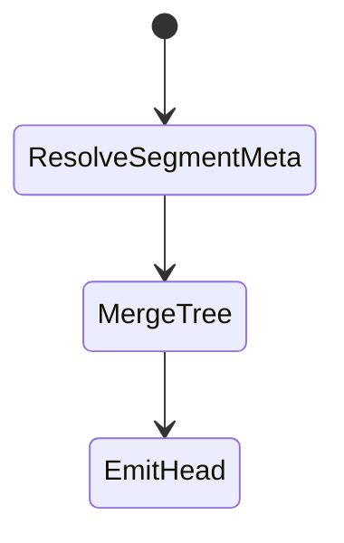
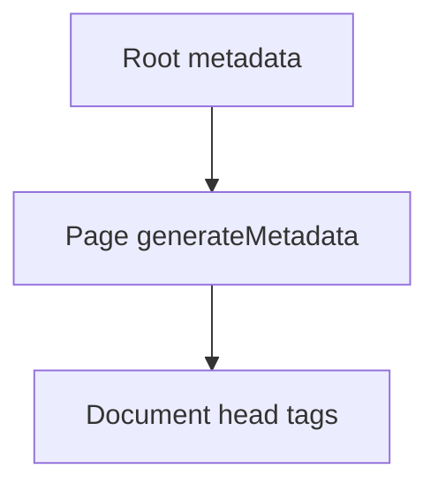

# Metadata

<TopicMeta />

<Prerequisites />

::: tip Published
This page meets the handbook **published** bar: deep explanation, ≥10 common mistakes, and official references. Further engine-level errata welcome via PR.
:::

## Introduction

The **Metadata API** lets Server Components export a `metadata` object or `generateMetadata` function to set title, description, Open Graph, robots, icons, and more. Next merges metadata along the layout/page tree.

## Why does it exist?

Correct titles/OG tags are product requirements for SEO and sharing. A typed, stream-friendly API beats hand-edited `<head>` tags scattered across pages.

## Historical Background

Replaced ad-hoc `next/head` usage from Pages Router with a dedicated App Router API.

## Mental Model

Metadata is computed on the server from the route tree. Static `metadata` export for constants; `generateMetadata` when it depends on params/fetched data. Child segments override/merge with parents.

## Internal Workflow

1. Export `metadata` or `generateMetadata` from layout/page.
2. Next merges fields for the matched segments.
3. Tags are rendered into the document head.
4. For OG images, use file conventions or `ImageResponse`.

## Lifecycle



## Browser Perspective

Head tags update on client navigations as well as first load.

## JavaScript Engine Perspective

Not applicable.

## React Perspective

Not applicable to client-only head hacks; prefer the Metadata API.

## Next.js Perspective

File-based metadata (`favicon.ico`, `opengraph-image.tsx`) colocates assets with routes.

## Server Perspective

generateMetadata may fetch; share cache with the page via `cache`/tags to avoid double work.

## Network Perspective

Crawlers and link unfurlers read OG tags—keep them accurate for share URLs.

## Memory Perspective

Not applicable.

## Performance

Heavy fetches only in generateMetadata hurt TTFB. Deduplicate with page data. Dynamic metadata can force dynamic rendering if it uses dynamic APIs.

## Production Example

Product pages generate titles from CMS data and dynamic OG images with brand templates for social previews.

## Code Examples

```tsx
import type { Metadata } from 'next'

export async function generateMetadata({
  params,
}: {
  params: Promise<{ slug: string }>
}): Promise<Metadata> {
  const { slug } = await params
  const post = await getPost(slug)
  return {
    title: post.title,
    description: post.excerpt,
    openGraph: { title: post.title, images: [post.cover] },
  }
}
```

## Diagrams



## Common Mistakes

1. Setting document.title only in useEffect (bad for SEO/crawlers)
2. Duplicating fetches in page and generateMetadata without cache
3. Forgetting absolute URLs for OG images
4. Mixing Pages Router next/head patterns into app/
5. Huge metadata objects recomputed with unstable references every render
6. Blocking indexing of private app routes incorrectly (or forgetting noindex on staging)
7. Missing a production edge case for 11-nextjs.metadata (#1)
8. Missing a production edge case for 11-nextjs.metadata (#2)
9. Missing a production edge case for 11-nextjs.metadata (#3)
10. Missing a production edge case for 11-nextjs.metadata (#4)


## Best Practices

- Define sensible root defaults; override per page
- Share data loaders between page and generateMetadata
- Use metadataBase for composing absolute URLs
- Add noindex on preview/staging environments

## Anti-patterns

- Client-only SEO libraries fighting the Metadata API
- Identical titles on every page
- User-generated content in titles without sanitization/length limits

## Comparison

| API | Router |
| --- | --- |
| Metadata API | App Router |
| next/head | Pages Router |

## Interview Questions

### Easy

**Q:** How do you set a page title in App Router?

**A:** Export `metadata` or `generateMetadata` from a page/layout; Next merges and emits head tags.

### Medium

**Q:** When use generateMetadata vs static metadata?

**A:** Use generateMetadata when title/description depend on params or fetched content; static metadata for constants.

### Hard

**Q:** How can metadata generation affect caching/rendering mode?

**A:** If generateMetadata reads cookies/headers or uses uncached dynamic fetch, the route may become dynamic. Align cache policy with the page’s data layer.

## Summary

- Metadata API owns SEO/social head tags
- Merges across the route tree
- generateMetadata for dynamic content
- Deduplicate data with the page

## References

- [Next.js — Metadata and OG images](https://nextjs.org/docs/app/building-your-application/optimizing/metadata)

<RelatedTopics />


Prev: [`11-nextjs.error-ui`](/11-nextjs/error-ui/) · Next: [`11-nextjs.route-handlers`](/11-nextjs/route-handlers/)
