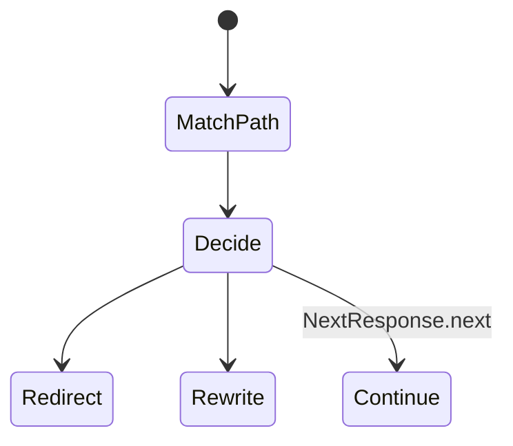
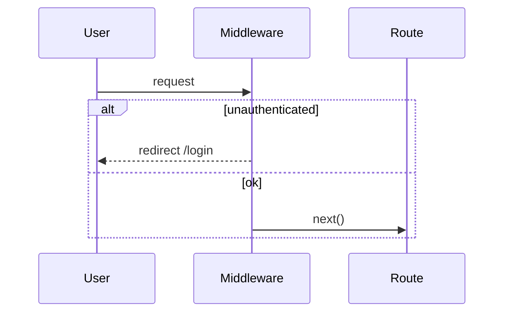

# Middleware

<TopicMeta />

<Prerequisites />

::: tip Published
This page meets the handbook **published** bar: deep explanation, ≥10 common mistakes, and official references. Further engine-level errata welcome via PR.
:::

## Introduction

**Middleware** (`middleware.ts` at the project root or `src/`) runs on the Edge before routes render. It can rewrite, redirect, set headers/cookies, and short-circuit responses. Keep it small—it is not your full backend.

## Why does it exist?

Coarse routing concerns—auth redirects, A/B rewrites, geo routing, header injection—need to run before heavy RSC work. Middleware centralizes those gates.

## Historical Background

Introduced to give Next a standard request interceptor at the edge, evolving with matcher config and runtime constraints.

## Mental Model

Middleware sees a `NextRequest` and returns `NextResponse`. It should be fast and stateless-friendly. Authorization for mutations must still be enforced in Server Actions/Handlers—middleware is necessary but not sufficient.

## Internal Workflow

1. Export `middleware` function + optional `config.matcher`.
2. Inspect cookies/headers/URL.
3. `NextResponse.redirect`, `rewrite`, or `next()`.
4. Avoid expensive I/O; prefer JWT/session cookie checks.

## Lifecycle



## Browser Perspective

Redirects appear as normal navigations; rewrites keep the URL while changing the target.

## JavaScript Engine Perspective

Not applicable.

## React Perspective

Not applicable.

## Next.js Perspective

Matcher excludes static assets carefully to avoid unnecessary invocations.

## Server Perspective

Not full Node—limited APIs. No heavy ORM usage.

## Network Perspective

Runs close to users on Edge; adds latency if bloated.

## Memory Perspective

Keep middleware bundle tiny; large imports hurt every matched request.

## Performance

Every matched request pays middleware cost. Narrow matchers; avoid large dependency graphs.

## Production Example

Middleware checks a session cookie and redirects anonymous users from `/account/*` to `/login?next=...`, while APIs enforce auth again.

## Code Examples

```ts
import { NextResponse } from 'next/server'
import type { NextRequest } from 'next/server'

export function middleware(request: NextRequest) {
  const session = request.cookies.get('session')
  if (!session && request.nextUrl.pathname.startsWith('/account')) {
    const url = request.nextUrl.clone()
    url.pathname = '/login'
    url.searchParams.set('next', request.nextUrl.pathname)
    return NextResponse.redirect(url)
  }
  return NextResponse.next()
}

export const config = {
  matcher: ['/account/:path*'],
}
```

## Diagrams



## Common Mistakes

1. Treating middleware as the only auth layer
2. Running middleware on all static assets via bad matchers
3. Heavy database calls in middleware
4. Complex branching that belongs in the app
5. Infinite redirect loops
6. Assuming Node APIs exist on Edge middleware
7. Missing a production edge case for 11-nextjs.middleware (#1)
8. Missing a production edge case for 11-nextjs.middleware (#2)
9. Missing a production edge case for 11-nextjs.middleware (#3)
10. Missing a production edge case for 11-nextjs.middleware (#4)


## Best Practices

- Keep middleware fast and focused
- Use precise matchers
- Re-check auth in server mutations
- Prefer rewrites for experiments over client forks

## Anti-patterns

- Importing the entire app into middleware
- Business-critical authorization only at the edge
- Mutating responses in undocumented ways

## Comparison

| Layer | Strength |
| --- | --- |
| Middleware | Early redirect/rewrite/headers |
| RSC layout | Data-aware UI gates |
| Server Action | True mutation authz |

## Interview Questions

### Easy

**Q:** Where does Next.js middleware run?

**A:** On the Edge runtime before matched requests complete, via root `middleware.ts`.

### Medium

**Q:** Redirect vs rewrite in middleware?

**A:** Redirect changes the URL the user sees; rewrite internally maps to another path while keeping the browser URL.

### Hard

**Q:** Why is middleware insufficient as sole authorization?

**A:** It can be bypassed by mis-matchers, static escapes, or direct backend calls; it also lacks full app context. Enforce authz at data/mutation boundaries too.

## Summary

- Middleware intercepts matched requests at the edge
- Best for redirects, rewrites, headers
- Keep it small and not Node-heavy
- Never the only security control

## References

- [Next.js — Middleware](https://nextjs.org/docs/app/building-your-application/routing/middleware)

<RelatedTopics />


Prev: [`11-nextjs.route-handlers`](/11-nextjs/route-handlers/) · Next: [`11-nextjs.edge-runtime`](/11-nextjs/edge-runtime/)
