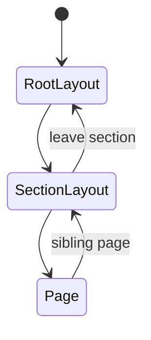
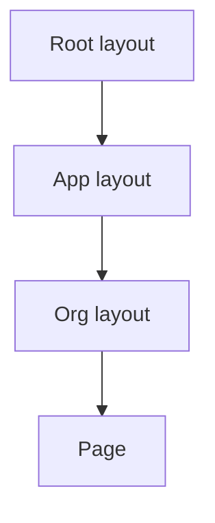

# Nested Layouts

<TopicMeta />

<Prerequisites />

::: tip Published
This page meets the handbook **published** bar: deep explanation, ≥10 common mistakes, and official references. Further engine-level errata welcome via PR.
:::

## Introduction

**Nested layouts** stack: root → section → subsection. Each `layout.tsx` wraps its child segment’s layout/page. This models real product hierarchy (app shell → project → settings) without remounting outer chrome.

## Why does it exist?

Complex apps need multiple durable UI layers. Nested layouts encode that hierarchy in the filesystem so data boundaries and loading UI can sit at the right depth.

## Historical Background

A direct App Router advance over single `_app` wrapping. Inspired by nested routing in Relay/Remix-style frameworks.

## Mental Model

Depth = specificity. Outer layouts = global chrome; inner = feature chrome. A navigation that changes only the deepest segment remounts nothing above it.

## Internal Workflow

1. Place layout.tsx at each segment that needs chrome.
2. Ensure each layout renders `{children}` (and slots if parallel).
3. Choose fetch/auth boundaries per level.
4. Add loading/error at the level where failures should be contained.

## Lifecycle



## Browser Perspective

Partial DOM updates feel like an SPA with server-driven segments.

## JavaScript Engine Perspective

Not applicable.

## React Perspective

Nested React trees; outer effects stay alive while inner pages churn.

## Next.js Perspective

Matched segments determine which layouts mount—URL structure is UX architecture.

## Server Perspective

Each layout can be an async Server Component; avoid serial waterfalls (start fetches early, compose later).

## Network Perspective

Not applicable.

## Memory Perspective

Each client boundary in nested layouts retains state—audit providers at each level.

## Performance

Waterfalls: parent layout await then child await hurts TTFB. Fetch in parallel or push awaits down. Too many nested client providers increases JS.

## Production Example

`app/(app)/layout.tsx` auth shell → `app/(app)/org/[orgId]/layout.tsx` org switcher → pages for projects/billing with local loading states.

## Code Examples

```tsx
// app/(app)/org/[orgId]/layout.tsx
export default async function OrgLayout({
  children,
  params,
}: {
  children: React.ReactNode
  params: Promise<{ orgId: string }>
}) {
  const { orgId } = await params
  const org = await getOrg(orgId)
  return (
    <div>
      <h1>{org.name}</h1>
      {children}
    </div>
  )
}
```

## Diagrams



## Common Mistakes

1. Serial awaits across nested layouts causing request waterfalls
2. Re-fetching the same user/org in every nested layout without cache
3. Putting error.tsx only at the root so inner failures blank the whole app
4. Nesting client providers that duplicate context
5. URL depth not matching UX hierarchy, forcing awkward layout remounts
6. Assuming nested layouts remount like templates
7. Missing a production edge case for 11-nextjs.nested-layouts (#1)
8. Missing a production edge case for 11-nextjs.nested-layouts (#2)
9. Missing a production edge case for 11-nextjs.nested-layouts (#3)
10. Missing a production edge case for 11-nextjs.nested-layouts (#4)


## Best Practices

- Align folder depth with UX shells
- Contain errors/loading at the segment that owns the risk
- Share data via cache tags / React cache(), not prop drilling through layouts
- Keep each layout’s client surface small

## Anti-patterns

- Five levels of nested client-only layouts
- Org layout that blocks streaming of the page on non-critical data
- Copy-pasting the same layout file instead of nesting

## Comparison

| Depth | Responsibility |
| --- | --- |
| Root | html/body, fonts, global CSS |
| App shell | Auth chrome, nav |
| Feature | Section sidebar |
| Page | Leaf content |

## Interview Questions

### Easy

**Q:** What are nested layouts?

**A:** Multiple layout.tsx files along the route tree that wrap each other and persist independently as you navigate within their segments.

### Medium

**Q:** How do you avoid data waterfalls in nested async layouts?

**A:** Kick off fetches early without awaiting between levels unnecessarily, use React `cache()` for dedupe, or move awaits into the page/parallel slots so shells stream first.

### Hard

**Q:** When should an auth check live in a nested layout vs middleware?

**A:** Middleware for coarse redirect/edge checks; layout/Server Component for data-dependent authorization UI. Always enforce again in Server Actions/Route Handlers—layouts are not a security boundary alone.

## Summary

- Nested layouts stack along segments
- Outer chrome persists while inner pages swap
- Watch for async waterfalls and over-fetching
- Match folder hierarchy to product UX

## References

- [Next.js — Nesting Layouts](https://nextjs.org/docs/app/building-your-application/routing/pages-and-layouts#nesting-layouts)

<RelatedTopics />


Prev: [`11-nextjs.layouts`](/11-nextjs/layouts/) · Next: [`11-nextjs.templates`](/11-nextjs/templates/)
