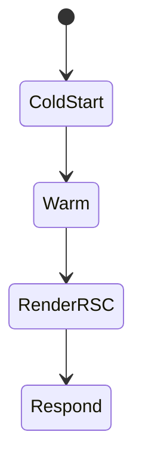
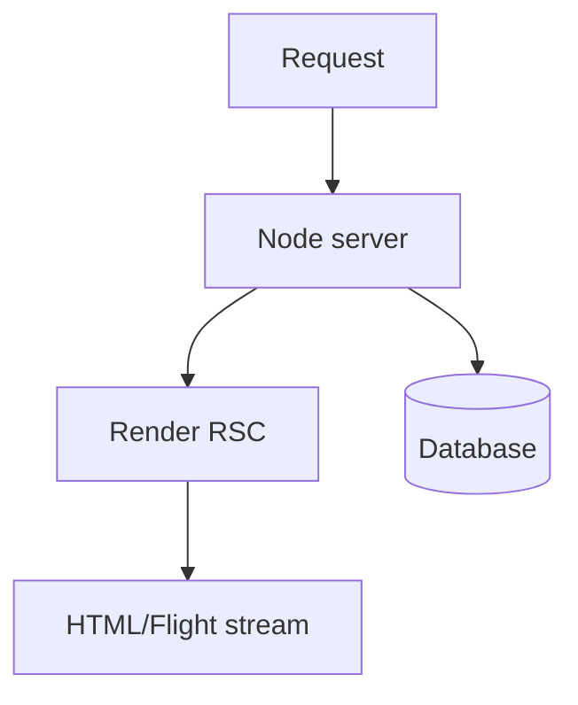

# Node Runtime

<TopicMeta />

<Prerequisites />

::: tip Published
This page meets the handbook **published** bar: deep explanation, ≥10 common mistakes, and official references. Further engine-level errata welcome via PR.
:::

## Introduction

The **Node.js runtime** is Next’s default for Server Components, Server Actions, and Route Handlers. You get the Node API surface, mature DB drivers, and the familiar server ecosystem—at the cost of heavier cold starts than Edge for tiny functions.

## Why does it exist?

Real apps need filesystems (build), native modules, Postgres drivers, and longer-running work. Node remains the practical default for full-stack React rendering.

## Historical Background

Next has always been Node-based; Edge was added later for a subset of workloads.

## Mental Model

Node runtime = full server. Use it unless you have a concrete edge latency win that fits constraints.

## Internal Workflow

1. Default: no export needed (`runtime = 'nodejs'`).
2. Import Node libraries freely (within deployment size/time limits).
3. Manage connection pooling for serverless.
4. Prefer streaming RSC to hide TTFB.

## Lifecycle



## Browser Perspective

Not applicable.

## JavaScript Engine Perspective

V8 in Node—same JS semantics; watch event-loop blocking.

## React Perspective

Not applicable.

## Next.js Perspective

RSC rendering, `next/image` optimizer, and most data libraries expect Node.

## Server Perspective

Connection pools, CPU time, and memory per instance dominate ops.

## Network Perspective

Often regional; combine with CDN for static assets.

## Memory Perspective

Leaked global caches across warm invocations are a classic serverless bug.

## Performance

Optimize TTFB with caching/streaming; avoid blocking the event loop; reuse connections on warm instances.

## Production Example

API + RSC on Node with Prisma accelerate/HTTP driver; Middleware on edge for auth redirect only.

## Code Examples

```ts
export const runtime = 'nodejs'

export async function POST(request: Request) {
  const body = await request.json()
  await db.order.create({ data: body })
  return Response.json({ ok: true })
}
```

## Diagrams



## Common Mistakes

1. Opening a new DB connection per request without pooling
2. Blocking the event loop with sync crypto/fs on huge files
3. Assuming edge-compatible code when on Node (and vice versa)
4. Storing request-specific data in module global state
5. Disabling streaming and buffering entire pages
6. Shipping dev-only debug tools into production server bundles
7. Missing a production edge case for 11-nextjs.node-runtime (#1)
8. Missing a production edge case for 11-nextjs.node-runtime (#2)
9. Missing a production edge case for 11-nextjs.node-runtime (#3)
10. Missing a production edge case for 11-nextjs.node-runtime (#4)


## Best Practices

- Use pooled/serverless-friendly DB clients
- Stream RSC and set sane function timeouts
- Isolate secrets to server-only modules
- Observe cold start vs warm latency separately

## Anti-patterns

- Giant monolith handlers doing ETL inline
- Mutating global caches without eviction
- Forcing everything to edge for “speed”

## Comparison

| Need | Prefer |
| --- | --- |
| ORM, files, long CPU | Node |
| Tiny geo redirect | Edge |
| Default RSC page | Node |

## Interview Questions

### Easy

**Q:** What is the default runtime for Server Components?

**A:** Node.js runtime.

### Medium

**Q:** Why can serverless Node need special DB clients?

**A:** Traditional pools assume long-lived processes; serverless creates many short instances—use pooling proxies or HTTP drivers.

### Hard

**Q:** How do you decide Node vs Edge for a Route Handler?

**A:** Inventory required APIs/deps, latency budget, CPU time, and region needs. Prototype both if unclear; measure p95 including cold starts.

## Summary

- Node is the default full-capability runtime
- Best for RSC + real databases
- Mind pooling and event-loop health
- Use Edge only when constraints fit

## References

- [Next.js — Runtime](https://nextjs.org/docs/app/api-reference/file-conventions/route-segment-config#runtime)
- [Node.js Docs](https://nodejs.org/docs/latest/api/)

<RelatedTopics />


Prev: [`11-nextjs.edge-runtime`](/11-nextjs/edge-runtime/) · Next: [`11-nextjs.image-optimization`](/11-nextjs/image-optimization/)
