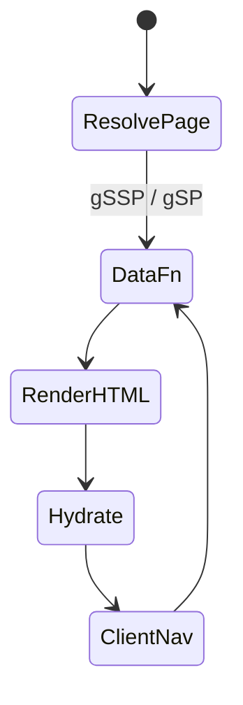

# Pages Router

<TopicMeta />

<Prerequisites />

::: tip Published
This page meets the handbook **published** bar: deep explanation, ≥10 common mistakes, and official references. Further engine-level errata welcome via PR.
:::

## Introduction

The **Pages Router** uses the `pages/` directory: each file is a route, `_app` wraps pages, and data loads via `getServerSideProps`, `getStaticProps`, or client-side fetching. It remains fully supported and powers many production apps, but new features (RSC, nested layouts, PPR) center on App Router.

## Why does it exist?

Before App Router, teams needed SSR/SSG in React without wiring Express by hand. Pages Router gave file-based routes, hybrid rendering, and API routes in one framework—solving SEO and first paint for React SPAs.

## Historical Background

Introduced with early Next.js and refined through the hybrid SSG/SSR era. App Router (Next 13+) is the successor model; Pages Router is maintenance-mode for features but not removed.

## Mental Model

One page file ≈ one URL. Data methods run on the server at request (`getServerSideProps`) or build/revalidate time (`getStaticProps`). The page component still ships to the client and hydrates. `pages/api/*` are serverless handlers, not React.

## Internal Workflow

1. Match `pages/` file (dynamic `[id].tsx`, catch-all `[...slug].tsx`).
2. Run data function if present → props.
3. Render React tree to HTML on server (SSR/SSG).
4. Send HTML + JS bundle; hydrate on client.
5. Client transitions via `next/router` fetch JSON for next page props.

## Lifecycle



## Browser Perspective

Full document HTML arrives for the first view; client navigations often request `_next/data/...` JSON then render.

## JavaScript Engine Perspective

Not applicable.

## React Perspective

Everything in the page tree is part of the client bundle unless carefully code-split. No RSC boundary.

## Next.js Perspective

`next export` / static generation and ISR (`revalidate`) originated here. Prefer App Router for new streaming/RSC work.

## Server Perspective

Node serverless functions execute gSSP and API routes; cold starts matter.

## Network Perspective

HTML + JS for first load; subsequent navigations are lighter data fetches.

## Memory Perspective

Client retains page state only within the React tree; `_app` state persists across navigations.

## Performance

gSSP on every request increases TTFB. Prefer gSP + ISR for semi-static content. Watch bundle size—Pages Router encourages larger client graphs.

## Production Example

A marketing site still on Pages Router uses `getStaticProps` + `revalidate: 300` for blog posts and gSSP only for personalized account pages during a gradual App Router migration via both routers in one project.

## Code Examples

```tsx
// pages/posts/[id].tsx
import type { GetStaticProps, GetStaticPaths } from 'next'

export const getStaticPaths: GetStaticPaths = async () => {
  return { paths: [{ params: { id: '1' } }], fallback: 'blocking' }
}

export const getStaticProps: GetStaticProps = async ({ params }) => {
  const post = await fetch(`https://api.example.com/posts/${params!.id}`).then((r) => r.json())
  return { props: { post }, revalidate: 60 }
}

export default function PostPage({ post }: { post: { title: string } }) {
  return <h1>{post.title}</h1>
}
```

## Diagrams


## Common Mistakes

1. Using getServerSideProps for content that could be static or ISR
2. Fetching the same data in gSSP and again on the client on mount
3. Assuming API routes are a full backend (auth, validation, rate limits still required)
4. Blocking migration forever when a feature needs nested layouts/RSC
5. Forgetting `fallback` behavior for dynamic SSG paths
6. Putting secrets in `NEXT_PUBLIC_*` because “pages need them”
7. Missing a production edge case for 11-nextjs.pages-router (#1)
8. Missing a production edge case for 11-nextjs.pages-router (#2)
9. Missing a production edge case for 11-nextjs.pages-router (#3)
10. Missing a production edge case for 11-nextjs.pages-router (#4)


## Best Practices

- Prefer getStaticProps + revalidate when data allows
- Keep `_app` thin; avoid huge global providers without need
- Plan dual-router migration: move route trees incrementally to `app/`
- Use `getServerSideProps` only for truly per-request personalized HTML

## Anti-patterns

- Client-only SPA inside Next with empty gSP and no SSR benefit
- Giant `getInitialProps` in `_app` forcing every page dynamic
- Duplicating business logic in API routes and external backends inconsistently

## Comparison

| | Pages Router | App Router |
| --- | --- | --- |
| Data API | gSSP / gSP / gIP | async Server Components + fetch |
| Layouts | Limited | Nested first-class |
| RSC | No | Yes |
| Status | Legacy-stable | Default for new work |

## Interview Questions

### Easy

**Q:** What is getStaticProps?

**A:** A Pages Router function that runs at build time (and on ISR revalidation) to provide props for a statically generated page.

### Medium

**Q:** When would you choose getServerSideProps over getStaticProps?

**A:** When HTML must reflect per-request data (auth, geo, A/B) that cannot be cached as a shared static page—accepting higher TTFB.

### Hard

**Q:** How do you migrate a Pages Router app to App Router without a big bang?

**A:** Run both routers: move leaf routes to `app/`, keep shared backend, replace gSP with RSC fetch + cache tags, replace gSSP with dynamic RSC or Route Handlers, and migrate `_app` providers into root layout Client Components carefully.

## Summary

- Pages Router maps files in pages/ to routes with gSSP/gSP
- Still valid for existing apps; App Router is the future default
- ISR via revalidate originated in this model
- Avoid dynamizing everything through _app getInitialProps

## References

- [Next.js — Pages Router](https://nextjs.org/docs/pages)
- [Next.js — Migrating to App Router](https://nextjs.org/docs/app/building-your-application/upgrading/app-router-migration)

<RelatedTopics />


Prev: [`11-nextjs.app-router`](/11-nextjs/app-router/) · Next: [`11-nextjs.routing`](/11-nextjs/routing/)
