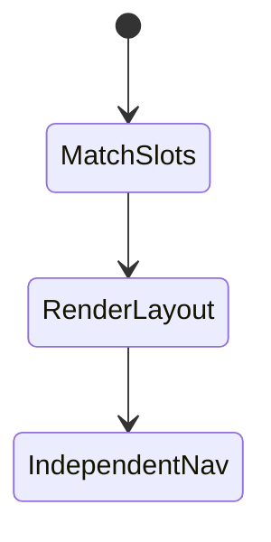
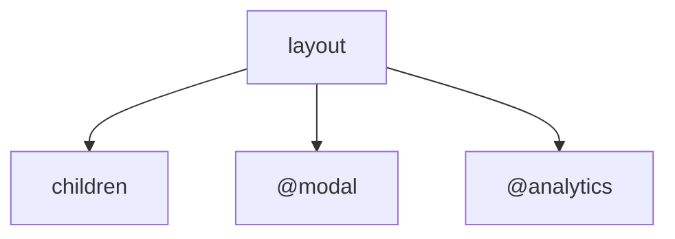

# Parallel Routes

<TopicMeta />

<Prerequisites />

::: tip Published
This page meets the handbook **published** bar: deep explanation, ≥10 common mistakes, and official references. Further engine-level errata welcome via PR.
:::

## Introduction

**Parallel routes** use named slots—folders like `@analytics` and `@team`—so one layout can render multiple `children`-like props at once. Ideal for dashboards and modal patterns with intercepts.

## Why does it exist?

Complex UIs need independent navigation/loading/error for panes that share a URL layout.

## Historical Background

App Router advanced routing feature for multi-slot composition.

## Mental Model

Layout receives props named after slots: `{ children, modal, analytics }`. Each slot is its own segment tree with optional `default.tsx`.

## Internal Workflow

1. Create `@slot` folders with `page.tsx`.
2. Accept slot props in `layout.tsx`.
3. Add `default.tsx` so unmatched slots don’t error on soft nav.
4. Optionally combine with intercepting routes for modals.

## Lifecycle



## Browser Perspective

URL can still be singular while UI is multi-pane.

## JavaScript Engine Perspective

Not applicable.

## React Perspective

Multiple subtrees compose in one layout.

## Next.js Perspective

Each slot can have its own loading/error UI.

## Server Perspective

Not applicable.

## Network Perspective

Not applicable.

## Memory Perspective

Not applicable.

## Performance

Slots can stream independently—good. Don’t mount heavy client panes eagerly if unused.

## Production Example

Admin layout renders `@table` and `@drawer` slots; drawer uses intercept for row details.

## Code Examples

```tsx
// app/layout.tsx
export default function Layout({
  children,
  modal,
}: {
  children: React.ReactNode
  modal: React.ReactNode
}) {
  return (
    <>
      {children}
      {modal}
    </>
  )
}
```

## Diagrams



## Common Mistakes

1. Missing default.tsx causing 404 on soft navigation
2. Forgetting to render the slot prop in layout
3. Slot folders without @ prefix
4. Over-fragmenting simple pages into slots
5. State sharing hacks instead of URL/search params
6. No error boundaries per heavy slot
7. Missing a production edge case for 11-nextjs.parallel-routes (#1)
8. Missing a production edge case for 11-nextjs.parallel-routes (#2)
9. Missing a production edge case for 11-nextjs.parallel-routes (#3)
10. Missing a production edge case for 11-nextjs.parallel-routes (#4)


## Best Practices

- Provide default.tsx for every slot
- Use slots for truly independent panes
- Pair with intercepts for modal UX
- Give slots their own loading UI when slow

## Anti-patterns

- Parallel routes as a general state manager
- Dozen slots for a simple CRUD page
- Ignoring back/forward behavior across slots

## Comparison

| Pattern | Purpose |
| --- | --- |
| Parallel routes | Multi-slot UI |
| Nested layouts | Hierarchical chrome |
| Intercepts | Alternate UI on soft nav |

## Interview Questions

### Easy

**Q:** How do you declare a parallel route slot?

**A:** Create a folder named `@slotName` and render the matching prop in the parent layout.

### Medium

**Q:** Why is default.tsx important?

**A:** When a soft navigation doesn’t match a slot’s active page, Next needs a default to render or recovery fails/404s.

### Hard

**Q:** Design a photo gallery modal with parallel + intercept routes.

**A:** Keep gallery in `children`, put intercepted photo in `@modal` with `(.)` intercept, full photo page for hard loads, and `default.tsx` that returns null for the modal slot.

## Summary

- @slots enable parallel UI panes
- Layout must render each slot prop
- default.tsx prevents soft-nav breakage
- Powerful with intercepting modals

## References

- [Next.js — Parallel Routes](https://nextjs.org/docs/app/building-your-application/routing/parallel-routes)

<RelatedTopics />


Prev: [`11-nextjs.intercepting-routes`](/11-nextjs/intercepting-routes/)
