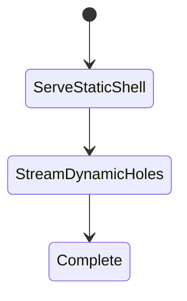
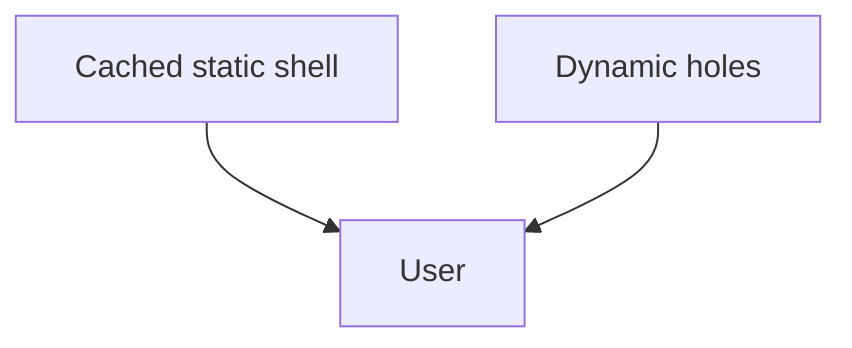

# Partial Prerendering

<TopicMeta />

<Prerequisites />

::: tip Published
This page meets the handbook **published** bar: deep explanation, ≥10 common mistakes, and official references. Further engine-level errata welcome via PR.
:::

## Introduction

**Partial Prerendering (PPR)** combines static and dynamic rendering in one route: a prerendered shell (cached) ships immediately while Suspense-bound dynamic holes stream per request.

## Why does it exist?

Many pages are mostly static with a small personalized part (header cart, recommendations). Full SSR wastes origin; full SSG can’t personalize. PPR aims for both.

## Historical Background

Experimental/evolving in Next 14–15+ as the completion of streaming + static generation ideas.

## Mental Model

Prerender everything outside dynamic Suspense holes. Dynamic APIs inside holes don’t dynamize the whole page.

## Internal Workflow

1. Enable PPR per docs for your version.
2. Structure pages with Suspense around dynamic parts.
3. Keep static shell free of cookies/headers reads.
4. Verify static shell hits CDN/cache; holes stream.

## Lifecycle



## Browser Perspective

Fast first paint of shell; content fills in.

## JavaScript Engine Perspective

Not applicable.

## React Perspective

Suspense boundaries define the holes.

## Next.js Perspective

Flagship rendering strategy alongside App Router caches.

## Server Perspective

Only dynamic holes execute per request.

## Network Perspective

Shell can be edge-cached; holes come from origin.

## Memory Perspective

Not applicable.

## Performance

Excellent LCP for shell-defined LCP elements. Don’t put LCP in a slow dynamic hole.

## Production Example

Marketing page static; cart count and personalized rail suspended as dynamic holes.

## Code Examples

```tsx
import { Suspense } from 'react'
import { CartCount } from './cart-count' // reads cookies()

export default function Page() {
  return (
    <main>
      <h1>Summer sale</h1>
      <Suspense fallback={<span>…</span>}>
        <CartCount />
      </Suspense>
    </main>
  )
}
```

## Diagrams



## Common Mistakes

1. Reading cookies() in the root of the page and dynamizing everything
2. Putting the LCP image inside a slow dynamic hole
3. No Suspense around dynamic APIs
4. Assuming PPR is identical across all Next minor versions without reading flags
5. Fallbacks that cause large CLS
6. Personalizing content that should be static marketing HTML
7. Missing a production edge case for 11-nextjs.partial-prerendering (#1)
8. Missing a production edge case for 11-nextjs.partial-prerendering (#2)
9. Missing a production edge case for 11-nextjs.partial-prerendering (#3)
10. Missing a production edge case for 11-nextjs.partial-prerendering (#4)


## Best Practices

- Define a clear static shell
- Suspense every dynamic API usage
- Keep holes small
- Align with cache tags for hole data

## Anti-patterns

- PPR with a shell that is empty (all dynamic)
- Client-only personalization that could be a small hole
- Disabling caching entirely while expecting PPR wins

## Comparison

| Strategy | Static | Dynamic |
| --- | --- | --- |
| SSG | Whole page | No |
| SSR | No | Whole page |
| PPR | Shell | Holes |

## Interview Questions

### Easy

**Q:** What is Partial Prerendering?

**A:** A model that serves a cached static shell immediately and streams dynamic Suspense holes per request.

### Medium

**Q:** How do you mark the dynamic parts?

**A:** Put components that use dynamic data/APIs inside Suspense boundaries so they become streamable holes.

### Hard

**Q:** How does PPR relate to the Full Route Cache?

**A:** The static shell is cached like static output; dynamic holes bypass that cache and render on demand, then stream into the shell.

## Summary

- PPR = static shell + dynamic holes
- Suspense defines the boundaries
- Keep LCP in the shell when possible
- See also /12-rendering/ppr/

## References

- [Next.js — Partial Prerendering](https://nextjs.org/docs/app/building-your-application/rendering/partial-prerendering)

<RelatedTopics />


Prev: [`11-nextjs.caching`](/11-nextjs/caching/) · Next: [`11-nextjs.data-fetching`](/11-nextjs/data-fetching/)
