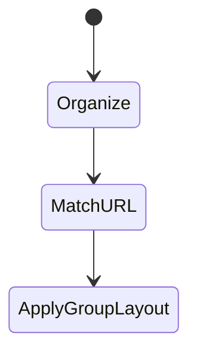
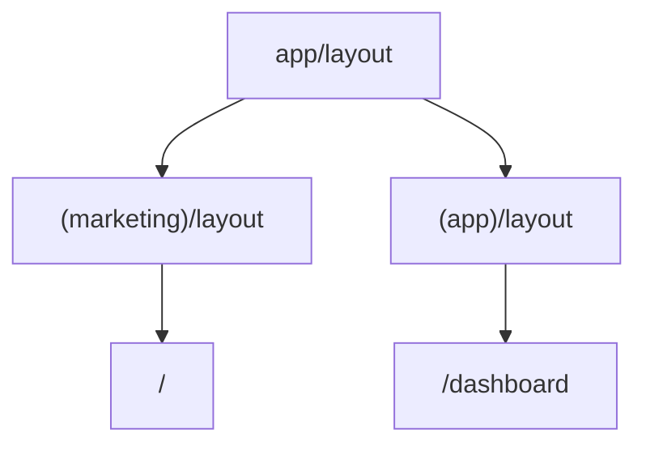

# Route Groups

<TopicMeta />

<Prerequisites />

::: tip Published
This page meets the handbook **published** bar: deep explanation, ≥10 common mistakes, and official references. Further engine-level errata welcome via PR.
:::

## Introduction

**Route groups** use parentheses—`app/(marketing)/page.tsx`—to organize routes and attach different layouts **without** adding a URL segment. `(marketing)` is invisible in the path.

## Why does it exist?

You often need multiple layout trees (marketing vs app shell) under one site without ugly URL prefixes.

## Historical Background

App Router convention for structuring large `app/` trees.

## Mental Model

(name) = organizational folder only. URL ignores it. Useful for multiple root layouts beneath the true root.

## Internal Workflow

1. Create `(group)` folders.
2. Put distinct `layout.tsx` files inside groups.
3. Ensure the real root `app/layout.tsx` still exists.
4. Avoid duplicate conflicting `page.tsx` for the same URL.

## Lifecycle



## Browser Perspective

URLs stay clean.

## JavaScript Engine Perspective

Not applicable.

## React Perspective

Different React layout trees per group.

## Next.js Perspective

Pure routing convention—no runtime API.

## Server Perspective

Not applicable.

## Network Perspective

Not applicable.

## Memory Perspective

Not applicable.

## Performance

Neutral—organizational. Don’t import heavy client code into a group layout shared widely.

## Production Example

`(marketing)` with docs/pricing layouts; `(app)` with authenticated shell—both share root fonts/css.

## Code Examples

```txt
app/
  layout.tsx
  (marketing)/
    layout.tsx
    page.tsx          → /
    pricing/page.tsx  → /pricing
  (app)/
    layout.tsx
    dashboard/page.tsx → /dashboard
```

## Diagrams



## Common Mistakes

1. Expecting (group) to appear in the URL
2. Two pages resolving to the same path
3. Forgetting the true root layout
4. Overusing groups until the tree is unreadable
5. Putting route groups inside public URL segments incorrectly
6. Assuming groups provide security isolation
7. Missing a production edge case for 11-nextjs.route-groups (#1)
8. Missing a production edge case for 11-nextjs.route-groups (#2)
9. Missing a production edge case for 11-nextjs.route-groups (#3)
10. Missing a production edge case for 11-nextjs.route-groups (#4)


## Best Practices

- Name groups by layout intent
- Keep one clear page per URL
- Share root providers sparingly
- Document the folder map for the team

## Anti-patterns

- Groups as a substitute for feature folders in packages
- Deeply nested meaningless groups
- Copy-pasting layouts instead of nesting/groups thoughtfully

## Comparison

| Folder | URL impact |
| --- | --- |
| `shop` | Adds /shop |
| `(shop)` | None |
| `[id]` | Dynamic segment |

## Interview Questions

### Easy

**Q:** What do parentheses mean in an app/ folder name?

**A:** A route group—organization/layout only; not part of the URL.

### Medium

**Q:** How do route groups enable multiple layouts?

**A:** Each group can supply its own layout.tsx while sharing one root layout, so marketing and app shells differ without URL prefixes.

### Hard

**Q:** What happens if two groups define page.tsx for `/`?

**A:** Conflicting routes—Next build fails or is ambiguous. Each URL must map to one page.

## Summary

- (group) folders do not affect URLs
- Great for multiple layout trees
- Avoid conflicting pages for one path
- Still need a root layout

## References

- [Next.js — Route Groups](https://nextjs.org/docs/app/building-your-application/routing/route-groups)

<RelatedTopics />


Prev: [`11-nextjs.data-fetching`](/11-nextjs/data-fetching/) · Next: [`11-nextjs.intercepting-routes`](/11-nextjs/intercepting-routes/)
