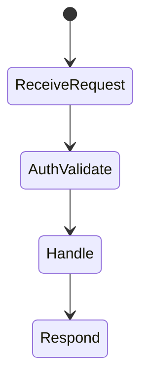
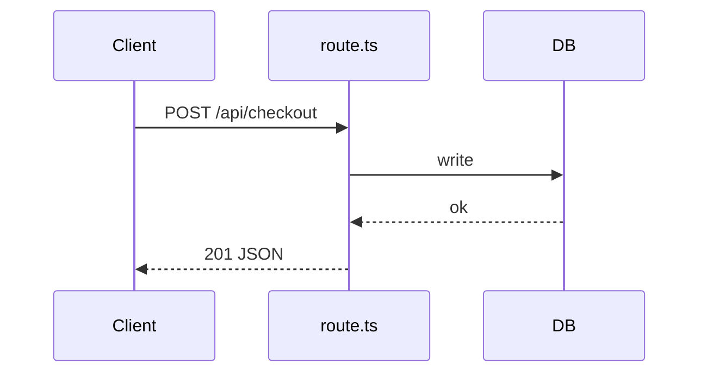

# Route Handlers

<TopicMeta />

<Prerequisites />

::: tip Published
This page meets the handbook **published** bar: deep explanation, ≥10 common mistakes, and official references. Further engine-level errata welcome via PR.
:::

## Introduction

**Route Handlers** are `route.ts` files exporting HTTP method functions (`GET`, `POST`, …). They replace many `pages/api` use cases with Web Request/Response APIs and can run on Node or Edge runtimes.

## Why does it exist?

Browsers and external clients need non-RSC HTTP endpoints: webhooks, token exchange, public JSON APIs, image responses. Route Handlers provide that without a separate server.

## Historical Background

App Router successor to Pages API routes, aligned with Fetch API standards.

## Mental Model

`route.ts` is not a React page—it cannot export a component. It handles raw HTTP. Prefer Server Actions for UI-driven mutations from forms; use Route Handlers for APIs and non-React clients.

## Internal Workflow

1. Create `app/api/.../route.ts`.
2. Export async functions named after methods.
3. Read `request`, cookies, headers; return `Response`/`NextResponse`.
4. Set runtime/`dynamic` as needed; validate auth on every mutating method.

## Lifecycle



## Browser Perspective

Called via fetch from Client Components or external services.

## JavaScript Engine Perspective

Not applicable.

## React Perspective

Not a React tree—don’t expect hooks.

## Next.js Perspective

Same deployment unit as the app; path conflicts if both page.tsx and route.ts exist incorrectly.

## Server Perspective

Runs in the chosen runtime; long work may need background jobs instead of blocking the handler.

## Network Perspective

Status codes, caching headers, CORS, and content types are your responsibility.

## Memory Perspective

Not applicable.

## Performance

Add `Cache-Control` for GET where safe. Avoid mega payloads. Edge for low-latency simple handlers; Node when you need full Node APIs.

## Production Example

Stripe webhook at `app/api/stripe/webhook/route.ts` verifies signatures, enqueues work, returns 200 quickly.

## Code Examples

```ts
import { NextResponse } from 'next/server'

export async function GET() {
  return NextResponse.json({ ok: true }, {
    headers: { 'Cache-Control': 'public, s-maxage=60' },
  })
}

export async function POST(request: Request) {
  const body = await request.json()
  // validate + auth
  return NextResponse.json({ received: body }, { status: 201 })
}
```

## Diagrams



## Common Mistakes

1. Exporting a React component from route.ts
2. Skipping auth on POST/PUT/DELETE
3. Using Route Handlers for every form when Server Actions fit better
4. Blocking on long CPU work in the handler
5. Forgetting CORS for cross-origin browser clients
6. Returning 200 on webhook failures so providers never retry
7. Missing a production edge case for 11-nextjs.route-handlers (#1)
8. Missing a production edge case for 11-nextjs.route-handlers (#2)
9. Missing a production edge case for 11-nextjs.route-handlers (#3)
10. Missing a production edge case for 11-nextjs.route-handlers (#4)


## Best Practices

- Validate input (zod etc.) before side effects
- Prefer Server Actions for same-app form mutations
- Set explicit cache headers on GET
- Keep webhook handlers idempotent

## Anti-patterns

- Business logic only in the handler with no shared domain module
- Exposing admin JSON without authentication
- Giant file uploads without size limits

## Comparison

| | Route Handlers | Server Actions |
| --- | --- | --- |
| Clients | Any HTTP client | React/forms primarily |
| API shape | REST-like methods | POST RPC from UI |
| Use | Webhooks, public API | UI mutations |

## Interview Questions

### Easy

**Q:** What is a Route Handler?

**A:** A `route.ts` module exporting HTTP method functions that return Web Responses for that URL.

### Medium

**Q:** When prefer Server Actions over Route Handlers?

**A:** For mutations initiated from your own UI/forms with progressive enhancement; keep Route Handlers for external clients and webhooks.

### Hard

**Q:** How do you secure a Route Handler used by the browser?

**A:** Authenticate (session/JWT/cookies), CSRF strategy for cookie sessions, validate origin when needed, rate-limit, never trust body fields for authz—check server-side permissions.

## Summary

- route.ts exports HTTP method handlers
- Web Request/Response model
- Great for APIs/webhooks; Actions for UI mutations
- Auth and cache headers are manual

## References

- [Next.js — Route Handlers](https://nextjs.org/docs/app/building-your-application/routing/route-handlers)

<RelatedTopics />


Prev: [`11-nextjs.metadata`](/11-nextjs/metadata/) · Next: [`11-nextjs.middleware`](/11-nextjs/middleware/)
