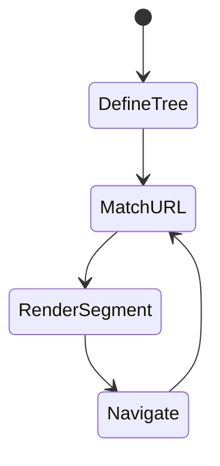

# Routing

<TopicMeta />

<Prerequisites />

::: tip Published
This page meets the handbook **published** bar: deep explanation, ≥10 common mistakes, and official references. Further engine-level errata welcome via PR.
:::

## Introduction

**Routing** in the App Router is folder-driven: `app/shop/[slug]/page.tsx` serves `/shop/:slug`. Dynamic segments, catch-alls, optional catch-alls, route groups, and parallel/intercepting routes extend the model. Navigation uses `next/link` and `next/navigation` hooks.

## Why does it exist?

URLs are the product’s public API. A consistent file convention removes hand-rolled router config and keeps layouts, loading states, and data boundaries aligned with the URL.

## Historical Background

File-based routing came from Next/Nuxt-era conventions. App Router deepened it with nested segments and advanced patterns (parallel slots, intercepts) beyond Pages Router.

## Mental Model

URL path ↔ segment tree. Static segments are folders; `[param]` is dynamic; `[...slug]` catch-all; `[[...slug]]` optional catch-all; `(group)` does not appear in the URL. Only `page.tsx` (or `route.ts`) makes a segment publicly addressable.

## Internal Workflow

1. Define folders under `app/`.
2. Add `page.tsx` for UI routes or `route.ts` for HTTP handlers.
3. Read params via props (`params`, `searchParams` — async in recent Next) in Server Components.
4. Navigate with `<Link href>` or `useRouter().push`.
5. Prefer soft navigation; use `redirect`/`notFound` on the server for control flow.

## Lifecycle



## Browser Perspective

History API updates on client navigations; back/forward restores scroll and cached segments when available.

## JavaScript Engine Perspective

Not applicable.

## React Perspective

Each segment can suspend independently; routing is tightly coupled to Suspense boundaries via loading.tsx.

## Next.js Perspective

Prefetch on Link (viewport) warms the RSC cache for likely next routes.

## Server Perspective

Not applicable.

## Network Perspective

Client navigations request Flight/RSC payloads, not full HTML documents (unless refresh).

## Memory Perspective

Router Cache keeps segment payloads; be aware of stale client cache after mutations (use revalidate/router.refresh).

## Performance

Deep trees with many client boundaries slow navigation. Prefetch helps repeat visits; don’t prefetch authenticated heavy routes indiscriminately.

## Production Example

Ecommerce uses `app/product/[id]/page.tsx` with `generateStaticParams` for top sellers and on-demand dynamic rendering for the long tail.

## Code Examples

```tsx
// app/blog/[slug]/page.tsx
export async function generateStaticParams() {
  return [{ slug: 'hello' }, { slug: 'nextjs' }]
}

export default async function Post({
  params,
}: {
  params: Promise<{ slug: string }>
}) {
  const { slug } = await params
  return <h1>Post {slug}</h1>
}
```

## Diagrams

```mermaid
flowchart TD
  app[app/] --> group["(shop)/"]
  group --> product[product/[id]/page.tsx]
  product --> url["URL /product/123"]
```

## Common Mistakes

1. Forgetting page.tsx so a folder is not a route
2. Using (groups) expecting them to appear in the URL
3. Confusing params with searchParams
4. Client-side redirect loops instead of server redirect()
5. Generating millions of static params without a long-tail strategy
6. Reading params in a Client Component when a Server Component could pass them as props
7. Missing a production edge case for 11-nextjs.routing (#1)
8. Missing a production edge case for 11-nextjs.routing (#2)
9. Missing a production edge case for 11-nextjs.routing (#3)
10. Missing a production edge case for 11-nextjs.routing (#4)


## Best Practices

- Colocate UI with the segment that owns the URL
- Use generateStaticParams for known hot paths
- Validate params and call notFound() for bad IDs
- Keep searchParams typing explicit

## Anti-patterns

- Parallel hand-rolled routers inside Next
- Encoding all state only in opaque query strings without server awareness
- Catch-all routes that swallow unrelated URLs

## Comparison

| Pattern | URL effect | Use |
| --- | --- | --- |
| `[id]` | Required segment | Resource pages |
| `[...slug]` | One or more | Docs trees |
| `[[...slug]]` | Zero or more | Optional CMS paths |
| `(group)` | None | Layout organization |

## Interview Questions

### Easy

**Q:** How do you create a dynamic route in App Router?

**A:** Create a folder like `app/users/[id]/page.tsx`; `id` is available via the page `params` prop.

### Medium

**Q:** What is a route group?

**A:** A folder named `(name)` that organizes layouts/routes without adding a URL segment—e.g. different roots for marketing vs app shells.

### Hard

**Q:** How does generateStaticParams interact with dynamicParams?

**A:** generateStaticParams prebuilds listed paths; `dynamicParams` (default true) allows non-listed paths to render on demand, or false to 404 them. Choose based on whether the long tail must exist.

## Summary

- Folders + page.tsx define addressable routes
- Dynamic and catch-all segments map to params
- Route groups organize without URL noise
- Link prefetch warms navigations

## References

- [Next.js — Routing Fundamentals](https://nextjs.org/docs/app/building-your-application/routing)
- [Next.js — Dynamic Routes](https://nextjs.org/docs/app/api-reference/file-conventions/dynamic-routes)

<RelatedTopics />


Prev: [`11-nextjs.pages-router`](/11-nextjs/pages-router/) · Next: [`11-nextjs.layouts`](/11-nextjs/layouts/)
