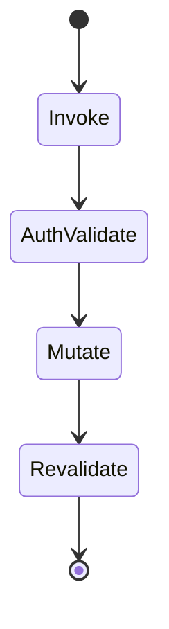
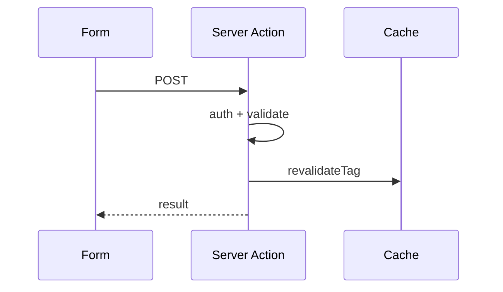

# Server Actions

<TopicMeta />

<Prerequisites />

::: tip Published
This page meets the handbook **published** bar: deep explanation, ≥10 common mistakes, and official references. Further engine-level errata welcome via PR.
:::

## Introduction

**Server Actions** are async functions marked with `"use server"` that run on the server and can be invoked from forms, Client Components, or Server Components. They streamline mutations without hand-written Route Handlers for UI-driven posts.

## Why does it exist?

Classic REST endpoints + client fetch for every form is boilerplate-heavy. Actions provide progressive enhancement (forms work before JS) and colocate mutation logic with UI.

## Historical Background

Stabilized across Next 14+ as the App Router mutation model alongside RSC.

## Mental Model

An Action is a server function with an encrypted/closed-over reference the client can POST to. Always validate inputs and auth—**never trust the client**.

## Internal Workflow

1. Mark file or function with "use server".
2. Bind to `<form action={fn}>` or call from client.
3. Mutate data; `revalidatePath`/`revalidateTag`/`redirect`.
4. Return serializable results/errors.

## Lifecycle



## Browser Perspective

Forms can submit without client JS; enhancements hydrate later.

## JavaScript Engine Perspective

Not applicable.

## React Perspective

`useFormStatus` / `useActionState` pair well for pending UI.

## Next.js Perspective

Integrates with caching invalidation helpers and form progressive enhancement.

## Server Perspective

Runs on server runtime; treat like an authenticated endpoint.

## Network Perspective

POST requests; be mindful of CSRF/cookie semantics for cookie sessions.

## Memory Perspective

Not applicable.

## Performance

Avoid huge payloads; revalidate narrowly with tags. Don’t hide expensive work without UX pending states.

## Production Example

Create-comment action verifies session, inserts row, `revalidateTag('comments')`, and returns field errors for the form.

## Code Examples

```ts
'use server'

import { revalidatePath } from 'next/cache'

export async function createTodo(formData: FormData) {
  const title = String(formData.get('title') ?? '')
  if (!title) throw new Error('Title required')
  await db.todo.create({ data: { title } })
  revalidatePath('/todos')
}
```

```tsx
import { createTodo } from './actions'

export function TodoForm() {
  return (
    <form action={createTodo}>
      <input name="title" />
      <button type="submit">Add</button>
    </form>
  )
}
```

## Diagrams



## Common Mistakes

1. No authz checks inside the action
2. Trusting FormData without validation
3. Revalidating the entire site path tree unnecessarily
4. Returning non-serializable values
5. Using actions for public machine APIs (prefer Route Handlers)
6. Swallowing errors so the UI hangs pending forever
7. Missing a production edge case for 11-nextjs.server-actions (#1)
8. Missing a production edge case for 11-nextjs.server-actions (#2)
9. Missing a production edge case for 11-nextjs.server-actions (#3)
10. Missing a production edge case for 11-nextjs.server-actions (#4)


## Best Practices

- Validate with a schema library
- Authorize every mutation
- Revalidate by tag for precision
- Use progressive enhancement forms

## Anti-patterns

- Client fetch wrappers around actions that disable progressive enhancement
- Business logic only in the client before calling a dumb action
- Giant multipurpose actions without input discrimination

## Comparison

| | Server Actions | Route Handlers |
| --- | --- | --- |
| UI forms | Excellent | Manual |
| External webhooks | Poor fit | Excellent |
| Progressive enhancement | Yes | DIY |

## Interview Questions

### Easy

**Q:** What is a Server Action?

**A:** A server-running async function marked `"use server"` that UI can call (often via forms) to perform mutations.

### Medium

**Q:** How do actions update cached UI?

**A:** After mutation, call `revalidatePath` or `revalidateTag` so the Data/Full Route caches refresh on next read.

### Hard

**Q:** What security model should you assume?

**A:** Treat every action like a public POST endpoint: authenticate, authorize, validate, rate-limit; closures don’t make arguments safe.

## Summary

- Server Actions are server mutations callable from UI
- Validate and authorize every call
- Revalidate caches after writes
- Prefer Route Handlers for non-UI HTTP clients

## References

- [Next.js — Server Actions](https://nextjs.org/docs/app/building-your-application/data-fetching/server-actions-and-mutations)

<RelatedTopics />


Prev: [`11-nextjs.client-components`](/11-nextjs/client-components/) · Next: [`11-nextjs.streaming`](/11-nextjs/streaming/)
