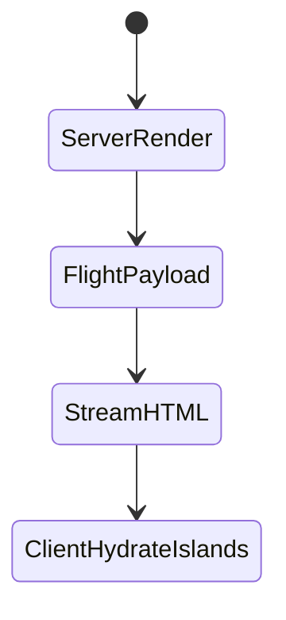
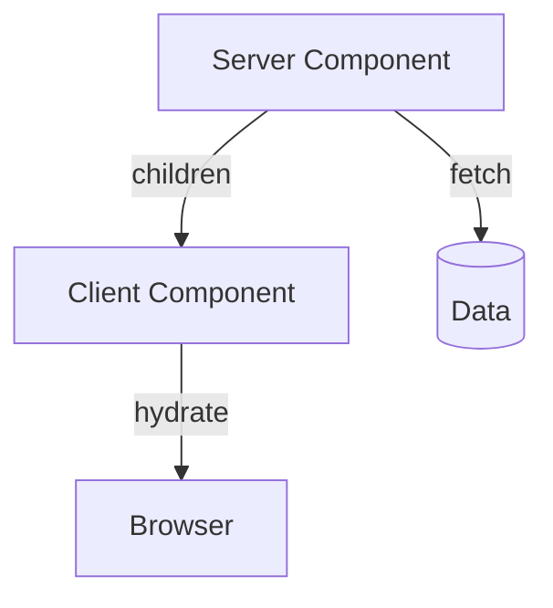

# Server Components

<TopicMeta />

<Prerequisites />

::: tip Published
This page meets the handbook **published** bar: deep explanation, ≥10 common mistakes, and official references. Further engine-level errata welcome via PR.
:::

## Introduction

**Server Components** (RSC) are the default in `app/`. They render on the server (or at build time), can be `async` and fetch data directly, and **do not** ship their code to the browser. They may import Client Components as children but cannot use hooks/state/browser APIs.

## Why does it exist?

Most UI is not interactive. RSC keeps data access and markup on the server, shrinking JS bundles and sealing secrets away from the client.

## Historical Background

React Server Components proposal → Next App Router as the flagship production host. Flight protocol serializes the component output.

## Mental Model

Server Components = compute UI on the server. Client Components = islands of interactivity. The boundary is the `"use client"` file; everything it imports becomes part of the client graph.

## Internal Workflow

1. Write async Server Component pages/layouts.
2. Fetch with `fetch`/ORM on server.
3. Pass serializable props into Client children.
4. Never import server-only modules into client files.

## Lifecycle



## Browser Perspective

Receives HTML + references to client bundles for islands only.

## JavaScript Engine Perspective

Not applicable.

## React Perspective

RSC is a React rendering model, not a Next-only gimmick. Composition rules: server can render client children; client cannot import server components.

## Next.js Perspective

Integrates caching, routing, and streaming around RSC.

## Server Perspective

CPU + I/O bound; streaming hides waterfalls when structured well.

## Network Perspective

Flight payload size matters—don’t serialize huge props.

## Memory Perspective

Server memory per request; avoid retaining huge objects across requests in globals.

## Performance

Primary win is JS reduction. Watch server TTFB and Flight size. Parallelize fetches; use Suspense boundaries.

## Production Example

Product page fetches CMS + pricing on server, streams reviews in a Suspense hole, and hydrates only the add-to-cart Client button.

## Code Examples

```tsx
// app/product/[id]/page.tsx — Server Component
import { AddToCart } from './add-to-cart' // client child

export default async function ProductPage({
  params,
}: {
  params: Promise<{ id: string }>
}) {
  const { id } = await params
  const product = await db.product.findUnique({ where: { id } })
  return (
    <div>
      <h1>{product!.name}</h1>
      <AddToCart id={product!.id} />
    </div>
  )
}
```

## Diagrams



## Common Mistakes

1. Passing non-serializable props (functions, class instances) to Client Components
2. Marking a leaf interactive and accidentally pulling a huge server module graph into client via bad imports
3. Using useState/useEffect in a Server Component
4. Fetching in a Client Component what RSC could have streamed
5. Ignoring that server code still needs authz checks
6. Giant nested awaits creating waterfalls
7. Passing non-serializable props from Server to Client Components
8. Marking entire trees `"use client"` and losing RSC benefits
9. Fetching in client components secrets that belong on the server
10. Ignoring cache semantics of `fetch` in App Router


## Best Practices

- Keep Client Components small and at the edges
- Use server-only package for privileged modules
- Suspense-split slow parts
- Serialize DTOs consciously

## Anti-patterns

- `"use client"` on every file
- Deep prop drilling of server data through many client wrappers
- Calling secrets-bearing APIs from the client “because it’s easier”

## Comparison

| | Server Component | Client Component |
| --- | --- | --- |
| Hooks | No | Yes |
| Bundle | Not shipped | Shipped |
| Data fetch | Direct | via API/props |
| Secrets | OK | Never |

## Interview Questions

### Easy

**Q:** Are App Router components Server or Client by default?

**A:** Server Components by default; add `"use client"` to opt into Client Components.

### Medium

**Q:** Can a Client Component import a Server Component?

**A:** No. Pass Server Components as `children` from a parent Server Component instead.

### Hard

**Q:** What is the Flight protocol doing?

**A:** It serializes the RSC tree into a streamable payload the client router can progressively reconstruct, wiring placeholders to client component references.

## Summary

- RSC default shrinks client JS and keeps secrets server-side
- Async server components fetch data directly
- Client islands hydrate only where needed
- Import direction defines the boundary

## References

- [Next.js — Server Components](https://nextjs.org/docs/app/building-your-application/rendering/server-components)
- [React — Server Components](https://react.dev/reference/rsc/server-components)

<RelatedTopics />


Prev: [`11-nextjs.fonts`](/11-nextjs/fonts/) · Next: [`11-nextjs.client-components`](/11-nextjs/client-components/)
