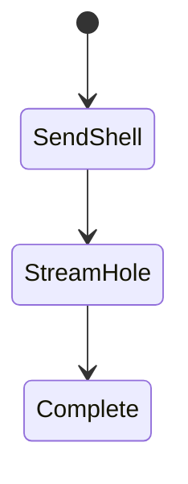
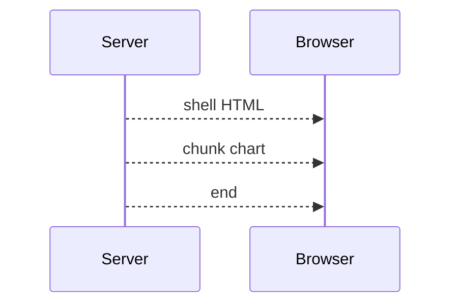

# Streaming

<TopicMeta />

<Prerequisites />

::: tip Published
This page meets the handbook **published** bar: deep explanation, ≥10 common mistakes, and official references. Further engine-level errata welcome via PR.
:::

## Introduction

**Streaming** lets Next send the document and RSC payload in chunks as Suspense boundaries resolve. Users see shells and ready segments early instead of waiting for the slowest fetch.

## Why does it exist?

TTFB and “time to first meaningful paint” suffer when servers buffer full pages. Streaming overlaps server work with client download/parse.

## Historical Background

React 18 streaming SSR + Suspense for data; App Router made it the default path with loading.tsx.

## Mental Model

Each Suspense boundary is a hole that can stream later. Static shells first; dynamic holes follow.

## Internal Workflow

1. Wrap slow async subtrees in Suspense (or use loading.tsx).
2. Ensure the parent doesn’t await the slow child before returning.
3. Watch the network waterfall: chunked HTML/Flight.
4. Design fallbacks that preserve layout.

## Lifecycle



## Browser Perspective

Parses incrementally; can paint early.

## JavaScript Engine Perspective

Not applicable.

## React Perspective

Suspense orchestrates reveal order.

## Next.js Perspective

PPR builds on streaming + static shells.

## Server Perspective

Hold connections open longer; watch timeouts.

## Network Perspective

Transfer-Encoding chunked / streaming responses; proxies must not buffer forever.

## Memory Perspective

Not applicable.

## Performance

Improves perceived performance; may not change total work. Avoid mega sequential awaits above Suspense.

## Production Example

Dashboard streams KPI cards independently; nav shell paints immediately via layout + loading fallbacks.

## Code Examples

```tsx
import { Suspense } from 'react'

export default function Page() {
  return (
    <>
      <h1>Dashboard</h1>
      <Suspense fallback={<p>Loading chart…</p>}>
        <Chart />
      </Suspense>
    </>
  )
}

async function Chart() {
  const data = await getSlowChart()
  return <pre>{JSON.stringify(data)}</pre>
}
```

## Diagrams



## Common Mistakes

1. Awaiting all data in the page before returning JSX (disables streaming benefits)
2. Fallback that shifts layout (CLS)
3. Proxy buffering that defeats chunked responses
4. Too many tiny boundaries thrashing
5. Assuming streaming fixes a multi-second DB query (it only hides it)
6. Blocking the root layout on slow auth when a lighter gate exists
7. Missing a production edge case for 11-nextjs.streaming (#1)
8. Missing a production edge case for 11-nextjs.streaming (#2)
9. Missing a production edge case for 11-nextjs.streaming (#3)
10. Missing a production edge case for 11-nextjs.streaming (#4)


## Best Practices

- Suspense around independently slow parts
- Stable skeleton dimensions
- Combine with caching for hot data
- Verify streaming in production-like proxies

## Anti-patterns

- Single Suspense around the entire page only
- Client spinners instead of server streaming
- Nested waterfalls inside each streamed child

## Comparison

| | Buffered SSR | Streaming SSR |
| --- | --- | --- |
| First byte | After all work | After shell ready |
| Complexity | Lower | Boundaries needed |
| UX on slow data | Blank wait | Progressive |

## Interview Questions

### Easy

**Q:** What enables streaming UI in App Router?

**A:** React Suspense boundaries (including `loading.tsx`) letting Next send HTML/RSC in chunks.

### Medium

**Q:** Why might streaming not help TTFB?

**A:** If the server still awaits critical data before sending the first byte (work above all Suspense), first byte stays late.

### Hard

**Q:** How does streaming interact with CDNs?

**A:** Many CDNs/cache layers buffer or only cache complete responses; dynamic streaming routes often bypass full-page CDN cache—use PPR/static shells where you need edge caching.

## Summary

- Streaming sends UI progressively via Suspense
- Don’t await slow children before returning shell
- Fallbacks should protect CLS
- Related: PPR and loading UI

## References

- [Next.js — Streaming](https://nextjs.org/docs/app/building-your-application/routing/loading-ui-and-streaming#streaming-with-suspense)
- [React — Suspense](https://react.dev/reference/react/Suspense)

<RelatedTopics />


Prev: [`11-nextjs.server-actions`](/11-nextjs/server-actions/) · Next: [`11-nextjs.caching`](/11-nextjs/caching/)
