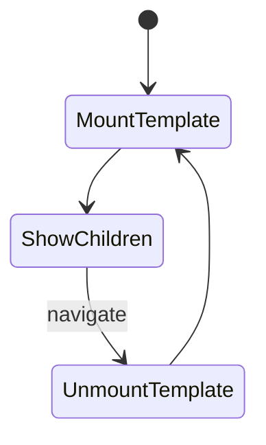
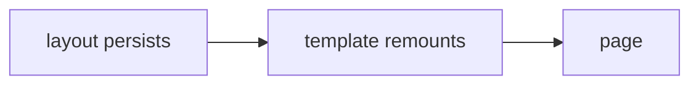

# Templates

<TopicMeta />

<Prerequisites />

::: tip Published
This page meets the handbook **published** bar: deep explanation, ≥10 common mistakes, and official references. Further engine-level errata welcome via PR.
:::

## Introduction

A **template** (`template.tsx`) is structurally like a layout—it wraps `children`—but Next **remounts** it on navigation, giving you a fresh React state and effects each time. Use it for enter animations or reset semantics layouts cannot provide.

## Why does it exist?

Layouts intentionally preserve state. Sometimes you need the opposite: CSS enter transitions, resetting a wizard, or remounting a keyed client widget per page view.

## Historical Background

Introduced with App Router as the remounting counterpart to persistent layouts.

## Mental Model

Layout = durable. Template = new instance per navigation. You can use both: layout outside, template inside (or vice versa depending on structure).

## Internal Workflow

1. Add `template.tsx` beside or beneath a layout.
2. Render `{children}` with optional transition wrappers.
3. On child navigation, React unmounts/remounts the template instance.

## Lifecycle



## Browser Perspective

May cause more DOM teardown/create—keep templates light.

## JavaScript Engine Perspective

Not applicable.

## React Perspective

Remount re-runs effects and resets `useState`. Useful with animation libraries that expect mount lifecycle.

## Next.js Perspective

Templates do not replace layouts for `<html>`/shared chrome; they complement them.

## Server Perspective

Not applicable.

## Network Perspective

Not applicable.

## Memory Perspective

Old template state is discarded—good for preventing stale client caches in that subtree.

## Performance

Remounting has a cost; don’t wrap huge trees in templates for cosmetic reasons. Prefer CSS on small wrappers.

## Production Example

Docs site wraps article pages in a template that applies a fade-in class on mount without resetting the sidebar layout.

## Code Examples

```tsx
// app/dashboard/template.tsx
export default function Template({ children }: { children: React.ReactNode }) {
  return <div className="animate-in fade-in duration-200">{children}</div>
}
```

## Diagrams



## Common Mistakes

1. Using template when you actually wanted persistent layout state
2. Putting auth providers only in a template so they reset constantly
3. Heavy data fetching inside templates
4. Confusing template with React `<Suspense>` fallbacks
5. Expecting template to change the URL structure
6. Animating with templates that remount the entire dashboard including charts unnecessarily
7. Missing a production edge case for 11-nextjs.templates (#1)
8. Missing a production edge case for 11-nextjs.templates (#2)
9. Missing a production edge case for 11-nextjs.templates (#3)
10. Missing a production edge case for 11-nextjs.templates (#4)


## Best Practices

- Keep templates thin—animation wrappers, not data shells
- Combine with layout: layout for chrome, template for page transitions
- Prefer CSS transitions that do not require remount when possible
- Document remount intent for future maintainers

## Anti-patterns

- Template as a substitute for key={pathname} everywhere
- Resetting forms via full template remount instead of explicit form reset
- Nesting many templates that thrash the DOM

## Comparison

| | Layout | Template |
| --- | --- | --- |
| State | Preserved | Reset |
| Effects | Persist | Re-run |
| Use | Shells | Transitions / reset |

## Interview Questions

### Easy

**Q:** How does template.tsx differ from layout.tsx?

**A:** Both wrap children, but templates remount on navigation while layouts persist.

### Medium

**Q:** Give a valid use case for templates.

**A:** Page enter animations or ensuring a client widget remounts with clean state on each navigation while the outer layout stays mounted.

### Hard

**Q:** Could you replace templates with key={pathname} on a layout child?

**A:** Often yes for remount semantics; `template.tsx` is the framework convention and composes cleanly with the segment model. Prefer the convention for clarity unless you need custom keying rules.

## Summary

- Templates wrap children but remount on navigate
- Ideal for transitions and state reset
- Keep them light
- Layouts remain the right tool for durable chrome

## References

- [Next.js — Templates](https://nextjs.org/docs/app/building-your-application/routing/pages-and-layouts#templates)

<RelatedTopics />


Prev: [`11-nextjs.nested-layouts`](/11-nextjs/nested-layouts/) · Next: [`11-nextjs.loading-ui`](/11-nextjs/loading-ui/)
