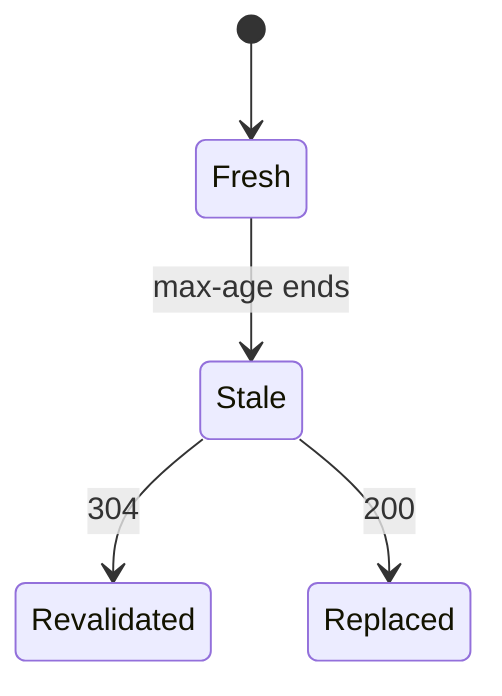
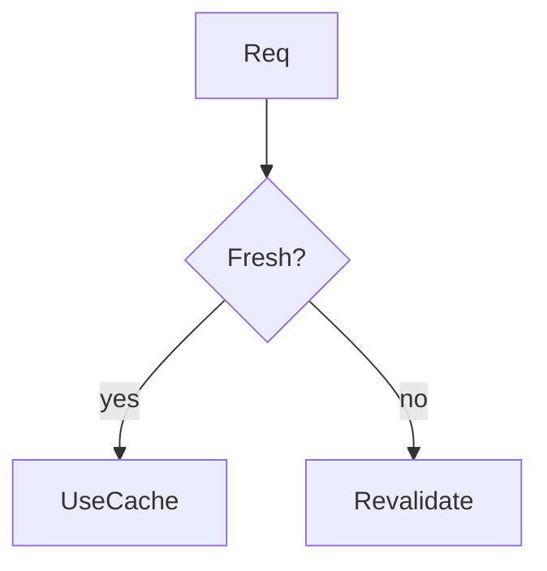

# Browser Cache

<TopicMeta />

<Prerequisites />

::: tip Published
This page meets the handbook **published** bar: deep explanation, ≥10 common mistakes, and official references. Further engine-level errata welcome via PR.
:::

## Introduction

The **browser cache** stores HTTP responses on the client so repeat visits skip network (or use conditional requests). It is governed primarily by `Cache-Control`, validators (`ETag`/`Last-Modified`), and heuristic rules.

## Why does it exist?

Repeat views dominate real usage. Without browser caching, every navigation redownloads assets and tanks performance.

## Historical Background

HTTP/1.0 heuristics → modern Cache-Control spec sophistication.

## Mental Model

Fresh → serve instantly; stale → revalidate or refetch based on headers. `no-store` bypasses; `immutable` never revalidates before expiry.

## Internal Workflow

1. Server sets headers.
2. Browser stores response.
3. Later request uses cache algorithm.
4. DevTools Network “disable cache” only for debugging.

## Lifecycle



## Browser Perspective

Disk/memory caches; partitioned in privacy scenarios.

## JavaScript Engine Perspective

Not applicable.

## React Perspective

Not applicable.

## Next.js Perspective

Hashed `_next/static` assets are long-cache friendly.

## Server Perspective

Not applicable.

## Network Perspective

304 responses save bytes.

## Memory Perspective

Large assets consume disk cache quota.

## Performance

Massive win for repeat LCP/INP. Don’t fight the cache with random query strings.

## Production Example

CI emits content-hashed assets; service workers may add another cache layer for PWAs.

## Code Examples

```http
Cache-Control: public, max-age=31536000, immutable
ETag: "abc123"
```

## Diagrams



## Common Mistakes

1. Disable cache left on while “performance testing”
2. Cache-busting with random query params always
3. no-cache vs no-store confusion
4. Caching authenticated JSON in shared ways incorrectly
5. Not setting validators for revalidation
6. Expecting localStorage to act as HTTP cache
7. Missing a production edge case for 12-rendering.browser-cache (#1)
8. Missing a production edge case for 12-rendering.browser-cache (#2)
9. Missing a production edge case for 12-rendering.browser-cache (#3)
10. Missing a production edge case for 12-rendering.browser-cache (#4)


## Best Practices

- Correct Cache-Control per resource class
- Hash static assets
- Use ETag/Last-Modified for HTML when appropriate
- Test with cache enabled for real UX

## Anti-patterns

- Global no-store
- Mega max-age on HTML without versioning strategy
- Manual cache hacks in JS duplicating HTTP

## Comparison

| Directive | Meaning (simplified) |
| --- | --- |
| max-age | Fresh lifetime |
| no-cache | Must revalidate before use |
| no-store | Do not store |
| immutable | Won’t change before expiry |

## Interview Questions

### Easy

**Q:** What controls browser HTTP caching?

**A:** Primarily `Cache-Control` plus validators like `ETag`/`Last-Modified`.

### Medium

**Q:** Difference between no-cache and no-store?

**A:** `no-cache` allows storage but requires revalidation before reuse; `no-store` forbids storing the response.

### Hard

**Q:** How do hashed assets + HTML caching interact?

**A:** HTML can be short-lived pointing at long-lived hashed URLs; when HTML updates, it references new hashes, so clients fetch new assets without needing to purge old immutable files.

## Summary

- Browser cache follows HTTP headers
- Fresh vs revalidate vs no-store
- Hash static files for immutable caching
- Test with cache enabled

## References

- [MDN — HTTP caching](https://developer.mozilla.org/en-US/docs/Web/HTTP/Caching)
- [web.dev — HTTP cache](https://web.dev/articles/http-cache)

<RelatedTopics />


Prev: [`12-rendering.cdn`](/12-rendering/cdn/) · Next: [`12-rendering.cache-control`](/12-rendering/cache-control/)
