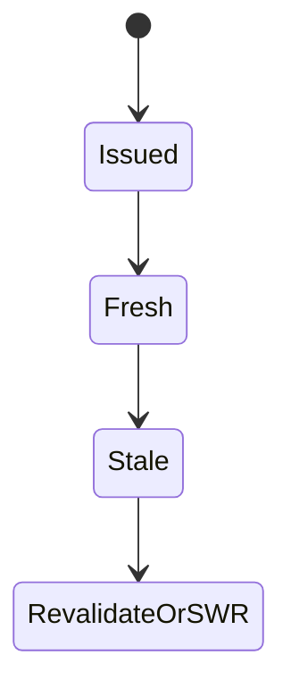
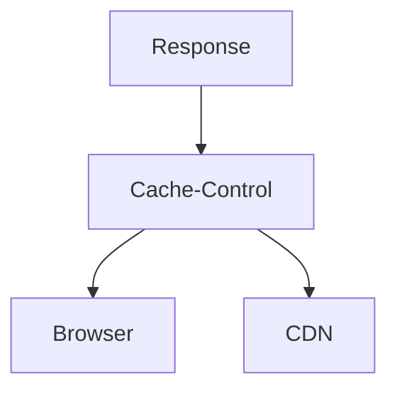

# Cache-Control

<TopicMeta />

<Prerequisites />

::: tip Published
This page meets the handbook **published** bar: deep explanation, ≥10 common mistakes, and official references. Further engine-level errata welcome via PR.
:::

## Introduction

**Cache-Control** is the primary HTTP header for caching policy: `max-age`, `s-maxage`, `no-store`, `private`, `public`, `stale-while-revalidate`, and more. It steers browsers and CDNs.

## Why does it exist?

Without explicit policy, intermediaries guess wrong. Cache-Control makes intent machine-readable.

## Historical Background

Superseded many Expires-centric patterns; continually extended (SWR, stale-if-error).

## Mental Model

Speak to two audiences: browsers (`max-age`, `private`) and shared caches (`s-maxage`, `public`).

## Internal Workflow

1. Classify response (public asset, private HTML, API).
2. Choose directives.
3. Add validators.
4. Verify via DevTools/CDN logs.

## Lifecycle



## Browser Perspective

Respects private/no-store carefully.

## JavaScript Engine Perspective

Not applicable.

## React Perspective

Not applicable.

## Next.js Perspective

Framework/route handlers should set headers intentionally for Route Handlers and static assets.

## Server Perspective

Defaults may be too conservative or too open—set explicitly.

## Network Perspective

Every cache hop interprets directives.

## Memory Perspective

Not applicable.

## Performance

Right headers = free speed. Wrong headers = bugs or missed cache hits.

## Production Example

`public, s-maxage=60, stale-while-revalidate=300` for a public marketing JSON feed.

## Code Examples

```ts
return new Response(body, {
  headers: {
    'Cache-Control': 'public, s-maxage=60, stale-while-revalidate=300',
  },
})
```

## Diagrams



## Common Mistakes

1. Using private by accident on public assets
2. Confusing max-age with s-maxage
3. Omitting Cache-Control so heuristics apply
4. no-cache thinking it means no-store
5. Long max-age on mutable HTML without versioning
6. Contradictory headers (Pragma/Expires fights)
7. Missing a production edge case for 12-rendering.cache-control (#1)
8. Missing a production edge case for 12-rendering.cache-control (#2)
9. Missing a production edge case for 12-rendering.cache-control (#3)
10. Missing a production edge case for 12-rendering.cache-control (#4)


## Best Practices

- Be explicit on all important responses
- Use s-maxage for CDN-specific freshness
- Pair with ETag when revalidating
- Document policies per surface

## Anti-patterns

- Copy-pasting one Cache-Control for all routes
- Disabling cache to fix a bug and leaving it forever
- Relying only on meta http-equiv

## Comparison

| Directive | Audience |
| --- | --- |
| max-age | Browser & shared (unless overridden) |
| s-maxage | Shared caches/CDN |
| private | Browser only |
| public | Explicitly shareable |

## Interview Questions

### Easy

**Q:** What is Cache-Control for?

**A:** Declaring how browsers and shared caches may store and reuse a response.

### Medium

**Q:** Why use s-maxage?

**A:** To set a different freshness lifetime for CDNs than for browsers.

### Hard

**Q:** Design headers for a personalized dashboard HTML page.

**A:** Typically `Cache-Control: private, no-store` or short private max-age; never public CDN caching without a per-user cache key strategy.

## Summary

- Cache-Control declares freshness/reuse policy
- Distinguish browser vs CDN directives
- Be explicit per resource class
- Pair with validators

## References

- [MDN — Cache-Control](https://developer.mozilla.org/en-US/docs/Web/HTTP/Headers/Cache-Control)
- [RFC 9111 — HTTP Caching](https://www.rfc-editor.org/rfc/rfc9111)

<RelatedTopics />


Prev: [`12-rendering.browser-cache`](/12-rendering/browser-cache/) · Next: [`12-rendering.etag`](/12-rendering/etag/)
