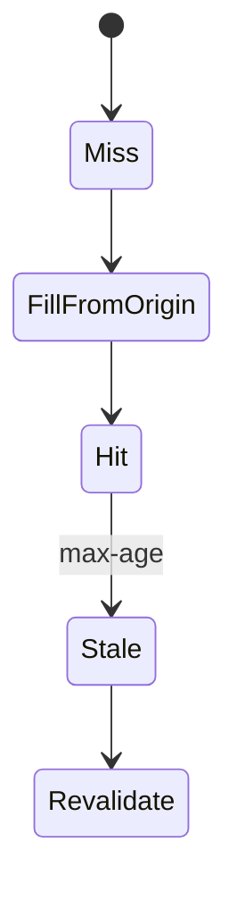

# CDN

<TopicMeta />

<Prerequisites />

::: tip Published
This page meets the handbook **published** bar: deep explanation, ≥10 common mistakes, and official references. Further engine-level errata welcome via PR.
:::

## Introduction

A **CDN** is a distributed cache/proxy network that serves static assets (and sometimes HTML/API responses) from locations close to users, shielding origin servers.

## Why does it exist?

Origins can’t be everywhere. CDNs buy you latency, bandwidth offload, and DDoS absorption for cacheable content.

## Historical Background

From Akamai-era static acceleration to modern programmable edges.

## Mental Model

Client → nearby PoP → (hit) response; (miss) origin → populate cache. Headers decide cacheability.

## Internal Workflow

1. Put cacheable assets on CDN URLs.
2. Set Cache-Control/CDN directives.
3. Version filenames for immutable assets.
4. Purge/invalidate on release when needed.

## Lifecycle



## Browser Perspective

Faster JS/CSS/image fetch.

## JavaScript Engine Perspective

Not applicable.

## React Perspective

Not applicable.

## Next.js Perspective

Static/_next assets and static routes benefit heavily.

## Server Perspective

Origin sees fewer requests.

## Network Perspective

Fewer origin hops; TLS at PoP.

## Memory Perspective

Not applicable.

## Performance

Critical for LCP asset delivery. Misconfigured caching causes either staleness or origin overload.

## Production Example

Immutable hashed bundles `Cache-Control: public, max-age=31536000, immutable`; HTML carefully tuned.

## Code Examples

```http
Cache-Control: public, max-age=31536000, immutable
```

## Diagrams


## Common Mistakes

1. Caching personalized HTML publicly
2. No fingerprinting → short max-age on all JS
3. Forgetting purge on emergency hotfix
4. Mixing query-string cache variants poorly
5. Assuming CDN fixes unoptimized images
6. Origin gzip only while CDN compresses differently without testing
7. Missing a production edge case for 12-rendering.cdn (#1)
8. Missing a production edge case for 12-rendering.cdn (#2)
9. Missing a production edge case for 12-rendering.cdn (#3)
10. Missing a production edge case for 12-rendering.cdn (#4)


## Best Practices

- Immutable cache for hashed assets
- Separate HTML vs asset policies
- Purge APIs in release pipelines when required
- Log cache hit ratios

## Anti-patterns

- no-store on everything
- One global TTL for HTML and images
- Bypassing CDN in production “for debugging” permanently

## Comparison

| Content | CDN strategy |
| --- | --- |
| Hashed JS/CSS | Long immutable |
| HTML | Short/SWR/private |
| Personalized | Bypass or vary carefully |

## Interview Questions

### Easy

**Q:** What does a CDN do?

**A:** Caches and serves content from edge locations near users to reduce latency and origin load.

### Medium

**Q:** Why fingerprint filenames?

**A:** So you can cache forever (`immutable`) and deploy new hashes without serving stale JS under the same URL.

### Hard

**Q:** How do you CDN-cache HTML safely?

**A:** Only cache public identical HTML; use Vary carefully; prefer SSG/PPR shells; never cache private user pages at shared PoPs without correct keys.

## Summary

- CDNs cache near users
- Immutable hashed assets
- Be careful with HTML/personalization
- Measure hit ratio

## References

- [MDN — CDN](https://developer.mozilla.org/en-US/docs/Glossary/CDN)
- [web.dev — HTTP caching](https://web.dev/articles/http-cache)

<RelatedTopics />


Prev: [`12-rendering.edge-rendering`](/12-rendering/edge-rendering/) · Next: [`12-rendering.browser-cache`](/12-rendering/browser-cache/)
