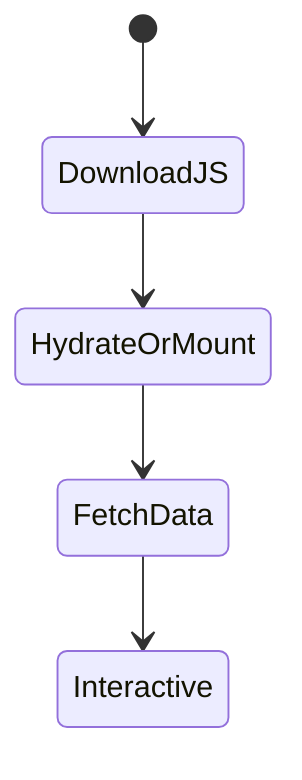
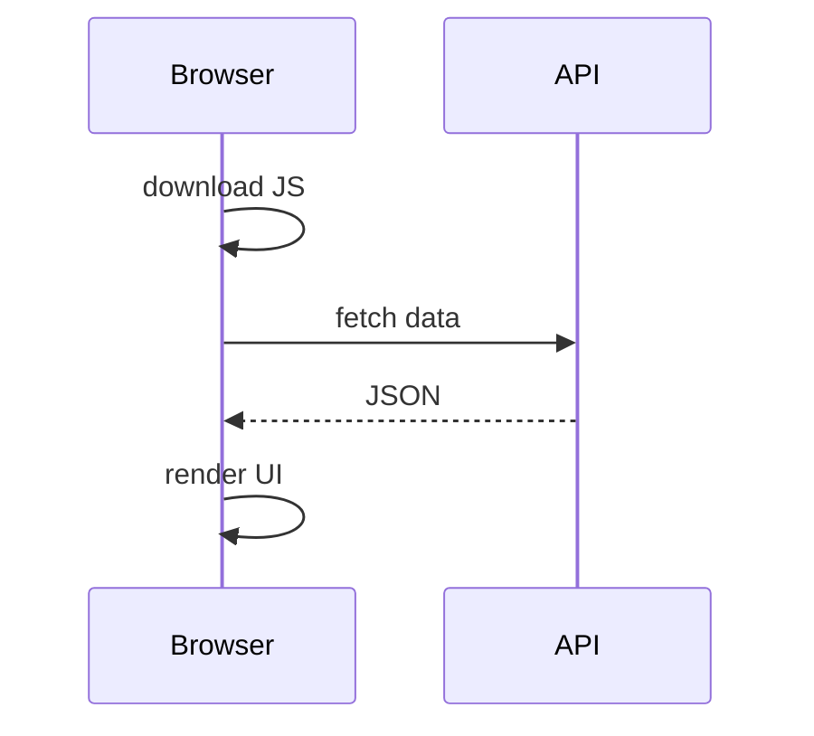

# Client-Side Rendering

<TopicMeta />

<Prerequisites />

::: tip Published
This page meets the handbook **published** bar: deep explanation, ≥10 common mistakes, and official references. Further engine-level errata welcome via PR.
:::

## Introduction

**Client-Side Rendering (CSR)** delivers a minimal HTML shell and builds the UI in the browser with JavaScript—typically after downloading a SPA bundle and fetching data. First paint of real content waits on JS + network.

## Why does it exist?

CSR maximizes interactivity and can simplify hosting (static files + API). It exists because rich clients outgrew multi-page apps—but it costs SEO and startup performance if overused.

## Historical Background

Dominant SPA era (Angular/React/Vue) defaulted to CSR. Frameworks later reintroduced SSR/SSG for CWV and SEO.

## Mental Model

HTML is a bootloader; React (etc.) owns the DOM after JS runs. Great for app-like tools; weak for content-first first paint.

## Internal Workflow

1. Serve shell HTML + JS bundles.
2. Browser downloads/parses/executes JS.
3. App mounts, fetches data, renders UI.
4. Further navigations are client-side.

## Lifecycle



## Browser Perspective

Main thread busy with parse/compile/exec before content; watch long tasks.

## JavaScript Engine Perspective

Not applicable.

## React Perspective

CSR SPA uses client routers; contrast with RSC/SSR in Next.

## Next.js Perspective

Possible with App Router Client Components + client fetch, but not the default recommendation for content pages.

## Server Perspective

Not applicable.

## Network Perspective

Critical path = JS + API RTTs; HTTP/2 helps but bytes still matter.

## Memory Perspective

Large SPAs retain big client graphs and caches.

## Performance

Often weak LCP/TTI on cold loads. Mitigate with code splitting, SSR/SSG for first paint, and skeletons.

## Production Example

Internal admin tool ships as CSR Vite SPA behind auth—SEO irrelevant; marketing site uses SSG instead.

## Code Examples

```tsx
// Classic CSR mount
import { createRoot } from 'react-dom/client'
import { App } from './App'

createRoot(document.getElementById('root')!).render(<App />)
```

## Diagrams



## Common Mistakes

1. Using CSR for SEO-critical marketing pages without SSR/SSG
2. Blocking first content on a giant unsplit bundle
3. Waterfalling many client API calls on boot
4. No loading/error states during client fetch
5. Assuming CSR is “faster” because it skips the server (usually false for first paint)
6. Shipping secrets into the client bundle
7. Missing a production edge case for 12-rendering.csr (#1)
8. Missing a production edge case for 12-rendering.csr (#2)
9. Missing a production edge case for 12-rendering.csr (#3)
10. Missing a production edge case for 12-rendering.csr (#4)


## Best Practices

- Reserve CSR for app shells where SEO is secondary
- Split routes and defer non-critical JS
- Prefer SSR/RSC for public content
- Measure LCP/INP on real devices

## Anti-patterns

- Blank white screen until all JS loads
- One mega bundle for the whole product
- Client-only auth gates with no server enforcement

## Comparison

| | CSR | SSR |
| --- | --- | --- |
| First HTML content | Weak | Strong |
| Hosting | Simple static | Needs server |
| Interactivity after load | Strong | Strong after hydrate |

## Interview Questions

### Easy

**Q:** What is CSR?

**A:** The browser builds the UI with JavaScript after load, rather than receiving fully rendered HTML content up front.

### Medium

**Q:** Why can CSR hurt LCP?

**A:** Meaningful pixels often wait on downloading, parsing, and executing JS plus client data fetches.

### Hard

**Q:** When is CSR still a good default?

**A:** Authenticated highly interactive tools with little SEO need, strong CDN for assets, and careful code-splitting—or as islands inside a mostly server-rendered app.

## Summary

- CSR builds UI in the browser after JS loads
- Great for app-like UX; weak cold content paint
- Split bundles and consider SSR/SSG for public pages
- Never rely on client-only security

## References

- [web.dev — Rendering on the web](https://web.dev/articles/rendering-on-the-web)
- [Next.js — Rendering](https://nextjs.org/docs/app/building-your-application/rendering)

<RelatedTopics />


Next: [`12-rendering.ssr`](/12-rendering/ssr/)
