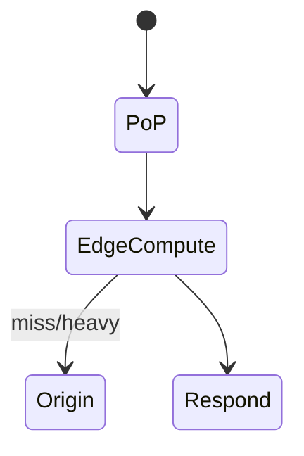

# Edge Rendering

<TopicMeta />

<Prerequisites />

::: tip Published
This page meets the handbook **published** bar: deep explanation, ≥10 common mistakes, and official references. Further engine-level errata welcome via PR.
:::

## Introduction

**Edge rendering** runs UI generation or request mediation at geographically distributed PoPs. In practice this ranges from edge Middleware rewrites to rendering lightweight routes on Edge runtimes.

## Why does it exist?

Physics: lowering RTT improves TTFB. Edge helps when work is small and globally cache-aware.

## Historical Background

CDNs → Workers/Edge functions → framework adapters (Next Edge, others).

## Mental Model

Put tiny, fast, globally replicated compute near users; keep heavy/regional data in origin data centers.

## Internal Workflow

1. Identify latency-sensitive tiny work.
2. Ensure edge-compatible APIs.
3. Cache outputs when possible.
4. Fall back to origin for heavy RSC/DB.

## Lifecycle



## Browser Perspective

Faster HTML/redirects when applicable.

## JavaScript Engine Perspective

Not applicable.

## React Perspective

Not applicable.

## Next.js Perspective

Middleware + optional edge runtime routes.

## Server Perspective

Constraints: CPU time, no full Node, cold isolates.

## Network Perspective

Fewer miles to first byte for eligible work.

## Memory Perspective

Not applicable.

## Performance

Wins for redirects, A/B, geo, simple API. Loses when edge still waits on far DB.

## Production Example

Edge auth redirect + geo pricing flag; product RSC on regional Node near DB.

## Code Examples

```ts
export const runtime = 'edge'
export async function GET(request: Request) {
  return new Response('ok', { headers: { 'x-geo': request.headers.get('x-vercel-ip-country') ?? '' } })
}
```

## Diagrams


## Common Mistakes

1. Edge-rendering chatty DB pages far from DB
2. Huge frameworks on edge
3. Ignoring regional data compliance
4. Assuming edge HTML is always faster than CDN static
5. No fallback when edge fails
6. Putting long CPU jobs on edge
7. Missing a production edge case for 12-rendering.edge-rendering (#1)
8. Missing a production edge case for 12-rendering.edge-rendering (#2)
9. Missing a production edge case for 12-rendering.edge-rendering (#3)
10. Missing a production edge case for 12-rendering.edge-rendering (#4)


## Best Practices

- Edge for tiny request shaping
- Static/PPR shell at CDN when possible
- Keep origin near data
- Measure p95 by region

## Anti-patterns

- Everything on edge slogan-driven
- Edge ORM to distant SQL without plan
- Mega middleware

## Comparison

| | Edge render | Origin SSR |
| --- | --- | --- |
| RTT | Low | Higher |
| Capabilities | Limited | Full |
| Data locality | Often poor | Better |

## Interview Questions

### Easy

**Q:** What is edge rendering?

**A:** Running render or request logic at CDN PoPs close to users to cut latency.

### Medium

**Q:** When is edge a bad place to render?

**A:** When you need heavy Node APIs or multi-join DB access in a distant region—RTT to data erases edge gains.

### Hard

**Q:** How combine edge + PPR?

**A:** Cache static shell globally at edge/CDN; run tiny personalization holes at edge or origin; keep heavy queries regional with streaming.

## Summary

- Edge cuts RTT for small work
- Constraints differ from Node
- Data locality often dominates
- Prefer static CDN + selective edge logic

## References

- [Next.js — Edge Runtime](https://nextjs.org/docs/app/api-reference/edge)
- [web.dev — Adaptive serving](https://web.dev/articles/adaptive-serving-based-on-network-quality)

<RelatedTopics />


Prev: [`12-rendering.resumability`](/12-rendering/resumability/) · Next: [`12-rendering.cdn`](/12-rendering/cdn/)
