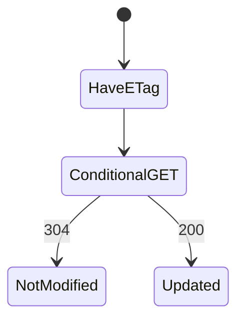
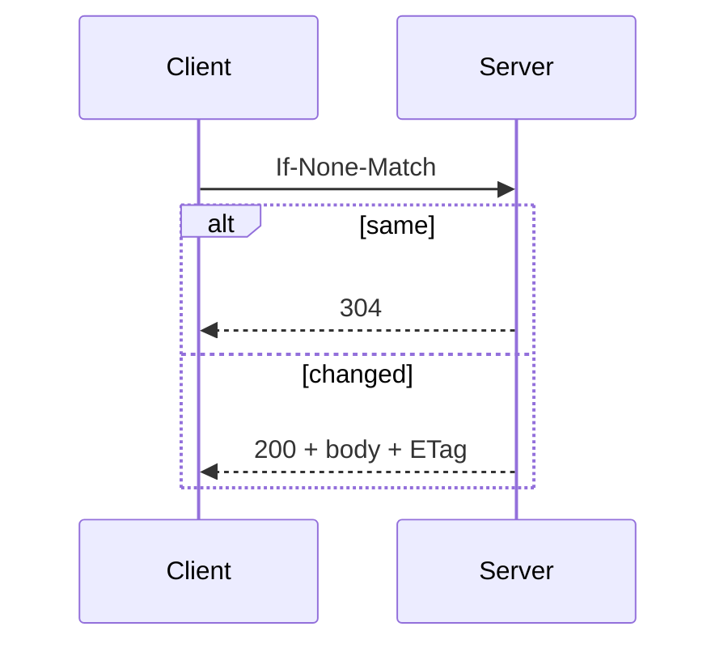

# ETag

<TopicMeta />

<Prerequisites />

::: tip Published
This page meets the handbook **published** bar: deep explanation, ≥10 common mistakes, and official references. Further engine-level errata welcome via PR.
:::

## Introduction

An **ETag** is an opaque validator for a representation. Clients send `If-None-Match`; servers return `304 Not Modified` when the tag matches—saving transfer when content is unchanged.

## Why does it exist?

Even with expired freshness, revalidation can be cheap. ETags make “did this change?” efficient.

## Historical Background

HTTP validators alongside Last-Modified; strong vs weak ETags matter for ranges/caching correctness.

## Mental Model

ETag = fingerprint of the bytes (or logical version). Match → 304; mismatch → 200 + new body + new ETag.

## Internal Workflow

1. Server computes ETag.
2. Client caches with response.
3. Later: If-None-Match.
4. 304 or 200.

## Lifecycle



## Browser Perspective

Automatic for cached responses with validators.

## JavaScript Engine Perspective

Not applicable.

## React Perspective

Not applicable.

## Next.js Perspective

Static file servers typically emit ETags; custom handlers should set them when useful.

## Server Perspective

Generating expensive ETags can erase wins—hash smartly.

## Network Perspective

Saves bandwidth; still costs a round trip when revalidating.

## Memory Perspective

Not applicable.

## Performance

Great for large unchanged assets. For tiny JSON, RTT may dominate—use longer freshness instead.

## Production Example

API catalog responses use content-hash ETags; clients poll cheaply.

## Code Examples

```http
ETag: "v3-contenthash"

GET /api/catalog
If-None-Match: "v3-contenthash"

HTTP/1.1 304 Not Modified
```

## Diagrams



## Common Mistakes

1. Weak ETags when strong needed for range requests
2. ETag changing every response despite same bytes
3. CPU-heavy ETag over full DB serialize
4. Ignoring If-None-Match in custom servers
5. Expecting ETag to replace Cache-Control freshness
6. Leaking sensitive data via ETag schemes
7. Missing a production edge case for 12-rendering.etag (#1)
8. Missing a production edge case for 12-rendering.etag (#2)
9. Missing a production edge case for 12-rendering.etag (#3)
10. Missing a production edge case for 12-rendering.etag (#4)


## Best Practices

- Hash the representation bytes or version
- Combine with Cache-Control
- Prefer cheap version stamps when available
- Understand strong vs weak validators

## Anti-patterns

- Random ETag per request
- 304 without proper cache update semantics
- Relying only on Last-Modified with coarse timestamps

## Comparison

| Validator | Basis |
| --- | --- |
| ETag | Opaque version/hash |
| Last-Modified | Timestamp |

## Interview Questions

### Easy

**Q:** What does an ETag enable?

**A:** Conditional requests that can return 304 Not Modified when content is unchanged.

### Medium

**Q:** Why still use max-age if you have ETags?

**A:** max-age avoids the revalidation RTT entirely while fresh; ETags help after freshness expires.

### Hard

**Q:** Strong vs weak ETag?

**A:** Strong means byte-identical; weak means semantically equivalent. Range requests and some cache behaviors require strong validators.

## Summary

- ETags validate cached representations
- Enable 304 responses
- Don’t make ETag computation expensive
- Works with Cache-Control

## References

- [MDN — ETag](https://developer.mozilla.org/en-US/docs/Web/HTTP/Headers/ETag)
- [RFC 9110 — HTTP Semantics](https://www.rfc-editor.org/rfc/rfc9110)

<RelatedTopics />


Prev: [`12-rendering.cache-control`](/12-rendering/cache-control/) · Next: [`12-rendering.stale-while-revalidate`](/12-rendering/stale-while-revalidate/)
