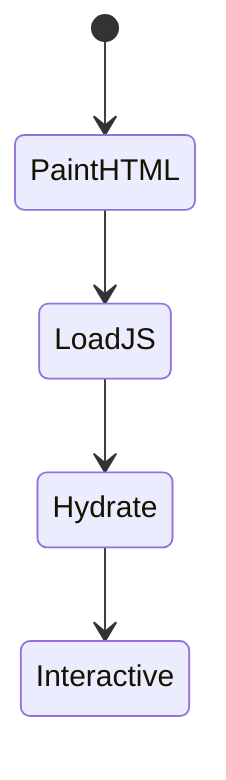
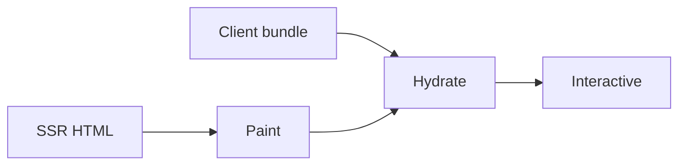

# Hydration

<TopicMeta />

<Prerequisites />

::: tip Published
This page meets the handbook **published** bar: deep explanation, ≥10 common mistakes, and official references. Further engine-level errata welcome via PR.
:::

## Introduction

**Hydration** is when client React reconciles with existing SSR/SSG HTML, attaches event handlers, and takes over updates. Until hydration finishes, the page may look ready but not be interactive.

## Why does it exist?

SSR HTML alone is inert for React event systems. Hydration reuses markup instead of throwing it away (vs full client re-render).

## Historical Background

Core to React SSR since early days; mismatches and cost drove progressive hydration / RSC / resumability discussions.

## Mental Model

Server HTML + client bundle → hydrate root → interactive. Markup must match what client render expects (same component output).

## Internal Workflow

1. Server emits HTML.
2. Browser paints.
3. JS downloads.
4. React hydrates; warns on mismatch.
5. State/effects run; events work.

## Lifecycle



## Browser Perspective

Hydration work is main-thread JS—impacts INP/TBT.

## JavaScript Engine Perspective

Parse/compile client components before hydrate.

## React Perspective

hydrateRoot; Strict Mode double-invokes in dev.

## Next.js Perspective

Only Client Components hydrate; RSC HTML doesn’t need component hydration.

## Server Perspective

Not applicable.

## Network Perspective

Not applicable.

## Memory Perspective

Component trees + listeners allocate on hydrate.

## Performance

Shrink client components to shrink hydration. Selective hydration helps under Suspense. Fix mismatches—they force expensive client render.

## Production Example

Product page HTML from RSC; only price widget and cart button hydrate as client islands.

## Code Examples

```tsx
import { hydrateRoot } from 'react-dom/client'
import App from './App'

hydrateRoot(document.getElementById('root')!, <App />)
```

## Diagrams



## Common Mistakes

1. Invalid HTML nesting causing mismatch
2. Date.now()/Math.random() during render
3. locale/timezone differences server vs client
4. Browser-only APIs in render path
5. Hydrating massive trees that could be RSC
6. Ignoring hydration warnings in prod builds
7. Rendering different HTML on server vs client (Date.now, random, locale)
8. Injecting browser-only APIs during SSR render
9. Suppressing hydration warnings instead of fixing mismatches
10. Hydrating huge trees that should stay server-only static HTML


## Best Practices

- Keep markup deterministic
- Push client boundaries down
- Use suppressHydrationWarning sparingly (time ago text)
- Measure hydration cost in Performance panel

## Anti-patterns

- Entire app `"use client"`
- Silencing mismatches without root cause
- Replacing SSR HTML immediately with client render

## Comparison

| | Hydration | Resumability |
| --- | --- | --- |
| Re-exec components | Yes (client) | Mostly no |
| Examples | React SSR | Qwik-style |

## Interview Questions

### Easy

**Q:** What is hydration?

**A:** Connecting client React to server-rendered HTML so handlers/state work without discarding the markup.

### Medium

**Q:** What causes hydration mismatches?

**A:** Server and client render different HTML—often non-deterministic values, invalid HTML, or locale differences.

### Hard

**Q:** How do RSC reduce hydration cost?

**A:** Server Components never hydrate; only Client Component islands do, so less JS runs on the main thread.

## Summary

- Hydration makes SSR HTML interactive
- Markup must match
- Cost scales with client JS
- RSC shrinks what must hydrate

## References

- [React — hydrateRoot](https://react.dev/reference/react-dom/client/hydrateRoot)
- [web.dev — Hydration](https://web.dev/articles/hydration)

<RelatedTopics />


Prev: [`12-rendering.streaming`](/12-rendering/streaming/) · Next: [`12-rendering.progressive-hydration`](/12-rendering/progressive-hydration/)
