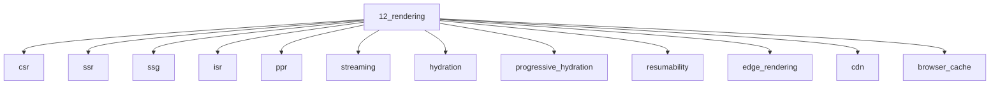

# Rendering

## Scope

CSR through PPR, hydration models, and caching layers

## Prerequisites

See the learning paths and each topic's prerequisites in the registry.

## Topics in order

- [Client-Side Rendering](/12-rendering/csr/) — junior, ~30 min
- [Server-Side Rendering](/12-rendering/ssr/) — mid, ~40 min
- [Static Site Generation](/12-rendering/ssg/) — junior, ~30 min
- [Incremental Static Regeneration](/12-rendering/isr/) — mid, ~30 min
- [Partial Prerendering](/12-rendering/ppr/) — senior, ~35 min
- [Streaming](/12-rendering/streaming/) — mid, ~35 min
- [Hydration](/12-rendering/hydration/) — mid, ~40 min
- [Progressive Hydration](/12-rendering/progressive-hydration/) — senior, ~30 min
- [Resumability](/12-rendering/resumability/) — senior, ~35 min
- [Edge Rendering](/12-rendering/edge-rendering/) — mid, ~30 min
- [CDN](/12-rendering/cdn/) — junior, ~25 min
- [Browser Cache](/12-rendering/browser-cache/) — junior, ~25 min
- [Cache-Control](/12-rendering/cache-control/) — mid, ~30 min
- [ETag](/12-rendering/etag/) — mid, ~25 min
- [Stale While Revalidate](/12-rendering/stale-while-revalidate/) — mid, ~25 min
- [Rendering Strategy Decision Tree](/12-rendering/rendering-strategy-decision-tree/) — mid, ~35 min

## Module knowledge graph

## Suggested learning paths

Browse [Learning Paths](/learning-paths/).
