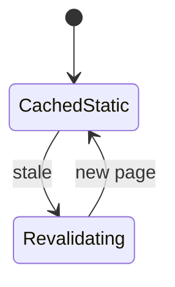
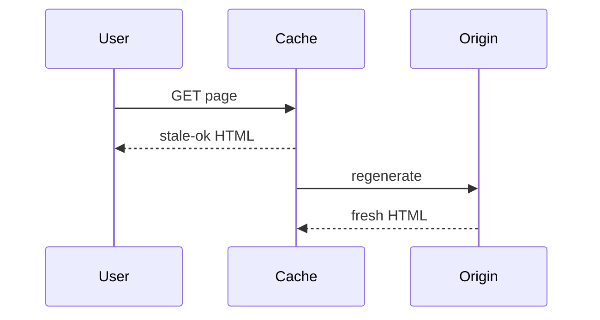

# Incremental Static Regeneration

<TopicMeta />

<Prerequisites />

::: tip Published
This page meets the handbook **published** bar: deep explanation, ≥10 common mistakes, and official references. Further engine-level errata welcome via PR.
:::

## Introduction

**ISR** serves statically generated pages and regenerates them after a revalidation period (or on-demand), blending SSG speed with fresher content without full-site rebuilds.

## Why does it exist?

Pure SSG goes stale; pure SSR is expensive. ISR updates pages incrementally as traffic or webhooks arrive.

## Historical Background

Popularized by Next.js `revalidate` in Pages Router; App Router expresses similar ideas via fetch `revalidate` / tags / PPR evolution.

## Mental Model

CDN/static hit first; after TTL (or tag invalidation), next request may trigger regeneration while others get stale-while-revalidate behavior depending on platform.

## Internal Workflow

1. Pre-render page.
2. Set revalidate seconds or tags.
3. On expiry/invalidation, regenerate.
4. Swap cache to new output.

## Lifecycle



## Browser Perspective

Sees static HTML; may be slightly stale by design.

## JavaScript Engine Perspective

Not applicable.

## React Perspective

Not applicable.

## Next.js Perspective

`revalidate` / `revalidateTag` / `revalidatePath` are the knobs.

## Server Perspective

Origin spikes on regeneration—protect backends.

## Network Perspective

Users mostly hit cached HTML at the edge.

## Memory Perspective

Not applicable.

## Performance

Near-SSG latency with controlled freshness. Stampeding regenerations need care (platform coalescing).

## Production Example

Product pages `revalidate: 60` plus webhook `revalidateTag` on publish.

## Code Examples

```ts
const res = await fetch('https://api.example.com/products/1', {
  next: { revalidate: 60, tags: ['product:1'] },
})
```

## Diagrams



## Common Mistakes

1. TTL too long for business-critical prices without on-demand invalidation
2. TTL too short causing origin stampede
3. Forgetting on-demand revalidate for CMS publishes
4. ISR for per-user pages
5. Assuming all CDNs implement ISR identically
6. No monitoring for regeneration failures
7. Missing a production edge case for 12-rendering.isr (#1)
8. Missing a production edge case for 12-rendering.isr (#2)
9. Missing a production edge case for 12-rendering.isr (#3)
10. Missing a production edge case for 12-rendering.isr (#4)


## Best Practices

- Combine time-based + tag-based revalidation
- Webhook from CMS on publish
- Keep regeneration handlers idempotent
- Document freshness SLAs

## Anti-patterns

- revalidate: 1 on every page
- Manual full redeploys for copy edits
- Mixing personalized cookies into ISR pages

## Comparison

| | SSG | ISR | SSR |
| --- | --- | --- | --- |
| Freshness | Deploy | TTL/tags | Immediate |
| Origin load | Build | Occasional | Every request |

## Interview Questions

### Easy

**Q:** What problem does ISR solve?

**A:** It keeps most of SSG’s speed while allowing pages to update without a full rebuild.

### Medium

**Q:** Time-based vs on-demand revalidation?

**A:** Time-based refreshes after N seconds; on-demand uses tags/paths when content changes (e.g. CMS webhook).

### Hard

**Q:** How do you prevent thundering herds on revalidation?

**A:** Rely on platform coalescing, tagged invalidation instead of tiny global TTLs, backoff, and cache stale-while-revalidate semantics.

## Summary

- ISR refreshes static pages incrementally
- Use revalidate seconds and tags
- Webhook invalidation for editorial freshness
- Not for personalized HTML

## References

- [Next.js — Incremental Static Regeneration](https://nextjs.org/docs/app/building-your-application/data-fetching/incremental-static-regeneration)
- [Next.js — Caching](https://nextjs.org/docs/app/building-your-application/caching)

<RelatedTopics />


Prev: [`12-rendering.ssg`](/12-rendering/ssg/) · Next: [`12-rendering.ppr`](/12-rendering/ppr/)
