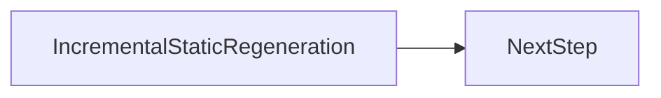

# Incremental Static Regeneration

<TopicMeta />

<Prerequisites />

::: warning Stub
This page is a structural stub. Follow `standards/DOCUMENTATION_STANDARD.md` when writing content.
:::

## Introduction

TODO: Explain Incremental Static Regeneration in simple language.

## Why does it exist?

TODO: What problem does it solve?

## Historical Background

TODO: Why was it introduced? What existed before it?

## Mental Model

TODO: Build intuition before implementation.

## Internal Workflow

TODO: Explain every internal step.

## Lifecycle

TODO: Explain the entire lifecycle.

## Browser Perspective

TODO: What happens inside Chrome?

## JavaScript Engine Perspective

TODO: What happens inside V8 (when relevant)?

## React Perspective

Not applicable.

## Next.js Perspective

Not applicable.

## Server Perspective

Not applicable.

## Network Perspective

Not applicable.

## Memory Perspective

TODO: Stack / Heap / References when relevant.

## Performance

TODO: Implications, optimizations, trade-offs.

## Production Example

TODO: Realistic production example.

## Code Examples

TODO: Start simple, then production-grade. Explain important lines.

## Diagrams

## Common Mistakes

1. TODO
2. TODO
3. TODO
4. TODO
5. TODO
6. TODO
7. TODO
8. TODO
9. TODO
10. TODO

## Best Practices

TODO: Production recommendations.

## Anti-patterns

TODO: What not to do.

## Comparison

| Approach | When to use | Trade-off |
| --- | --- | --- |
| TODO | TODO | TODO |

## Interview Questions

### Easy

TODO — question and answer.

### Medium

TODO — question and answer.

### Hard

TODO — question and answer.

## Summary

- TODO: key takeaway

## References

- TODO: official documentation links

<RelatedTopics />

Prev: [Static Site Generation](/12-rendering/ssg/) · Next: [Partial Prerendering](/12-rendering/ppr/)
