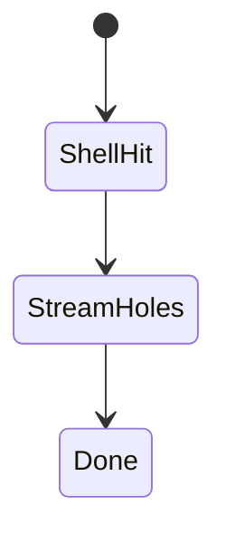
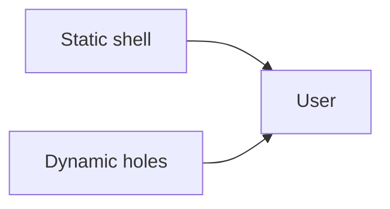

# Partial Prerendering

<TopicMeta />

<Prerequisites />

::: tip Published
This page meets the handbook **published** bar: deep explanation, ≥10 common mistakes, and official references. Further engine-level errata welcome via PR.
:::

## Introduction

**PPR** (module view) is the rendering strategy of shipping a **static shell** instantly and streaming **dynamic holes** for personalized/live parts. Next’s implementation lives also under [/11-nextjs/partial-prerendering/](/11-nextjs/partial-prerendering/).

## Why does it exist?

Pages are rarely 100% static or 100% dynamic. PPR matches reality: cache the common chrome/content; compute the rest per request.

## Historical Background

Emerged from streaming SSR + static generation research; productized in Next experimental/stable tracks.

## Mental Model

Shell = CDN-friendly. Holes = Suspense-bound dynamic. Don’t let dynamic reads escape into the shell.

## Internal Workflow

1. Design shell vs holes.
2. Suspense around cookies/session/live data.
3. Enable PPR per framework docs.
4. Verify shell cache hits + hole streaming.

## Lifecycle



## Browser Perspective

Fast paint then progressive fill-in.

## JavaScript Engine Perspective

Not applicable.

## React Perspective

Suspense boundaries are the hole API.

## Next.js Perspective

Primary implementation today.

## Server Perspective

Only holes hit origin compute.

## Network Perspective

Shell from edge cache; holes from origin.

## Memory Perspective

Not applicable.

## Performance

Best when LCP element is in the shell. Holes should be non-critical or well-skeletoned.

## Production Example

Storefront: static product description shell; price/availability and cart hole stream.

## Code Examples

```tsx
import { Suspense } from 'react'

export default function Page() {
  return (
    <>
      <ProductStaticShell />
      <Suspense fallback={<PriceSkeleton />}>
        <LivePrice />
      </Suspense>
    </>
  )
}
```

## Diagrams



## Common Mistakes

1. Dynamic API in shell dynamizes the page
2. LCP trapped in a slow hole
3. No skeletons → CLS
4. Treating PPR as on without Suspense structure
5. Personalizing content that should be static marketing
6. Ignoring version-specific Next PPR flags
7. Missing a production edge case for 12-rendering.ppr (#1)
8. Missing a production edge case for 12-rendering.ppr (#2)
9. Missing a production edge case for 12-rendering.ppr (#3)
10. Missing a production edge case for 12-rendering.ppr (#4)


## Best Practices

- Shell-first design
- Small holes
- Stable fallbacks
- Cross-link Next PPR docs for enablement

## Anti-patterns

- Everything in one hole
- Empty shell
- Disabling CDN caching while expecting PPR wins

## Comparison

| Strategy | Static part | Dynamic part |
| --- | --- | --- |
| SSG | All | None |
| SSR | None | All |
| PPR | Shell | Holes |

## Interview Questions

### Easy

**Q:** Explain PPR in one sentence.

**A:** Serve a cached static shell immediately and stream dynamic regions per request.

### Medium

**Q:** How do holes get defined?

**A:** Via Suspense boundaries around components that use dynamic data/APIs.

### Hard

**Q:** Compare PPR to classic SSR + client fetch for a cart count.

**A:** PPR streams the cart hole with server data in the first response; client fetch waits for hydration and extra RTT. PPR usually wins perceived performance and SEO of the shell.

## Summary

- PPR mixes static shell + dynamic holes
- Suspense defines boundaries
- Keep LCP in the shell
- See Next.js PPR topic for setup

## References

- [Next.js — Partial Prerendering](https://nextjs.org/docs/app/building-your-application/rendering/partial-prerendering)
- [web.dev — Rendering on the web](https://web.dev/articles/rendering-on-the-web)

<RelatedTopics />


Prev: [`12-rendering.isr`](/12-rendering/isr/) · Next: [`12-rendering.streaming`](/12-rendering/streaming/)
