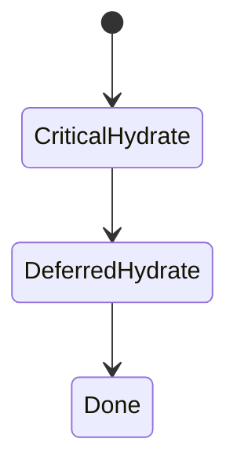
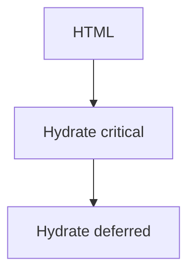

# Progressive Hydration

<TopicMeta />

<Prerequisites />

::: tip Published
This page meets the handbook **published** bar: deep explanation, ≥10 common mistakes, and official references. Further engine-level errata welcome via PR.
:::

## Introduction

**Progressive hydration** hydrates critical interactive parts first (or when idle/visible) rather than blocking on the entire tree. Suspense and selective hydration in React 18+ enable prioritizing user-driven regions.

## Why does it exist?

Monolithic hydration creates long tasks and poor INP. Progressive strategies make the page usable sooner.

## Historical Background

Research + React concurrent features; frameworks experiment with islands and selective hydration.

## Mental Model

Hydrate high-priority islands first; defer below-the-fold widgets. User interaction can bump priority.

## Internal Workflow

1. Split client islands.
2. Wrap lazy regions in Suspense.
3. Prefer smaller roots.
4. Defer non-critical widgets (`dynamic`, idle).

## Lifecycle



## Browser Perspective

Fewer long tasks; better INP.

## JavaScript Engine Perspective

Not applicable.

## React Perspective

Selective hydration can prioritize the Suspense region the user interacts with.

## Next.js Perspective

dynamic() + Suspense + small client components approximate the model.

## Server Perspective

Not applicable.

## Network Perspective

Not applicable.

## Memory Perspective

Deferred islands allocate later.

## Performance

Improves interactivity metrics more than raw LCP sometimes. Still need small JS.

## Production Example

Hydrate header search early; defer chat widget until idle/visible.

## Code Examples

```tsx
import dynamic from 'next/dynamic'

const Chat = dynamic(() => import('./Chat'), { ssr: false })
```

## Diagrams



## Common Mistakes

1. One giant client root (nothing to progress)
2. Deferring the LCP interactive control users need immediately
3. Too many tiny islands with overhead
4. Assuming progressive hydration fixes huge bundles alone
5. Breaking a11y focus when pieces appear late
6. Hydration order bugs from mismatched Suspense
7. Missing a production edge case for 12-rendering.progressive-hydration (#1)
8. Missing a production edge case for 12-rendering.progressive-hydration (#2)
9. Missing a production edge case for 12-rendering.progressive-hydration (#3)
10. Missing a production edge case for 12-rendering.progressive-hydration (#4)


## Best Practices

- Island architecture with clear priorities
- Suspense around deferred client regions
- Idle/visible load for chat/analytics widgets
- Profile long tasks during boot

## Anti-patterns

- Everything deferred including primary CTA
- Fake progressive via setTimeout soup
- Ignoring keyboard users during deferred mount

## Comparison

| | Monolithic hydrate | Progressive |
| --- | --- | --- |
| Main thread | Long task | Chunked |
| Complexity | Lower | Higher |

## Interview Questions

### Easy

**Q:** What is progressive hydration?

**A:** Hydrating parts of the UI over time/priority instead of one blocking pass.

### Medium

**Q:** How does React selective hydration help?

**A:** It can hydrate the Suspense region involved in user input before less important regions.

### Hard

**Q:** Design progressive hydration for a news article page.

**A:** Server-render article body as RSC; hydrate share/comment islands; defer recommendations and live chat until visible/idle; keep header interactive early.

## Summary

- Hydrate critical islands first
- Suspense/dynamic defer the rest
- Reduces long tasks / improves INP
- Requires real component splitting

## References

- [React — Suspense](https://react.dev/reference/react/Suspense)
- [web.dev — Import on visibility/idle](https://web.dev/articles/import-on-visibility)

<RelatedTopics />


Prev: [`12-rendering.hydration`](/12-rendering/hydration/) · Next: [`12-rendering.resumability`](/12-rendering/resumability/)
