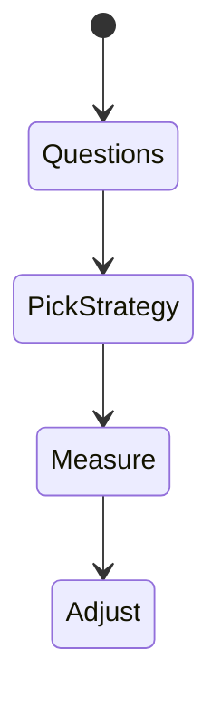
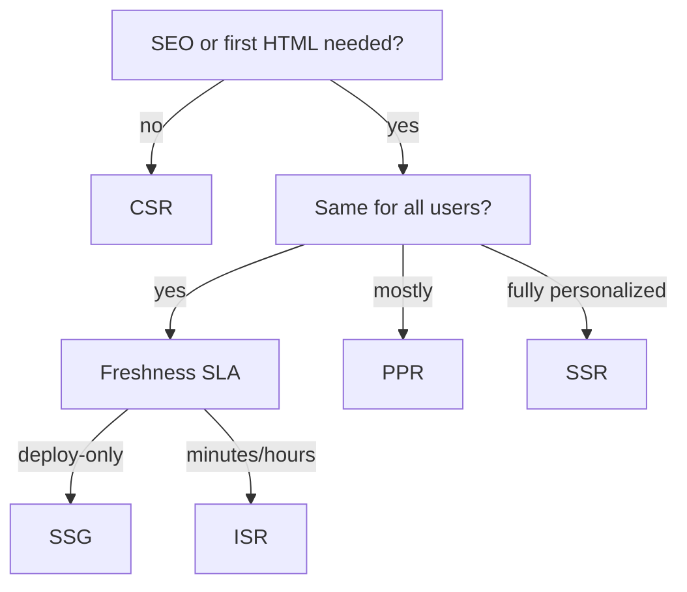

# Rendering Strategy Decision Tree

<TopicMeta />

<Prerequisites />

::: tip Published
This page meets the handbook **published** bar: deep explanation, ≥10 common mistakes, and official references. Further engine-level errata welcome via PR.
:::

## Introduction

Choosing a **rendering strategy** is a product+perf+ops decision. This topic is a decision tree: start from SEO/personalization/freshness constraints, then pick the cheapest strategy that meets them.

## Why does it exist?

Teams cargo-cult SSR or CSR and pay in TTFB or SEO. A explicit decision tree prevents ideology-driven architecture.

## Historical Background

As options multiplied (SSG/ISR/PPR/RSC), the industry needed clearer selection heuristics.

## Mental Model

Ask in order: (1) Must HTML be correct without JS? (2) Same for all users? (3) How fresh? (4) Where is data? Then pick SSG → ISR → PPR → SSR → CSR islands.

## Internal Workflow

1. Rank routes by business criticality.
2. Answer SEO/personalization/freshness questions.
3. Assign strategy per route—not one global dogma.
4. Measure CWV and cost; revisit quarterly.

## Lifecycle



## Browser Perspective

Hydration cost still matters for client islands.

## JavaScript Engine Perspective

Not applicable.

## React Perspective

RSC changes defaults toward server composition.

## Next.js Perspective

App Router can mix strategies per segment.

## Server Perspective

Origin cost differs radically by choice.

## Network Perspective

CDN-friendly strategies win at scale.

## Memory Perspective

Not applicable.

## Performance

The “fastest” strategy is the one that hits CDN with minimal JS for that route’s needs.

## Production Example

Marketing SSG; blog ISR; PDP PPR; account SSR; admin CSR islands.

## Code Examples

```txt
Decision sketch:
if !SEO && app-like → CSR/SPA OK
else if identical public content → SSG
else if mostly public + occasional updates → ISR
else if mostly static + small personalized → PPR
else if personalized HTML required → SSR/RSC dynamic
```

## Diagrams



## Common Mistakes

1. One strategy for the entire site
2. SSR for static blogs
3. CSR for marketing landing pages
4. Ignoring hydration cost after picking SSR
5. Not documenting freshness SLAs
6. Choosing edge without data locality
7. Missing a production edge case for 12-rendering.rendering-strategy-decision-tree (#1)
8. Missing a production edge case for 12-rendering.rendering-strategy-decision-tree (#2)
9. Missing a production edge case for 12-rendering.rendering-strategy-decision-tree (#3)
10. Missing a production edge case for 12-rendering.rendering-strategy-decision-tree (#4)


## Best Practices

- Per-route strategy table in the repo
- Prefer static/CDN first
- Use PPR/RSC to mix
- Re-evaluate with RUM data

## Anti-patterns

- Framework default without thought
- Premature microfrontends to fix rendering
- Optimizing hypothetical scale before measuring

## Comparison

| Need | Strategy |
| --- | --- |
| Docs | SSG/ISR |
| Storefront | PPR/ISR |
| Dashboard | RSC dynamic/SSR |
| Design tool | CSR heavy |

## Interview Questions

### Easy

**Q:** Name four rendering strategies.

**A:** CSR, SSR, SSG, ISR (plus PPR/edge as modern variants).

### Medium

**Q:** Walk a decision for a blog.

**A:** Public identical content with periodic updates → SSG + ISR/on-demand revalidation; minimal client JS.

### Hard

**Q:** Design mixed rendering for an ecommerce site.

**A:** SSG/ISR for content; PPR for PDP shell + live price/cart holes; SSR for account; CSR for highly interactive configurators; CDN for assets; measure LCP/INP per template.

## Summary

- Choose per route from constraints
- Prefer static/CDN when possible
- PPR/RSC enable mixed models
- Measure and revise

## References

- [web.dev — Rendering on the web](https://web.dev/articles/rendering-on-the-web)
- [Next.js — Rendering](https://nextjs.org/docs/app/building-your-application/rendering)

<RelatedTopics />


Prev: [`12-rendering.stale-while-revalidate`](/12-rendering/stale-while-revalidate/)
