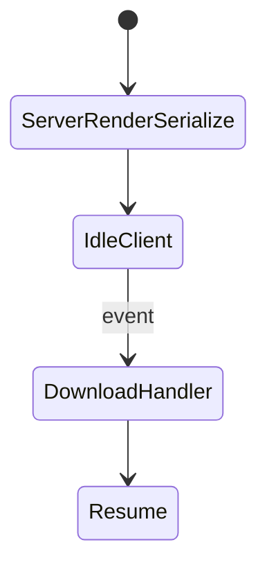
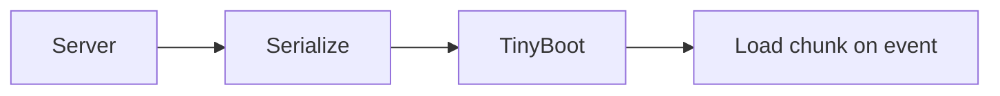

# Resumability

<TopicMeta />

<Prerequisites />

::: tip Published
This page meets the handbook **published** bar: deep explanation, ≥10 common mistakes, and official references. Further engine-level errata welcome via PR.
:::

## Introduction

**Resumability** (associated with Qwik-like models) serializes enough application state/listeners so the client can **resume** interactivity without re-running the whole app boot/hydration tree like classic React SSR.

## Why does it exist?

Hydration re-executes a lot of component code on the client. Resumability aims for near-instant interactivity with minimal eager JS.

## Historical Background

Qwik popularized the term; influences industry debate even when using React/Next (islands/RSC as pragmatic cousins).

## Mental Model

Server did the work; client downloads handlers lazily on event. Contrast: React hydration re-runs render to attach.

## Internal Workflow

1. Server renders + serializes resumable state.
2. Client loads tiny bootloader.
3. On interaction, download needed chunks.
4. Resume execution for that handler.

## Lifecycle



## Browser Perspective

Less eager JS; more lazy on interaction.

## JavaScript Engine Perspective

Not applicable.

## React Perspective

Classic React hydrates; RSC reduces hydrated surface as an alternative strategy.

## Next.js Perspective

Does not use Qwik resumability; uses RSC + hydration islands instead.

## Server Perspective

Not applicable.

## Network Perspective

Shifts bytes from boot to interaction time.

## Memory Perspective

Less upfront component tree on client.

## Performance

Excellent eager startup potential; interaction may pay a first-hit download cost.

## Production Example

Teams on React achieve similar goals via RSC + tiny client islands rather than true resumability.

## Code Examples

```txt
Conceptual contrast:
Hydration: download components → re-exec setup → attach listeners
Resumability: attach lazy listener refs → download on event → resume
```

## Diagrams



## Common Mistakes

1. Equating RSC with resumability (related goals, different mechanisms)
2. Expecting Next to be Qwik
3. Ignoring first-interaction latency after lazy download
4. Over-serializing huge state
5. Cargo-culting the term without measuring
6. Mixing mental models in one codebase without boundaries
7. Missing a production edge case for 12-rendering.resumability (#1)
8. Missing a production edge case for 12-rendering.resumability (#2)
9. Missing a production edge case for 12-rendering.resumability (#3)
10. Missing a production edge case for 12-rendering.resumability (#4)


## Best Practices

- Know your framework’s actual model
- On React/Next: minimize hydrate surface via RSC
- Measure eager vs interaction latency
- Keep serialized state small

## Anti-patterns

- Rewrites solely for buzzwords
- Lazy-loading primary CTA handlers without prefetch
- Claiming zero JS when analytics/widgets still hydrate

## Comparison

| | Hydration | Resumability |
| --- | --- | --- |
| Eager component exec | Yes | Minimal |
| Ecosystem | React SSR | Qwik et al. |
| React approx | RSC islands | — |

## Interview Questions

### Easy

**Q:** How does resumability differ from hydration?

**A:** Resumability avoids re-executing the whole app on the client; it resumes serialized work and loads handlers on demand.

### Medium

**Q:** How do React Server Components approximate the goal?

**A:** By not shipping/hydrating most components at all—only client islands hydrate.

### Hard

**Q:** What trade-off does lazy handler download introduce?

**A:** First interaction can stall on chunk fetch/parse; prefetch and caching strategies matter for INP.

## Summary

- Resumability skips classic eager hydration work
- Qwik-style vs React RSC/islands
- Next uses RSC + hydrate islands, not Qwik
- Measure boot vs interaction costs

## References

- [Qwik — Resumable](https://qwik.dev/docs/concepts/resumable/)
- [React — Server Components](https://react.dev/reference/rsc/server-components)

<RelatedTopics />


Prev: [`12-rendering.progressive-hydration`](/12-rendering/progressive-hydration/) · Next: [`12-rendering.edge-rendering`](/12-rendering/edge-rendering/)
