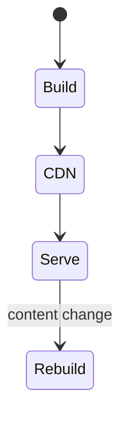

# Static Site Generation

<TopicMeta />

<Prerequisites />

::: tip Published
This page meets the handbook **published** bar: deep explanation, ≥10 common mistakes, and official references. Further engine-level errata welcome via PR.
:::

## Introduction

**Static Site Generation (SSG)** pre-renders HTML at build time (or on-demand once) and serves files from a CDN. Ideal for content that is identical for many users.

## Why does it exist?

Static files are the fastest, cheapest, most cacheable response. SSG exists to keep that win inside component frameworks.

## Historical Background

Jekyll/Hugo → Gatsby/Next `getStaticProps` → App Router static renders + `generateStaticParams`.

## Mental Model

Build produces HTML/RSC payload for known paths; runtime is mostly CDN. Rebuilding or ISR refreshes content.

## Internal Workflow

1. Know/enumerate paths.
2. Fetch data at build.
3. Emit static outputs.
4. CDN serves globally; rebuild or revalidate to update.

## Lifecycle



## Browser Perspective

Receives ready HTML immediately.

## JavaScript Engine Perspective

Not applicable.

## React Perspective

Still may hydrate client islands.

## Next.js Perspective

Static segments by default unless dynamic APIs used.

## Server Perspective

Origin often idle for pure static.

## Network Perspective

Peak CDN cache hit rates; tiny TTFB.

## Memory Perspective

Not applicable.

## Performance

Best TTFB/LCP potential for content sites. Build times grow with path count—use ISR/on-demand for long tails.

## Production Example

Docs and blog SSG; product pages ISR; account SSR.

## Code Examples

```tsx
export async function generateStaticParams() {
  return [{ slug: 'intro' }, { slug: 'ssg' }]
}

export default async function Page({ params }: { params: Promise<{ slug: string }> }) {
  const { slug } = await params
  const doc = await getDoc(slug)
  return <article>{doc.title}</article>
}
```

## Diagrams


## Common Mistakes

1. SSG for per-user personalized pages
2. Building millions of paths every CI without ISR
3. Forgetting fallback strategy for new paths
4. Stale content with no revalidation plan
5. Calling cookies() and accidentally dynamizing a “static” page
6. Huge client JS on top of static HTML (losing the win)
7. Missing a production edge case for 12-rendering.ssg (#1)
8. Missing a production edge case for 12-rendering.ssg (#2)
9. Missing a production edge case for 12-rendering.ssg (#3)
10. Missing a production edge case for 12-rendering.ssg (#4)


## Best Practices

- SSG for shared content
- ISR/on-demand revalidate for freshness
- generateStaticParams for hot paths
- Keep client JS minimal on content pages

## Anti-patterns

- Full rebuild for a typo on one page when on-demand exists
- Static HTML that immediately client-fetches everything
- Blocking build on flaky third-party APIs without caching

## Comparison

| | SSG | SSR |
| --- | --- | --- |
| When rendered | Build/revalidate | Each request |
| Personalization | Poor | Good |
| Cost at scale | Low | Higher |

## Interview Questions

### Easy

**Q:** What is SSG?

**A:** Pre-rendering HTML at build time so it can be served as static files from a CDN.

### Medium

**Q:** How do you handle new blog posts without full rebuilds?

**A:** Use ISR or on-demand revalidation / on-demand static generation for new paths.

### Hard

**Q:** What makes an App Router page static vs dynamic?

**A:** Using dynamic functions (cookies/headers/searchParams in ways that opt dynamic) or uncached fetch forces dynamic rendering; otherwise Next can statically prerender.

## Summary

- SSG prebuilds shared HTML for CDN
- Fastest/cheapest for content
- Pair with ISR for updates
- Avoid dynamizing accidentally

## References

- [Next.js — Static Rendering](https://nextjs.org/docs/app/building-your-application/rendering/server-components#static-rendering-default)
- [web.dev — Rendering on the web](https://web.dev/articles/rendering-on-the-web)

<RelatedTopics />


Prev: [`12-rendering.ssr`](/12-rendering/ssr/) · Next: [`12-rendering.isr`](/12-rendering/isr/)
