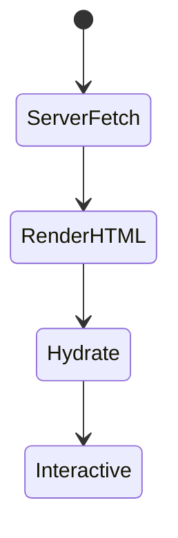
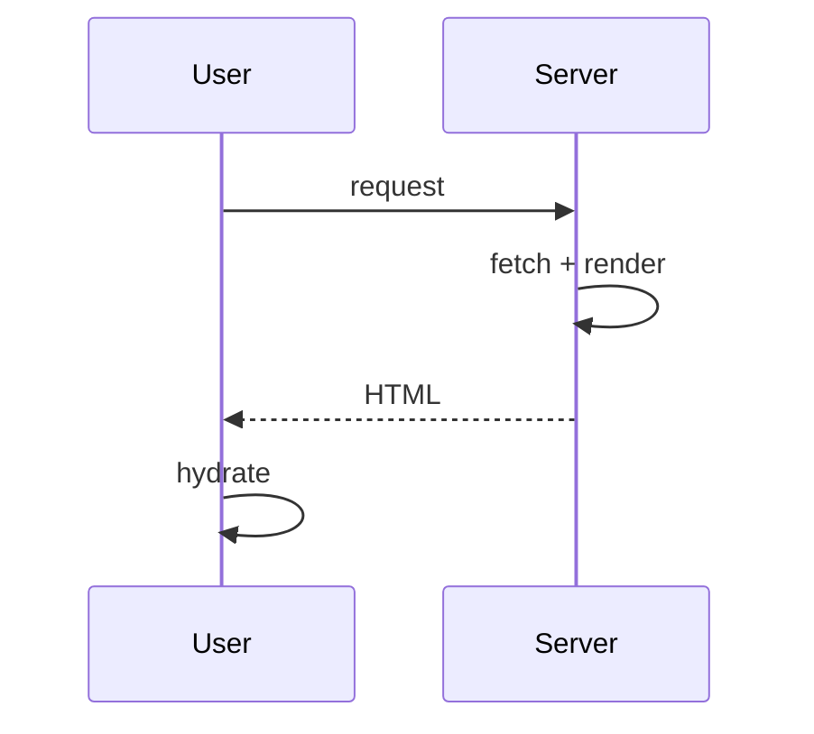

# Server-Side Rendering

<TopicMeta />

<Prerequisites />

::: tip Published
This page meets the handbook **published** bar: deep explanation, ≥10 common mistakes, and official references. Further engine-level errata welcome via PR.
:::

## Introduction

**Server-Side Rendering (SSR)** generates HTML on the server for each request (or personalized view), sends it to the browser for fast first paint, then hydrates client JS for interactivity.

## Why does it exist?

SSR improves SEO and first contentful paint versus pure CSR when data is dynamic per request. It keeps secrets and heavy data access on the server.

## Historical Background

Classic in PHP/Rails; returned to JS via Next/Nuxt after the SPA era exposed CSR weaknesses.

## Mental Model

Request → server fetch → render HTML → hydrate. Cost is paid on the server every time unless cached.

## Internal Workflow

1. Receive request (cookies/headers available).
2. Fetch data server-side.
3. Render HTML (+ RSC payload in Next).
4. Browser paints, downloads JS, hydrates.

## Lifecycle



## Browser Perspective

Can paint before JS; hydration may block interactivity.

## JavaScript Engine Perspective

Not applicable.

## React Perspective

SSR output must match client hydrate (no random/Date mismatches).

## Next.js Perspective

Dynamic App Router renders / gSSP in Pages Router.

## Server Perspective

CPU/I/O dominate TTFB; scale horizontally; cache where possible.

## Network Perspective

HTML is request-specific—harder to CDN-cache than SSG.

## Memory Perspective

Watch per-request allocations and leaks in global caches.

## Performance

Good for personalized HTML; watch TTFB. Stream to improve perception. Don’t SSR huge client-only trees unnecessarily.

## Production Example

Account dashboard SSR/RSC with user cookies; marketing pages stay SSG.

## Code Examples

```tsx
// App Router dynamic SSR-ish page
import { cookies } from 'next/headers'

export default async function Page() {
  const session = (await cookies()).get('session')?.value
  const data = await getDashboard(session)
  return <Dashboard data={data} />
}
```

## Diagrams



## Common Mistakes

1. SSR everything including static marketing pages
2. Hydration mismatches from non-deterministic render
3. Blocking the whole page on non-critical data (no streaming)
4. Caching personalized SSR HTML at CDN incorrectly
5. Huge client bundles still required after SSR
6. Doing SSR but fetching again on mount duplicates work
7. Overlooking an edge case #1 specific to 12-rendering.ssr in production traffic
8. Overlooking an edge case #2 specific to 12-rendering.ssr in production traffic
9. Overlooking an edge case #3 specific to 12-rendering.ssr in production traffic
10. Overlooking an edge case #4 specific to 12-rendering.ssr in production traffic


## Best Practices

- SSR when HTML must be personalized/fresh
- Stream with Suspense
- Keep client islands small
- Cache fragments/data aggressively when safe

## Anti-patterns

- SSR as default without measuring TTFB
- Server render + immediate client refetch of same data
- Non-deterministic markup

## Comparison

| | SSR | SSG |
| --- | --- | --- |
| Freshness | Per request | Build/revalidate |
| CDN cache | Harder | Easy |
| Personalization | Easy | Limited |

## Interview Questions

### Easy

**Q:** What is SSR?

**A:** Generating HTML on the server per request so the browser can paint content before/without waiting on client data fetching.

### Medium

**Q:** How does hydration relate to SSR?

**A:** SSR sends HTML; hydration attaches React event handlers/state so the page becomes interactive without redrawing from scratch.

### Hard

**Q:** How do you scale SSR?

**A:** Cache data, stream HTML, shrink client JS, horizontally scale Node, move static parts to SSG/PPR, and avoid origin work on every byte via CDN where safe.

## Summary

- SSR renders HTML per request
- Better first paint/SEO for dynamic pages
- Hydration still required for interactivity
- Stream and cache to control TTFB/cost

## References

- [web.dev — Rendering on the web](https://web.dev/articles/rendering-on-the-web)
- [Next.js — Server Rendering](https://nextjs.org/docs/app/building-your-application/rendering/server-components)

<RelatedTopics />


Prev: [`12-rendering.csr`](/12-rendering/csr/) · Next: [`12-rendering.ssg`](/12-rendering/ssg/)
