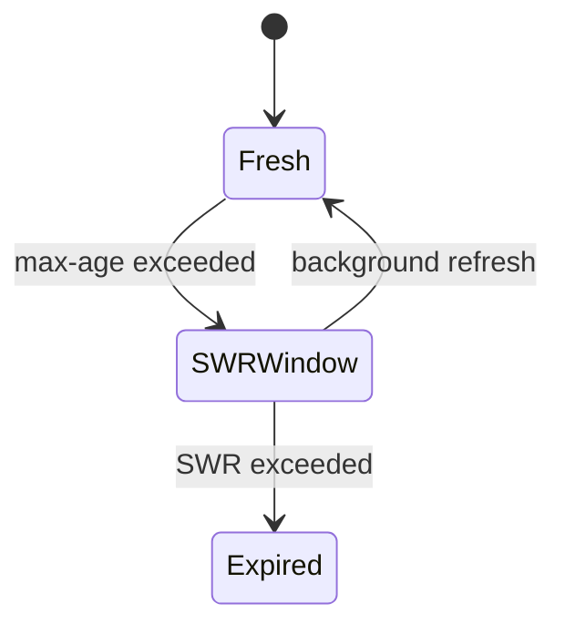
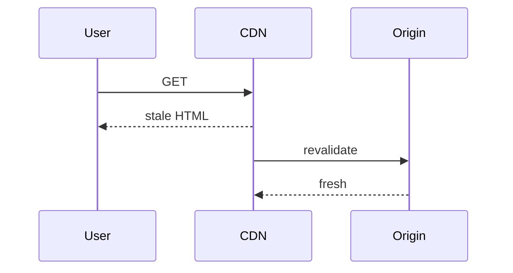

# Stale While Revalidate

<TopicMeta />

<Prerequisites />

::: tip Published
This page meets the handbook **published** bar: deep explanation, ≥10 common mistakes, and official references. Further engine-level errata welcome via PR.
:::

## Introduction

**stale-while-revalidate (SWR)** is a caching strategy (HTTP directive and a general pattern) where clients/CDNs can serve a stale response while fetching a fresh one asynchronously—optimizing for instant UX with eventual freshness.

## Why does it exist?

Hard waits for revalidation hurt UX. SWR trades brief staleness for snappy responses.

## Historical Background

HTTP `stale-while-revalidate` extension; popularized in web perf and libraries named SWR.

## Mental Model

If stale but within SWR window → return stale + refresh. Outside window → must revalidate/block depending on policy.

## Internal Workflow

1. Set `Cache-Control: max-age=..., stale-while-revalidate=...`.
2. Cache serves stale when allowed.
3. Background revalidate updates cache.
4. Next request gets fresh.

## Lifecycle



## Browser Perspective

May serve stale assets/pages per headers.

## JavaScript Engine Perspective

Not applicable.

## React Perspective

Not applicable.

## Next.js Perspective

ISR and client data libraries echo the pattern.

## Server Perspective

Must handle concurrent regenerations safely.

## Network Perspective

Supported by many CDNs/browsers with nuances.

## Memory Perspective

Not applicable.

## Performance

Excellent perceived performance. Document staleness tolerance with product/legal.

## Production Example

CDN: `s-maxage=60, stale-while-revalidate=600` for a public blog.

## Code Examples

```http
Cache-Control: public, s-maxage=60, stale-while-revalidate=600
```

## Diagrams



## Common Mistakes

1. SWR on security-sensitive personalized data
2. Unbounded staleness windows
3. Assuming all browsers/CDNs behave identically
4. No monitoring of stale ratios
5. Confusing library SWR with HTTP directive only
6. Using SWR to hide permanently broken origin
7. Missing a production edge case for 12-rendering.stale-while-revalidate (#1)
8. Missing a production edge case for 12-rendering.stale-while-revalidate (#2)
9. Missing a production edge case for 12-rendering.stale-while-revalidate (#3)
10. Missing a production edge case for 12-rendering.stale-while-revalidate (#4)


## Best Practices

- Pick TTLs from product freshness needs
- Prefer on-demand purge for urgent updates
- Apply to public cacheable content first
- Coalesce regenerations

## Anti-patterns

- SWR for checkout prices without safeguards
- Infinite stale-if-error masking outages forever
- Different mental model per layer undocumented

## Comparison

| Strategy | UX |
| --- | --- |
| Must-revalidate | Wait for fresh |
| SWR | Instant stale + refresh |
| no-store | Always network |

## Interview Questions

### Easy

**Q:** What does stale-while-revalidate mean?

**A:** Serve a cached stale response immediately while updating the cache in the background.

### Medium

**Q:** When is SWR inappropriate?

**A:** When serving stale content violates correctness/compliance—balances, authz decisions, private data.

### Hard

**Q:** How does ISR relate to SWR?

**A:** ISR platforms often serve the previous static page while regenerating—conceptually SWR for whole pages—controlled by revalidate settings and infrastructure.

## Summary

- SWR trades brief staleness for instant responses
- HTTP directive + general pattern
- Use for public cacheable content
- Avoid on correctness-critical private data

## References

- [MDN — stale-while-revalidate](https://developer.mozilla.org/en-US/docs/Web/HTTP/Headers/Cache-Control#stale-while-revalidate)
- [web.dev — stale-while-revalidate](https://web.dev/articles/stale-while-revalidate)

<RelatedTopics />


Prev: [`12-rendering.etag`](/12-rendering/etag/) · Next: [`12-rendering.rendering-strategy-decision-tree`](/12-rendering/rendering-strategy-decision-tree/)
