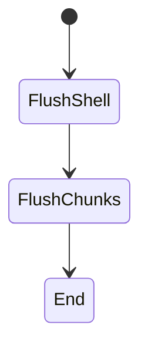
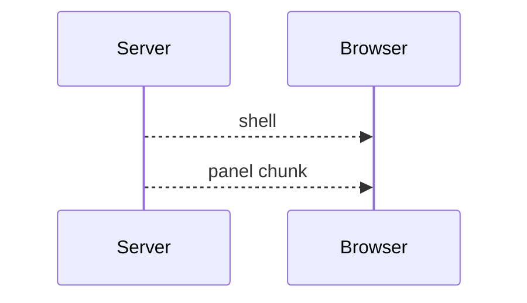

# Streaming

<TopicMeta />

<Prerequisites />

::: tip Published
This page meets the handbook **published** bar: deep explanation, ≥10 common mistakes, and official references. Further engine-level errata welcome via PR.
:::

## Introduction

**Streaming** (rendering module) is the practice of flushing HTML/RSC bytes early and filling Suspense holes later. It improves time-to-first-byte perception and progressive reveal.

## Why does it exist?

Buffering full pages couples UX to the slowest dependency. Streaming decouples shell from slow parts.

## Historical Background

HTTP chunked responses + React 18 streaming SSR; central to App Router.

## Mental Model

Send what’s ready; promise the rest. Boundaries define reveal units.

## Internal Workflow

1. Identify slow subtrees.
2. Wrap in Suspense/loading UI.
3. Avoid awaiting them in parents before return.
4. Ensure proxies allow streaming.

## Lifecycle



## Browser Perspective

Incremental parse/paint.

## JavaScript Engine Perspective

Not applicable.

## React Perspective

Suspense + Flight streams.

## Next.js Perspective

loading.tsx + PPR build on streaming.

## Server Perspective

Longer-lived responses; timeout tuning.

## Network Perspective

Chunked transfer; intermediate buffers can defeat you.

## Memory Perspective

Not applicable.

## Performance

Improves perceived performance; total server work may stay similar. Fix actual slow queries too.

## Production Example

Dashboard streams widgets; shell+nav first.

## Code Examples

```tsx
import { Suspense } from 'react'
export default function Page() {
  return (
    <Suspense fallback={<p>Loading…</p>}>
      <SlowPanel />
    </Suspense>
  )
}
```

## Diagrams



## Common Mistakes

1. Parent await kills streaming
2. Proxy buffering
3. CLS from poor fallbacks
4. Too many micro-boundaries
5. Streaming as excuse for 10s queries
6. Assuming CDN caches streamed dynamic docs
7. Missing a production edge case for 12-rendering.streaming (#1)
8. Missing a production edge case for 12-rendering.streaming (#2)
9. Missing a production edge case for 12-rendering.streaming (#3)
10. Missing a production edge case for 12-rendering.streaming (#4)


## Best Practices

- Boundary around independent slow work
- Stable skeletons
- Test through real CDN/proxy
- Combine with caching

## Anti-patterns

- Single page-wide Suspense only
- Client spinner instead of server stream
- Nested sequential awaits inside each hole

## Comparison

| | Buffered | Streaming |
| --- | --- | --- |
| First byte | Late | Early |
| Complexity | Lower | Boundaries |

## Interview Questions

### Easy

**Q:** What is HTML streaming?

**A:** Sending the document in chunks as parts become ready instead of waiting for the full render.

### Medium

**Q:** What React API enables UI streaming?

**A:** Suspense boundaries (and framework conventions like loading.tsx).

### Hard

**Q:** When does streaming not help SEO/LCP?

**A:** If the LCP element is inside a late hole or first byte still waits on critical data above all boundaries.

## Summary

- Stream shells early, holes later
- Suspense defines chunks
- Watch proxies and LCP placement
- Related Next topic: /11-nextjs/streaming/

## References

- [React — Suspense](https://react.dev/reference/react/Suspense)
- [Next.js — Streaming](https://nextjs.org/docs/app/building-your-application/routing/loading-ui-and-streaming)

<RelatedTopics />


Prev: [`12-rendering.ppr`](/12-rendering/ppr/) · Next: [`12-rendering.hydration`](/12-rendering/hydration/)
