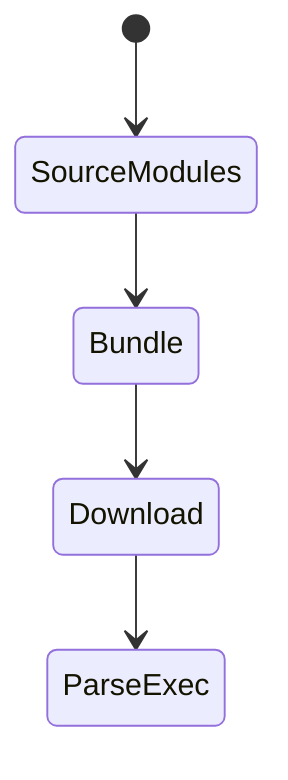

# Bundle

<TopicMeta />

<Prerequisites />

::: tip Published
This page meets the handbook **published** bar: deep explanation, ≥10 common mistakes, and official references. Further engine-level errata welcome via PR.
:::

## Introduction

A **bundle** is the packaged output of your bundler—JS/CSS (and assets) delivered to browsers. Bundle size strongly drives parse/compile/exec cost and network time.

## Why does it exist?

Browsers can’t run your TypeScript sources directly in production the way monorepos are authored. Bundles exist to resolve modules, tree-shake, and emit efficient files— but oversized bundles harm CWV.

## Historical Background

Script concatenation → webpack era → ESM-native tooling (Vite/esbuild/Rollup) with smarter splitting.

## Mental Model

Think in bytes over the wire + main-thread cost. Route-based chunks beat one mega bundle.

## Internal Workflow

1. Build production assets.
2. Inspect sizes (analyzer).
3. Split/defer heavy deps.
4. Set budgets in CI.

## Lifecycle



## Browser Perspective

Download → parse → compile → execute on main thread.

## JavaScript Engine Perspective

Larger JS → more compile/GC pressure.

## React Perspective

Not applicable.

## Next.js Perspective

Server/client graphs differ; watch client bundle specifically.

## Server Perspective

Not applicable.

## Network Perspective

Compression + HTTP/2 help; bytes still dominate on mobile.

## Memory Perspective

Retained modules increase heap.

## Performance

Track transfer size and execution time. Prefer fewer eager bytes on critical routes.

## Production Example

CI fails if main client bundle grows > budget; analyzer comment on PRs.

## Code Examples

```bash
npx source-map-explorer .next/static/chunks/*.js
```

## Diagrams


## Common Mistakes

1. Shipping the same mega bundle to every route
2. Importing barrel files that defeat tree-shaking
3. Measuring only gzip size and ignoring parse time
4. Duplicating React in multiple chunks incorrectly
5. Including Node polyfills in client bundles
6. No budget alarms
7. Missing a production edge case for 13-performance.bundle (#1)
8. Missing a production edge case for 13-performance.bundle (#2)
9. Missing a production edge case for 13-performance.bundle (#3)
10. Missing a production edge case for 13-performance.bundle (#4)


## Best Practices

- Route-based splitting
- Analyze regularly
- Prefer ESM-friendly libs
- Budget p95 bytes per template

## Anti-patterns

- lodash entire import
- moment.js when Intl suffices
- Dev dependencies accidentally in client

## Comparison

| Concept | Meaning |
| --- | --- |
| Bundle | Output artifact set |
| Chunk | Split piece of a bundle |
| Module | Source unit |

## Interview Questions

### Easy

**Q:** What is a JS bundle?

**A:** The packaged JavaScript file(s) produced for the browser from your modules.

### Medium

**Q:** Why split bundles?

**A:** So users download only code for the route/feature they need, improving startup.

### Hard

**Q:** How do barrel exports hurt bundles?

**A:** They can pull large index re-exports, preventing tree-shaking and inflating graphs.

## Summary

- Bundles are what users download
- Size ≈ network + main-thread cost
- Split and budget
- Analyze regressions

## References

- [web.dev — Reduce JavaScript payloads](https://web.dev/articles/reduce-javascript-payloads-with-code-splitting)
- [Vite — Build](https://vitejs.dev/guide/build.html)

<RelatedTopics />


Next: [`13-performance.chunk`](/13-performance/chunk/)
