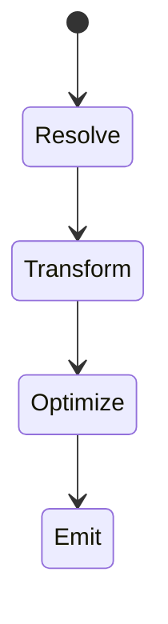

# Bundling

<TopicMeta />

<Prerequisites />

::: tip Published
This page meets the handbook **published** bar: deep explanation, ≥10 common mistakes, and official references. Further engine-level errata welcome via PR.
:::

## Introduction

**Bundling** is the pipeline that turns a module graph into optimized assets: resolve → transform (TS/JSX) → tree-shake → minify → emit chunks + hashes.

## Why does it exist?

Browsers historically needed fewer requests and compatibility transforms. Modern bundling still provides optimization, even with native ESM.

## Historical Background

Browserify → webpack → Rollup/Parcel → esbuild/Vite/Rspack/Turbopack speed race.

## Mental Model

Bundling is graph optimization under constraints (target, split points, env).

## Internal Workflow

1. Start from entries.
2. Resolve deps.
3. Apply loaders/plugins.
4. Emit hashed assets + HTML references.

## Lifecycle



## Browser Perspective

Consumes outputs only.

## JavaScript Engine Perspective

Output shape affects parse cost.

## React Perspective

Not applicable.

## Next.js Perspective

Bundles server and client separately (webpack/turbopack).

## Server Perspective

Not applicable.

## Network Perspective

Hashing enables immutable CDN caching.

## Memory Perspective

Dev bundler processes can use significant RAM on large graphs.

## Performance

Faster bundlers improve DX; output quality (shake/minify/split) improves UX.

## Production Example

Vite for SPA library mode; Next handles app bundling; CI caches toolchains.

## Code Examples

```ts
// vite.config.ts
export default { build: { rollupOptions: { output: { manualChunks: undefined } } } }
```

## Diagrams


## Common Mistakes

1. Optimizing bundler speed while shipping terrible output
2. Wrong target causing huge polyfills
3. Source maps missing in prod debugging strategy
4. Environment variables leaking into client
5. Not caching CI builds
6. Mixing CJS/ESM poorly causing duplication
7. Missing a production edge case for 13-performance.bundling (#1)
8. Missing a production edge case for 13-performance.bundling (#2)
9. Missing a production edge case for 13-performance.bundling (#3)
10. Missing a production edge case for 13-performance.bundling (#4)


## Best Practices

- Know your entries and targets
- Prefer ESM dependencies
- Emit content hashes
- Keep server and client graphs clean

## Anti-patterns

- Custom webpack forever without need
- Disable minify to “fix a bug” in prod
- Inlining megabyte assets as base64

## Comparison

| Tool | Strength |
| --- | --- |
| Vite | Dev speed + Rollup build |
| webpack | Ecosystem/plugins |
| esbuild | Transform speed |
| Turbopack | Next-oriented speed |

## Interview Questions

### Easy

**Q:** What does bundling do?

**A:** Resolves and packages modules into optimized assets for deployment.

### Medium

**Q:** Why content-hash filenames?

**A:** Cache forever on CDN and bust cache when content changes.

### Hard

**Q:** How can bundling create duplicate libraries?

**A:** Multiple versions resolved, mixed CJS/ESM interop, or improper split config—detect with analyzers and dependency dedupe.

## Summary

- Bundling transforms module graphs into assets
- DX speed ≠ UX output quality
- Hash, split, shake, minify
- Keep client graphs lean

## References

- [Vite Guide](https://vitejs.dev/guide/)
- [webpack Concepts](https://webpack.js.org/concepts/)

<RelatedTopics />


Prev: [`13-performance.chunk`](/13-performance/chunk/) · Next: [`13-performance.code-splitting`](/13-performance/code-splitting/)
