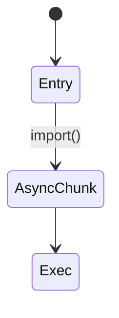
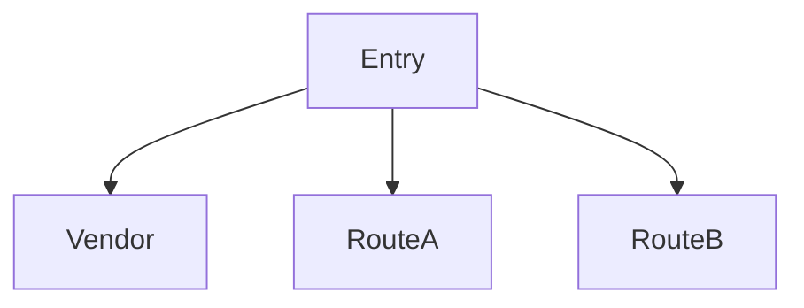

# Chunk

<TopicMeta />

<Prerequisites />

::: tip Published
This page meets the handbook **published** bar: deep explanation, ≥10 common mistakes, and official references. Further engine-level errata welcome via PR.
:::

## Introduction

A **chunk** is a file the bundler emits as part of splitting strategy—entry chunks, async chunks, shared vendor chunks. Chunking is how code splitting becomes real network requests.

## Why does it exist?

Without chunks, everything is one download. Chunks let unused routes stay off the critical path.

## Historical Background

webpack splitChunks → Rollup manualChunks → framework conventions (dynamic import).

## Mental Model

Dynamic `import()` ⇒ async chunk. Shared deps may form vendor chunks.

## Internal Workflow

1. Identify heavy optional features.
2. Load via `import()`/framework lazy.
3. Inspect chunk graph.
4. Avoid over-splitting tiny files.

## Lifecycle



## Browser Perspective

Extra requests; HTTP/2 mitigates, but each chunk has overhead.

## JavaScript Engine Perspective

Parse cost deferred until needed.

## React Perspective

Not applicable.

## Next.js Perspective

Route and `next/dynamic` create chunks automatically.

## Server Perspective

Not applicable.

## Network Perspective

Prefetch can warm likely chunks.

## Memory Perspective

Not applicable.

## Performance

Balance: too few chunks = fat; too many = waterfall of tiny files.

## Production Example

Editor feature loads a 200kb chunk on demand; landing page never downloads it.

## Code Examples

```ts
const Editor = await import('./editor')
```

## Diagrams



## Common Mistakes

1. Over-chunking icons into hundreds of files
2. Under-chunking admin into landing
3. Shared chunk dependency cycles surprises
4. Prefetching all chunks always
5. Ignoring CSS chunk ordering FOUC
6. Duplicating large libs across chunks
7. Missing a production edge case for 13-performance.chunk (#1)
8. Missing a production edge case for 13-performance.chunk (#2)
9. Missing a production edge case for 13-performance.chunk (#3)
10. Missing a production edge case for 13-performance.chunk (#4)


## Best Practices

- Split on route/feature boundaries
- Share stable vendor intelligently
- Prefetch on intent (hover/visible)
- Review chunk graph in PRs for big features

## Anti-patterns

- manualChunks chaos without measurement
- One async import per tiny component
- Blocking on many sequential chunks

## Comparison

| | Bundle | Chunk |
| --- | --- | --- |
| Meaning | Overall output | Individual split file |
| Load | Often eager entry | Often lazy |

## Interview Questions

### Easy

**Q:** What is a chunk?

**A:** A split file emitted by the bundler that can be loaded separately.

### Medium

**Q:** What creates an async chunk?

**A:** A dynamic `import()` (or framework wrapper) pointing at a module graph.

### Hard

**Q:** How do you prevent duplicate React in chunks?

**A:** Configure bundler split/share rules and verify with an analyzer; frameworks usually de-dupe React as a shared dependency.

## Summary

- Chunks implement code splitting on the wire
- Dynamic import creates async chunks
- Avoid too fat or too fragmented graphs
- Prefetch with intent

## References

- [webpack — Code Splitting](https://webpack.js.org/guides/code-splitting/)
- [web.dev — Code splitting](https://web.dev/articles/reduce-javascript-payloads-with-code-splitting)

<RelatedTopics />


Prev: [`13-performance.bundle`](/13-performance/bundle/) · Next: [`13-performance.bundling`](/13-performance/bundling/)
