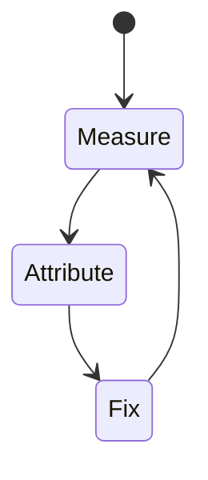
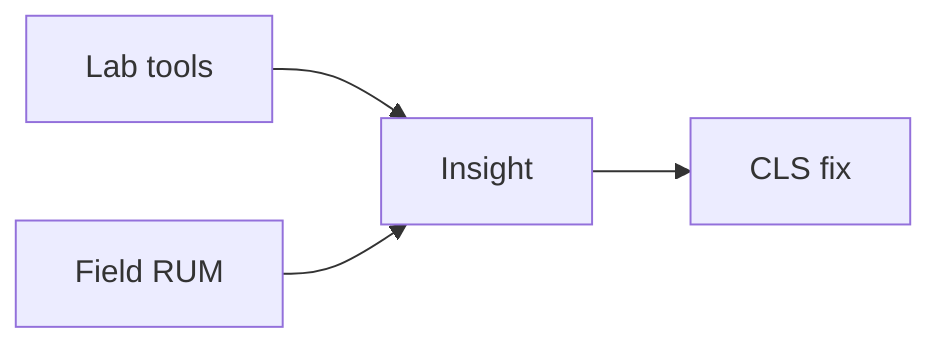

# CLS

<TopicMeta />

<Prerequisites />

::: tip Published
This page meets the handbook **published** bar: deep explanation, ≥10 common mistakes, and official references. Further engine-level errata welcome via PR.
:::

## Introduction

**CLS** quantifies how much visible content unexpectedly moves. It is a Core Web Vital for visual stability.

## Why does it exist?

Shifts cause mis-taps and make pages feel broken. Reserving space prevents layout thrash as resources load.

## Historical Background

Became CWV alongside LCP/FID; FID later replaced by INP.

## Mental Model

Unexpected shift = distance × impact fraction. Reserve width/height; avoid inserting above existing content.

## Internal Workflow

1. Define what CLS measures and the “good” threshold.
2. Collect lab (Lighthouse/Perf panel) and field (CrUX/RUM) data.
3. Attribute the slow stage in a trace.
4. Change one cause; remeasure.
5. Guard with budgets in CI/RUM alerts.

## Lifecycle



## Browser Perspective

CLS is observed in Chromium Performance/Lighthouse and via web-vitals JS APIs in the field.

## JavaScript Engine Perspective

JS long tasks, layout, and paint feed into how CLS feels to users.

## React Perspective

Unnecessary renders/hydration inflate interaction and paint costs that show up in CLS.

## Next.js Perspective

Server TTFB, streaming, and client bundle size all influence CLS depending on the metric.

## Server Perspective

Not applicable.

## Network Perspective

RTT, bytes, and CDN behavior often dominate before JS micro-optimizations.

## Memory Perspective

GC pauses and large DOM/images can indirectly worsen CLS.

## Performance

Good CLS ≤ 0.1 at p75. Set image/ad dimensions, font fallbacks (next/font), avoid late banners pushing content.

## Production Example

A team tracks CLS in RUM by route template, sets a regression alert at p75, and ties fixes to specific owners (images, JS, server).

## Code Examples

```html

```

```css
.aspect { aspect-ratio: 16 / 9; }
```

## Diagrams



## Common Mistakes

1. Images without dimensions
2. Web fonts swapping with large metric differences
3. Late cookie banners pushing content
4. Injecting ads without reserved slots
5. Animating top/left instead of transform
6. Counting shifts during user interactions incorrectly when debugging
7. Missing a production edge case for 13-performance.cls (#1)
8. Missing a production edge case for 13-performance.cls (#2)
9. Missing a production edge case for 13-performance.cls (#3)
10. Missing a production edge case for 13-performance.cls (#4)


## Best Practices

- Optimize CLS with field data, not vanity lab scores alone
- Fix the attributed cause, not a random best practice list
- Keep a performance budget for the owning surface
- Re-check after framework upgrades

## Anti-patterns

- Chasing Lighthouse while ignoring RUM
- Micro-optimizing JS before cutting bytes/RTT
- Declaring victory from one local run on fiber

## Comparison

| Signal | Use |
| --- | --- |
| Lab | Debug & regressions |
| Field | Real users / SEO signals |

## Interview Questions

### Easy

**Q:** What is CLS?

**A:** A score of unexpected layout shifts during the page’s life.

### Medium

**Q:** How do fonts affect CLS?

**A:** Fallback→webfont metric differences shift text; use size-adjusted fallbacks / font-display strategies.

### Hard

**Q:** How do you debug a production CLS regression?

**A:** Use RUM attribution + Performance panel experience section / Layout Shift regions; identify late-loading nodes and fix reservation or insertion order.

## Summary

- CLS: Cumulative Layout Shift: visual stability score from unexpected layout shifts.
- Measure lab + field
- Attribute before optimizing
- Budget and alert on p75

## References

- [web.dev — Core Web Vitals](https://web.dev/explore/learn-core-web-vitals)
- [Chrome — Web Vitals](https://developer.chrome.com/docs/performance/insights/web-vitals)

<RelatedTopics />


Prev: [`13-performance.lcp`](/13-performance/lcp/) · Next: [`13-performance.inp`](/13-performance/inp/)
