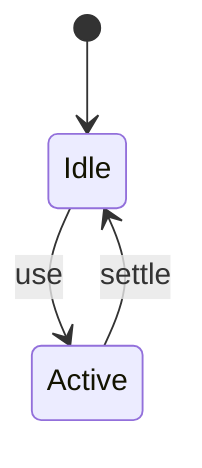
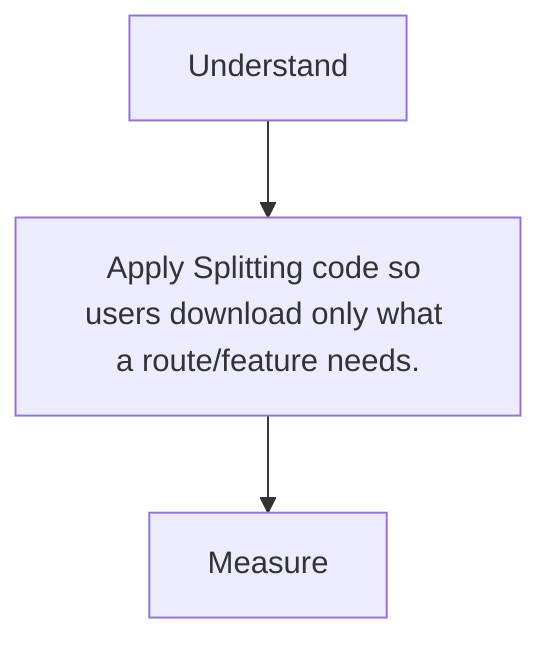

# Code Splitting

<TopicMeta />

<Prerequisites />

::: tip Published
This page meets the handbook **published** bar: deep explanation, ≥10 common mistakes, and official references. Further engine-level errata welcome via PR.
:::

## Introduction

**Code splitting** divides the module graph into separately loadable chunks—usually by route or heavy feature—so initial startup stays lean.

## Why does it exist?

Monolithic bundles punish every visit with code for rarely used screens.

## Historical Background

webpack async splits → dynamic import standardized → first-class in Next/React.lazy/Vite.

## Mental Model

Eager = critical path. Lazy = on navigation/intent. Shared = vendor chunk.

## Internal Workflow

1. Find heavy unique deps per route.
2. Use dynamic import / framework lazy.
3. Prefetch on likely intent.
4. Verify with analyzer.

## Lifecycle



## Browser Perspective

Extra requests deferred until needed.

## JavaScript Engine Perspective

Not applicable.

## React Perspective

Not applicable.

## Next.js Perspective

Route segments and next/dynamic split client graphs.

## Server Perspective

Not applicable.

## Network Perspective

Prefetch API/Link can warm chunks.

## Memory Perspective

Not applicable.

## Performance

Measure before/after with lab + field tools. Optimize the attributed bottleneck for Splitting code so users download only what a route/feature needs., not folklore.

## Production Example

Teams adopt Splitting code so users download only what a route/feature needs. on critical routes, add monitoring, and guard regressions with budgets or reviews.

## Code Examples

```tsx
import dynamic from 'next/dynamic'
const Chart = dynamic(() => import('./Chart'), { loading: () => <p>…</p> })
```

## Diagrams



## Common Mistakes

1. Splitting every tiny component
2. Not splitting a 300kb chart lib on marketing
3. Waterfalling many sequential lazy imports
4. Forgetting loading states
5. Prefetching everything
6. SSR/CSR mismatch with lazy components
7. Missing a production edge case for 13-performance.code-splitting (#1)
8. Missing a production edge case for 13-performance.code-splitting (#2)
9. Missing a production edge case for 13-performance.code-splitting (#3)
10. Missing a production edge case for 13-performance.code-splitting (#4)


## Best Practices

- Prefer platform/framework primitives
- Measure impact on real user metrics
- Keep the change reviewable and reversible
- Document the invariant you are protecting

## Anti-patterns

- Copy-paste without understanding failure modes
- Premature abstraction around a single use
- Optimizing without a baseline

## Comparison

| Approach | When |
| --- | --- |
| Use as designed | Default |
| Simpler alternative | If constraints differ |

## Interview Questions

### Easy

**Q:** What is code splitting?

**A:** Breaking JS into chunks loaded on demand so initial pages download less.

### Medium

**Q:** Where should you split?

**A:** Route boundaries and heavy optional widgets (editors, charts, admin).

### Hard

**Q:** How can splitting hurt?

**A:** Too many tiny chunks, request waterfalls, or delayed critical UI without prefetch.

## Summary

- Splitting code so users download only what a route/feature needs.
- Know why it exists and when not to use it
- Measure production impact
- Link related handbook topics instead of duplicating

## References

- [web.dev — Code splitting](https://web.dev/articles/reduce-javascript-payloads-with-code-splitting)
- [React — lazy](https://react.dev/reference/react/lazy)

<RelatedTopics />


Prev: [`13-performance.bundling`](/13-performance/bundling/) · Next: [`13-performance.tree-shaking`](/13-performance/tree-shaking/)
