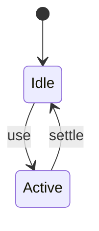
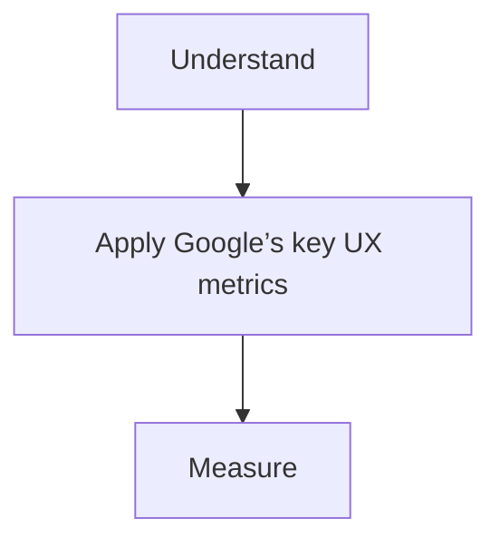

# Core Web Vitals

<TopicMeta />

<Prerequisites />

::: tip Published
This page meets the handbook **published** bar: deep explanation, ≥10 common mistakes, and official references. Further engine-level errata welcome via PR.
:::

## Introduction

**Core Web Vitals (CWV)** are LCP (loading), INP (interactivity), and CLS (stability). They are used in SEO tooling and as a shared performance language.

## Why does it exist?

A short metric set aligns product, eng, and SEO on user-centric outcomes.

## Historical Background

Launched with LCP/FID/CLS; FID → INP. Thresholds defined at p75 of users.

## Mental Model

Optimize p75 field experience per template. Lab diagnoses; field decides.

## Internal Workflow

1. Collect CrUX/RUM by URL group.
2. Find failing templates.
3. Attribute with traces.
4. Fix top regressions.
5. Budget + alert.

## Lifecycle



## Browser Perspective

Exposed via PerformanceObserver APIs.

## JavaScript Engine Perspective

Not applicable.

## React Perspective

Not applicable.

## Next.js Perspective

Framework choices heavily influence all three.

## Server Perspective

Not applicable.

## Network Perspective

CDN/TTFB feed LCP.

## Memory Perspective

Not applicable.

## Performance

Measure before/after with lab + field tools. Optimize the attributed bottleneck for Google’s key UX metrics, not folklore.

## Production Example

Teams adopt Google’s key UX metrics on critical routes, add monitoring, and guard regressions with budgets or reviews.

## Code Examples

```ts
import { onCLS, onINP, onLCP } from 'web-vitals'
;[onCLS, onINP, onLCP].forEach((fn) => fn(console.log))
```

## Diagrams



## Common Mistakes

1. Optimizing averages instead of p75
2. Only homepage focus
3. Lab-only celebration
4. Ignoring mobile segment
5. Treating CWV as only an SEO chore
6. No ownership per template
7. Optimizing only Lighthouse scores with tricks that hurt UX/a11y
8. Ignoring INP after FID retirement
9. Chasing lab metrics while field RUM regresses
10. Blaming React for LCP when the LCP element is a late image/font


## Best Practices

- Prefer platform/framework primitives
- Measure impact on real user metrics
- Keep the change reviewable and reversible
- Document the invariant you are protecting

## Anti-patterns

- Copy-paste without understanding failure modes
- Premature abstraction around a single use
- Optimizing without a baseline

## Comparison

| Approach | When |
| --- | --- |
| Use as designed | Default |
| Simpler alternative | If constraints differ |

## Interview Questions

### Easy

**Q:** Name the Core Web Vitals.

**A:** LCP, INP, and CLS.

### Medium

**Q:** What percentile matters?

**A:** p75 of page views for each metric.

### Hard

**Q:** How structure an org program around CWV?

**A:** Template-level RUM, owners, budgets in CI, weekly triage of regressions, and design system defaults that protect CLS/LCP.

## Summary

- Google’s key UX metrics: LCP, INP, and CLS (with supporting diagnostics).
- Know why it exists and when not to use it
- Measure production impact
- Link related handbook topics instead of duplicating

## References

- [web.dev — Core Web Vitals](https://web.dev/explore/learn-core-web-vitals)
- [web-vitals library](https://github.com/GoogleChrome/web-vitals)

<RelatedTopics />


Prev: [`13-performance.lighthouse`](/13-performance/lighthouse/) · Next: [`13-performance.lcp`](/13-performance/lcp/)
