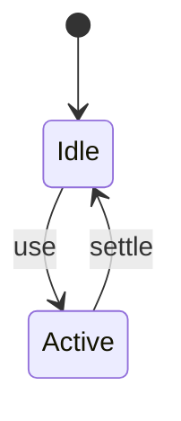

# Dead Code Elimination

<TopicMeta />

<Prerequisites />

::: tip Published
This page meets the handbook **published** bar: deep explanation, ≥10 common mistakes, and official references. Further engine-level errata welcome via PR.
:::

## Introduction

**Dead code elimination (DCE)** deletes unreachable code. Tree shaking is export-level DCE; minifiers also fold `if (false)` and unused functions inside modules.

## Why does it exist?

Feature flags, platform branches, and unused helpers bloat output if not eliminated.

## Historical Background

Compiler classic; JS minifiers (Terser/esbuild) + bundler shake cooperate.

## Mental Model

If production `define` replaces `process.env.NODE_ENV` with `"production"`, development branches can drop.

## Internal Workflow

1. Use bundler define/env replacement.
2. Prefer ESM for shake.
3. Avoid opaque dynamic access that pins code alive.
4. Confirm in minified output.

## Lifecycle



## Browser Perspective

Not applicable.

## JavaScript Engine Perspective

Not applicable.

## React Perspective

Not applicable.

## Next.js Perspective

Not applicable.

## Server Perspective

Not applicable.

## Network Perspective

Not applicable.

## Memory Perspective

Not applicable.

## Performance

Measure before/after with lab + field tools. Optimize the attributed bottleneck for Removing code that can never execute (DCE), including minify-time constant folding., not folklore.

## Production Example

Teams adopt Removing code that can never execute (DCE), including minify-time constant folding. on critical routes, add monitoring, and guard regressions with budgets or reviews.

## Code Examples

```ts
if (process.env.NODE_ENV !== 'production') {
  debugSetup() // dropped in prod builds with define
}
```

## Diagrams

```mermaid
flowchart TD
  A[Understand] --> B[Apply Removing code that can never execute (DCE), including minify-time constant folding.]
  B --> C[Measure]
```

## Common Mistakes

1. Dynamic property access keeping exports alive
2. Feature flags read at runtime from JSON blocking DCE
3. Expecting DCE without minify
4. Side-effect imports retained unexpectedly
5. Misusing eval/with
6. Shipping dead polyfills for never-targeted browsers
7. Missing a production edge case for 13-performance.dead-code-elimination (#1)
8. Missing a production edge case for 13-performance.dead-code-elimination (#2)
9. Missing a production edge case for 13-performance.dead-code-elimination (#3)
10. Missing a production edge case for 13-performance.dead-code-elimination (#4)


## Best Practices

- Prefer platform/framework primitives
- Measure impact on real user metrics
- Keep the change reviewable and reversible
- Document the invariant you are protecting

## Anti-patterns

- Copy-paste without understanding failure modes
- Premature abstraction around a single use
- Optimizing without a baseline

## Comparison

| Approach | When |
| --- | --- |
| Use as designed | Default |
| Simpler alternative | If constraints differ |

## Interview Questions

### Easy

**Q:** How does DCE differ from tree shaking?

**A:** Tree shaking drops unused exports across modules; DCE also removes unreachable code inside modules during minify/compile.

### Medium

**Q:** How do env defines help?

**A:** Replacing constants enables branch elimination of dev-only code.

### Hard

**Q:** What patterns defeat DCE?

**A:** Computed property access, runaway side effects, and runtime feature flag objects without compile-time inlining.

## Summary

- Removing code that can never execute (DCE), including minify-time constant folding.
- Know why it exists and when not to use it
- Measure production impact
- Link related handbook topics instead of duplicating

## References

- [esbuild — Drop](https://esbuild.github.io/api/#drop)
- [Terser](https://terser.org/)

<RelatedTopics />


Prev: [`13-performance.tree-shaking`](/13-performance/tree-shaking/) · Next: [`13-performance.dynamic-import`](/13-performance/dynamic-import/)
