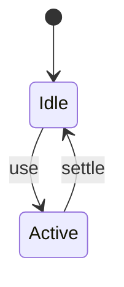
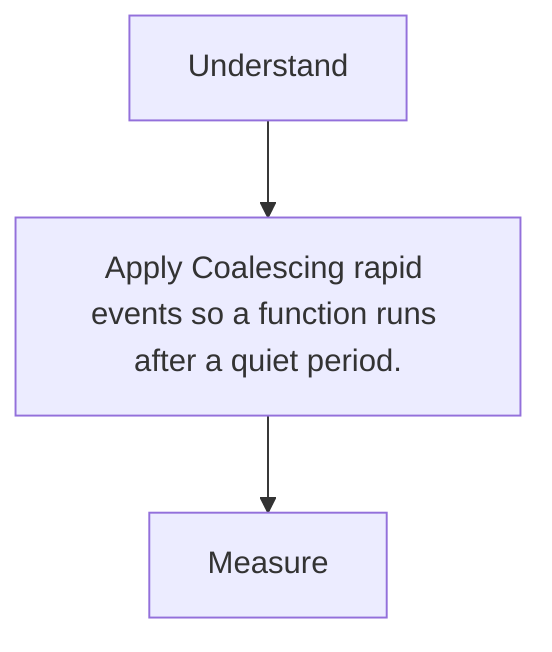

# Debounce

<TopicMeta />

<Prerequisites />

::: tip Published
This page meets the handbook **published** bar: deep explanation, ≥10 common mistakes, and official references. Further engine-level errata welcome via PR.
:::

## Introduction

**Debounce** delays invoking a function until events stop arriving for N ms—ideal for search typing and resize-end handlers.

## Why does it exist?

Per-keystroke work (filter/fetch) wastes CPU/network and hurts INP.

## Historical Background

Classic utility from underscore/lodash; trivial to implement with timers.

## Mental Model

Each event resets the timer; only the last quiet window fires.

## Internal Workflow

1. Pick delay (150–300ms typical for search).
2. Debounce the expensive side.
3. Cancel on unmount.
4. Consider leading edge if needed.

## Lifecycle



## Browser Perspective

Timer on main thread; keep fn light.

## JavaScript Engine Perspective

Not applicable.

## React Perspective

Prefer transition/deferred value patterns for rendering; debounce I/O.

## Next.js Perspective

Not applicable.

## Server Perspective

Not applicable.

## Network Perspective

Not applicable.

## Memory Perspective

Not applicable.

## Performance

Measure before/after with lab + field tools. Optimize the attributed bottleneck for Coalescing rapid events so a function runs after a quiet period., not folklore.

## Production Example

Teams adopt Coalescing rapid events so a function runs after a quiet period. on critical routes, add monitoring, and guard regressions with budgets or reviews.

## Code Examples

```ts
export function debounce<T extends (...a: any[]) => void>(fn: T, ms: number) {
  let t: ReturnType<typeof setTimeout> | undefined
  return (...args: Parameters<T>) => {
    clearTimeout(t)
    t = setTimeout(() => fn(...args), ms)
  }
}
```

## Diagrams



## Common Mistakes

1. Debouncing hard-required immediate UI feedback
2. Leaking timers on unmount
3. Debounce vs throttle confusion
4. Too long delay feeling broken
5. Debouncing React setState incorrectly causing stale closures
6. Server-filtering every keypress without debounce
7. Missing a production edge case for 13-performance.debounce (#1)
8. Missing a production edge case for 13-performance.debounce (#2)
9. Missing a production edge case for 13-performance.debounce (#3)
10. Missing a production edge case for 13-performance.debounce (#4)


## Best Practices

- Prefer platform/framework primitives
- Measure impact on real user metrics
- Keep the change reviewable and reversible
- Document the invariant you are protecting

## Anti-patterns

- Copy-paste without understanding failure modes
- Premature abstraction around a single use
- Optimizing without a baseline

## Comparison

| Approach | When |
| --- | --- |
| Use as designed | Default |
| Simpler alternative | If constraints differ |

## Interview Questions

### Easy

**Q:** Debounce vs throttle in one line?

**A:** Debounce waits for quiet; throttle ensures regular cadence while events fire.

### Medium

**Q:** Where use debounce in search UI?

**A:** On the network query; keep input value updates immediate.

### Hard

**Q:** How implement cancelable debounce with AbortController?

**A:** Start fetch in trailing call; abort previous controller when a new trailing call starts or on unmount.

## Summary

- Coalescing rapid events so a function runs after a quiet period.
- Know why it exists and when not to use it
- Measure production impact
- Link related handbook topics instead of duplicating

## References

- [MDN — setTimeout](https://developer.mozilla.org/en-US/docs/Web/API/Window/setTimeout)
- [web.dev — debounce](https://web.dev/articles/debounce-your-input-handlers)

<RelatedTopics />


Prev: [`13-performance.lazy-loading`](/13-performance/lazy-loading/) · Next: [`13-performance.throttle`](/13-performance/throttle/)
