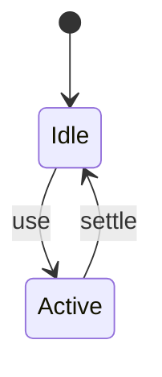

# Dynamic Import

<TopicMeta />

<Prerequisites />

::: tip Published
This page meets the handbook **published** bar: deep explanation, ≥10 common mistakes, and official references. Further engine-level errata welcome via PR.
:::

## Introduction

**Dynamic `import()`** returns a Promise of a module namespace and tells bundlers to create an async chunk. It is the language primitive behind lazy loading.

## Why does it exist?

Static imports are eager. Dynamic import defers cost until a condition/route/interaction.

## Historical Background

TC39 dynamic import; adopted by all modern bundlers.

## Mental Model

`import('./X')` → network fetch chunk → evaluate → use exports.

## Internal Workflow

1. Identify deferrable module.
2. Replace static import with `import()`.
3. Handle loading/error.
4. Optionally prefetch.

## Lifecycle



## Browser Perspective

Uses module script fetching.

## JavaScript Engine Perspective

Not applicable.

## React Perspective

Not applicable.

## Next.js Perspective

Powers next/dynamic under the hood.

## Server Perspective

Not applicable.

## Network Perspective

Not applicable.

## Memory Perspective

Not applicable.

## Performance

Measure before/after with lab + field tools. Optimize the attributed bottleneck for import() expressions that load modules asynchronously and create split points., not folklore.

## Production Example

Teams adopt import() expressions that load modules asynchronously and create split points. on critical routes, add monitoring, and guard regressions with budgets or reviews.

## Code Examples

```ts
async function openEditor() {
  const { createEditor } = await import('./editor')
  return createEditor()
}
```

## Diagrams

```mermaid
flowchart TD
  A[Understand] --> B[Apply import() expressions that load modules asynchronously and create split points.]
  B --> C[Measure]
```

## Common Mistakes

1. Dynamic import in a hot path without caching the promise
2. String concatenation that prevents static chunk naming
3. No error UI when chunk fails (offline)
4. Importing server-only modules dynamically on client
5. Waterfall: await A then import B that could parallelize
6. Using dynamic import for tiny modules needlessly
7. Missing a production edge case for 13-performance.dynamic-import (#1)
8. Missing a production edge case for 13-performance.dynamic-import (#2)
9. Missing a production edge case for 13-performance.dynamic-import (#3)
10. Missing a production edge case for 13-performance.dynamic-import (#4)


## Best Practices

- Prefer platform/framework primitives
- Measure impact on real user metrics
- Keep the change reviewable and reversible
- Document the invariant you are protecting

## Anti-patterns

- Copy-paste without understanding failure modes
- Premature abstraction around a single use
- Optimizing without a baseline

## Comparison

| Approach | When |
| --- | --- |
| Use as designed | Default |
| Simpler alternative | If constraints differ |

## Interview Questions

### Easy

**Q:** What does import() return?

**A:** A Promise that resolves to the module namespace object.

### Medium

**Q:** How do bundlers use import()?

**A:** As a split point generating a separate async chunk.

### Hard

**Q:** Why avoid fully dynamic paths like import(path)?

**A:** Bundlers cannot statically determine the graph and may include large contexts or fail to split optimally.

## Summary

- import() expressions that load modules asynchronously and create split points.
- Know why it exists and when not to use it
- Measure production impact
- Link related handbook topics instead of duplicating

## References

- [MDN — import()](https://developer.mozilla.org/en-US/docs/Web/JavaScript/Reference/Operators/import)
- [webpack — Dynamic imports](https://webpack.js.org/api/module-methods/#dynamic-expressions-in-import)

<RelatedTopics />


Prev: [`13-performance.dead-code-elimination`](/13-performance/dead-code-elimination/) · Next: [`13-performance.lazy-loading`](/13-performance/lazy-loading/)
