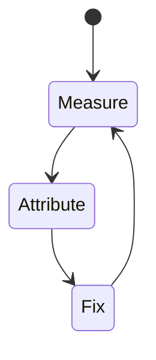
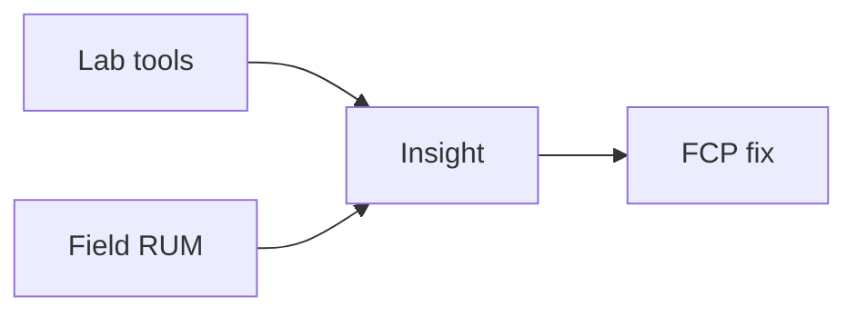

# FCP

<TopicMeta />

<Prerequisites />

::: tip Published
This page meets the handbook **published** bar: deep explanation, ≥10 common mistakes, and official references. Further engine-level errata welcome via PR.
:::

## Introduction

**FCP** marks the first time any content is painted. It is not a CWV by itself but a useful milestone toward LCP.

## Why does it exist?

Users need confirmation the navigation started working. FCP catches blank-page syndromes.

## Historical Background

Paint timing metrics evolved with High Resolution Time / Paint Timing APIs.

## Mental Model

Anything contentful counts—sometimes a header appears long before LCP hero.

## Internal Workflow

1. Define what FCP measures and the “good” threshold.
2. Collect lab (Lighthouse/Perf panel) and field (CrUX/RUM) data.
3. Attribute the slow stage in a trace.
4. Change one cause; remeasure.
5. Guard with budgets in CI/RUM alerts.

## Lifecycle



## Browser Perspective

FCP is observed in Chromium Performance/Lighthouse and via web-vitals JS APIs in the field.

## JavaScript Engine Perspective

JS long tasks, layout, and paint feed into how FCP feels to users.

## React Perspective

Unnecessary renders/hydration inflate interaction and paint costs that show up in FCP.

## Next.js Perspective

Server TTFB, streaming, and client bundle size all influence FCP depending on the metric.

## Server Perspective

Not applicable.

## Network Perspective

RTT, bytes, and CDN behavior often dominate before JS micro-optimizations.

## Memory Perspective

GC pauses and large DOM/images can indirectly worsen FCP.

## Performance

Improve server/TTFB, reduce render-blocking CSS, avoid @import chains, streamline critical CSS.

## Production Example

A team tracks FCP in RUM by route template, sets a regression alert at p75, and ties fixes to specific owners (images, JS, server).

## Code Examples

```ts
new PerformanceObserver((list) => {
  for (const e of list.getEntries()) console.log('paint', e.name, e.startTime)
}).observe({ type: 'paint', buffered: true })
```

## Diagrams



## Common Mistakes

1. Celebrating FCP while LCP is terrible
2. Huge CSS blocking first paint
3. Client-only rendering with empty HTML shell
4. Font timeout strategies causing blank text
5. Ignoring that FCP can be a tiny non-useful node
6. Comparing FCP across pages with different above-fold designs naively
7. Missing a production edge case for 13-performance.fcp (#1)
8. Missing a production edge case for 13-performance.fcp (#2)
9. Missing a production edge case for 13-performance.fcp (#3)
10. Missing a production edge case for 13-performance.fcp (#4)


## Best Practices

- Optimize FCP with field data, not vanity lab scores alone
- Fix the attributed cause, not a random best practice list
- Keep a performance budget for the owning surface
- Re-check after framework upgrades

## Anti-patterns

- Chasing Lighthouse while ignoring RUM
- Micro-optimizing JS before cutting bytes/RTT
- Declaring victory from one local run on fiber

## Comparison

| Signal | Use |
| --- | --- |
| Lab | Debug & regressions |
| Field | Real users / SEO signals |

## Interview Questions

### Easy

**Q:** What is FCP?

**A:** The first paint of content (text/image/etc.) to the screen.

### Medium

**Q:** Why isn’t FCP enough?

**A:** It can fire on a small header while the main content (LCP) arrives much later.

### Hard

**Q:** How do render-blocking resources affect FCP?

**A:** CSS (and sync JS in head) delay first paint; minimize critical CSS and defer non-critical JS.

## Summary

- FCP: First Contentful Paint: when the first text/image/canvas is painted.
- Measure lab + field
- Attribute before optimizing
- Budget and alert on p75

## References

- [MDN — Paint Timing](https://developer.mozilla.org/en-US/docs/Web/API/PerformancePaintTiming)
- [web.dev — Core Web Vitals](https://web.dev/explore/learn-core-web-vitals)
- [Chrome — Web Vitals](https://developer.chrome.com/docs/performance/insights/web-vitals)

<RelatedTopics />


Prev: [`13-performance.tti`](/13-performance/tti/) · Next: [`13-performance.tbt`](/13-performance/tbt/)
