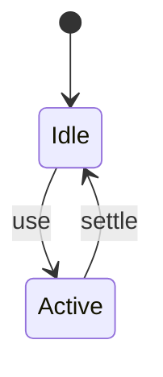
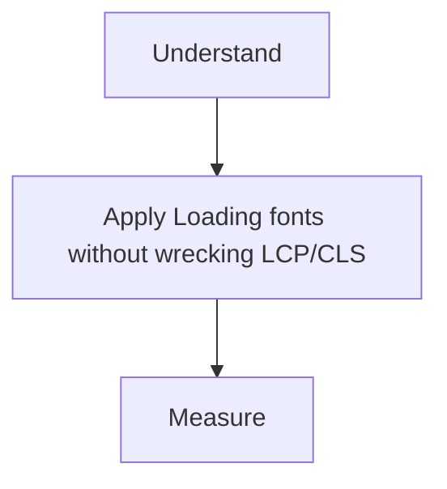

# Font Performance

<TopicMeta />

<Prerequisites />

::: tip Published
This page meets the handbook **published** bar: deep explanation, ≥10 common mistakes, and official references. Further engine-level errata welcome via PR.
:::

## Introduction

**Font performance** covers how webfonts are downloaded and applied. Poor strategy causes invisible text, late text, or CLS from fallback swaps.

## Why does it exist?

Fonts are render-critical for text-heavy pages and brand UI.

## Historical Background

FOIT/FOUT wars → font-display → size-adjusted fallbacks / next/font self-host.

## Mental Model

Fewer families/weights; subset; self-host; fallback metrics close to webfont.

## Internal Workflow

1. Audit used weights/glyphs.
2. Subset + modern formats (woff2).
3. Self-host with good Cache-Control.
4. Choose font-display / next/font.
5. Measure CLS.

## Lifecycle



## Browser Perspective

Not applicable.

## JavaScript Engine Perspective

Not applicable.

## React Perspective

Not applicable.

## Next.js Perspective

Not applicable.

## Server Perspective

Not applicable.

## Network Perspective

Not applicable.

## Memory Perspective

Not applicable.

## Performance

Measure before/after with lab + field tools. Optimize the attributed bottleneck for Loading fonts without wrecking LCP/CLS, not folklore.

## Production Example

Teams adopt Loading fonts without wrecking LCP/CLS on critical routes, add monitoring, and guard regressions with budgets or reviews.

## Code Examples

```css
@font-face {
  font-family: 'Inter';
  src: url('/fonts/inter.woff2') format('woff2');
  font-display: swap;
  unicode-range: U+000-5FF;
}
```

## Diagrams



## Common Mistakes

1. Loading entire icon + brand + serif stacks everywhere
2. Third-party font CSS blocking
3. No fallback metrics → CLS
4. Too many weights
5. Late @import for fonts
6. Base64 megabyte fonts in CSS
7. Missing a production edge case for 13-performance.font-performance (#1)
8. Missing a production edge case for 13-performance.font-performance (#2)
9. Missing a production edge case for 13-performance.font-performance (#3)
10. Missing a production edge case for 13-performance.font-performance (#4)


## Best Practices

- Prefer platform/framework primitives
- Measure impact on real user metrics
- Keep the change reviewable and reversible
- Document the invariant you are protecting

## Anti-patterns

- Copy-paste without understanding failure modes
- Premature abstraction around a single use
- Optimizing without a baseline

## Comparison

| Approach | When |
| --- | --- |
| Use as designed | Default |
| Simpler alternative | If constraints differ |

## Interview Questions

### Easy

**Q:** What does font-display: swap do?

**A:** Shows fallback text immediately, swapping to webfont when loaded (can CLS without metric adjustment).

### Medium

**Q:** Why self-host fonts?

**A:** Remove third-party RTT/privacy issues and control caching/subsetting.

### Hard

**Q:** How do size-adjusted fallbacks help CLS?

**A:** They approximate webfont metrics so swap causes less layout shift.

## Summary

- Loading fonts without wrecking LCP/CLS: subsetting, display strategy, self-hosting.
- Know why it exists and when not to use it
- Measure production impact
- Link related handbook topics instead of duplicating

## References

- [web.dev — Fonts](https://web.dev/learn/performance/optimize-web-fonts)
- [Next.js — Fonts](https://nextjs.org/docs/app/building-your-application/optimizing/fonts)

<RelatedTopics />


Prev: [`13-performance.image-optimization-perf`](/13-performance/image-optimization-perf/) · Next: [`13-performance.lighthouse`](/13-performance/lighthouse/)
