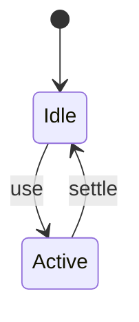
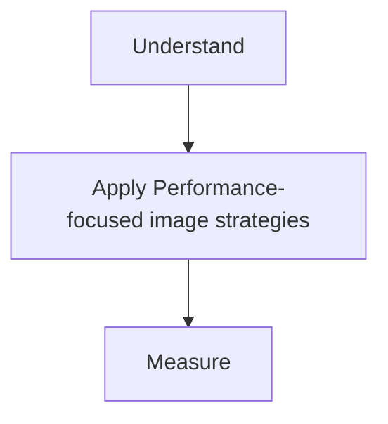

# Image Optimization

<TopicMeta />

<Prerequisites />

::: tip Published
This page meets the handbook **published** bar: deep explanation, ≥10 common mistakes, and official references. Further engine-level errata welcome via PR.
:::

## Introduction

**Image optimization** (perf lens) minimizes bytes and decode cost while protecting LCP/CLS: right format, dimensions, compression, responsive candidates, and priority hints.

## Why does it exist?

Images are often the LCP element and the largest bytes on the page.

## Historical Background

srcset/sizes → WebP/AVIF → framework components (next/image) + CDN transforms.

## Mental Model

Serve the smallest acceptable image for the display size and DPR; reserve space; prioritize the hero.

## Internal Workflow

1. Identify LCP image.
2. Compress + modern format.
3. Set dimensions/sizes.
4. priority/fetchpriority for hero; lazy others.
5. CDN transform URLs.

## Lifecycle



## Browser Perspective

Not applicable.

## JavaScript Engine Perspective

Not applicable.

## React Perspective

Not applicable.

## Next.js Perspective

Not applicable.

## Server Perspective

Not applicable.

## Network Perspective

Not applicable.

## Memory Perspective

Not applicable.

## Performance

Measure before/after with lab + field tools. Optimize the attributed bottleneck for Performance-focused image strategies, not folklore.

## Production Example

Teams adopt Performance-focused image strategies on critical routes, add monitoring, and guard regressions with budgets or reviews.

## Code Examples

```html

```

## Diagrams



## Common Mistakes

1. 4000px image in a 400px slot
2. Lazy LCP
3. No dimensions → CLS
4. PNG screenshots for photos
5. Too many decorative images eager
6. Ignoring AVIF/WebP support negotiation
7. Missing a production edge case for 13-performance.image-optimization-perf (#1)
8. Missing a production edge case for 13-performance.image-optimization-perf (#2)
9. Missing a production edge case for 13-performance.image-optimization-perf (#3)
10. Missing a production edge case for 13-performance.image-optimization-perf (#4)


## Best Practices

- Prefer platform/framework primitives
- Measure impact on real user metrics
- Keep the change reviewable and reversible
- Document the invariant you are protecting

## Anti-patterns

- Copy-paste without understanding failure modes
- Premature abstraction around a single use
- Optimizing without a baseline

## Comparison

| Approach | When |
| --- | --- |
| Use as designed | Default |
| Simpler alternative | If constraints differ |

## Interview Questions

### Easy

**Q:** Name three image perf levers.

**A:** Format/compression, responsive sizing, and correct prioritization/lazy rules.

### Medium

**Q:** What does sizes do?

**A:** Tells the browser the display width so it can pick from srcset.

### Hard

**Q:** How do CDNs fit?

**A:** On-the-fly transforms (width/format/quality) + caching variants at the edge reduce origin storage complexity.

## Summary

- Performance-focused image strategies: formats, sizing, priority, and CDN transforms.
- Know why it exists and when not to use it
- Measure production impact
- Link related handbook topics instead of duplicating

## References

- [web.dev — Optimize images](https://web.dev/articles/fast#optimize-your-images)
- [Next.js — Image](https://nextjs.org/docs/app/building-your-application/optimizing/images)

<RelatedTopics />


Prev: [`13-performance.virtualization`](/13-performance/virtualization/) · Next: [`13-performance.font-performance`](/13-performance/font-performance/)
