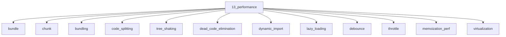

# Performance

## Scope

Bundles, runtime techniques, and Core Web Vitals

## Prerequisites

See the learning paths and each topic's prerequisites in the registry.

## Topics in order

- [Bundle](/13-performance/bundle/) — junior, ~25 min
- [Chunk](/13-performance/chunk/) — junior, ~20 min
- [Bundling](/13-performance/bundling/) — junior, ~30 min
- [Code Splitting](/13-performance/code-splitting/) — mid, ~35 min
- [Tree Shaking](/13-performance/tree-shaking/) — mid, ~30 min
- [Dead Code Elimination](/13-performance/dead-code-elimination/) — mid, ~25 min
- [Dynamic Import](/13-performance/dynamic-import/) — junior, ~25 min
- [Lazy Loading](/13-performance/lazy-loading/) — junior, ~25 min
- [Debounce](/13-performance/debounce/) — junior, ~20 min
- [Throttle](/13-performance/throttle/) — junior, ~20 min
- [Memoization](/13-performance/memoization-perf/) — junior, ~25 min
- [Virtualization](/13-performance/virtualization/) — mid, ~35 min
- [Image Optimization](/13-performance/image-optimization-perf/) — junior, ~30 min
- [Font Performance](/13-performance/font-performance/) — mid, ~25 min
- [Lighthouse](/13-performance/lighthouse/) — junior, ~30 min
- [Core Web Vitals](/13-performance/core-web-vitals/) — mid, ~35 min
- [LCP](/13-performance/lcp/) — mid, ~30 min
- [CLS](/13-performance/cls/) — mid, ~30 min
- [INP](/13-performance/inp/) — mid, ~30 min
- [TTFB](/13-performance/ttfb/) — mid, ~20 min
- [TTI](/13-performance/tti/) — mid, ~20 min
- [FCP](/13-performance/fcp/) — mid, ~20 min
- [TBT](/13-performance/tbt/) — mid, ~20 min
- [Profiling](/13-performance/profiling/) — mid, ~35 min
- [Long Tasks](/13-performance/long-tasks/) — mid, ~30 min
- [Scheduler and Yielding](/13-performance/scheduler-yielding/) — senior, ~35 min

## Module knowledge graph

## Suggested learning paths

Browse [Learning Paths](/learning-paths/).
